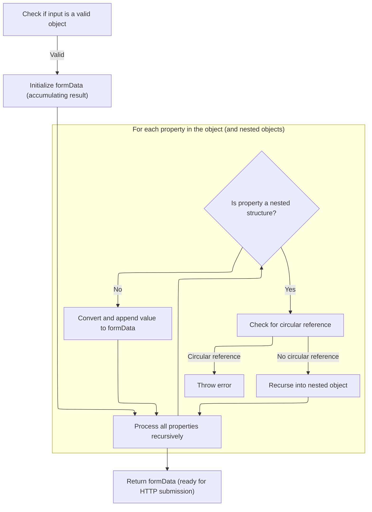
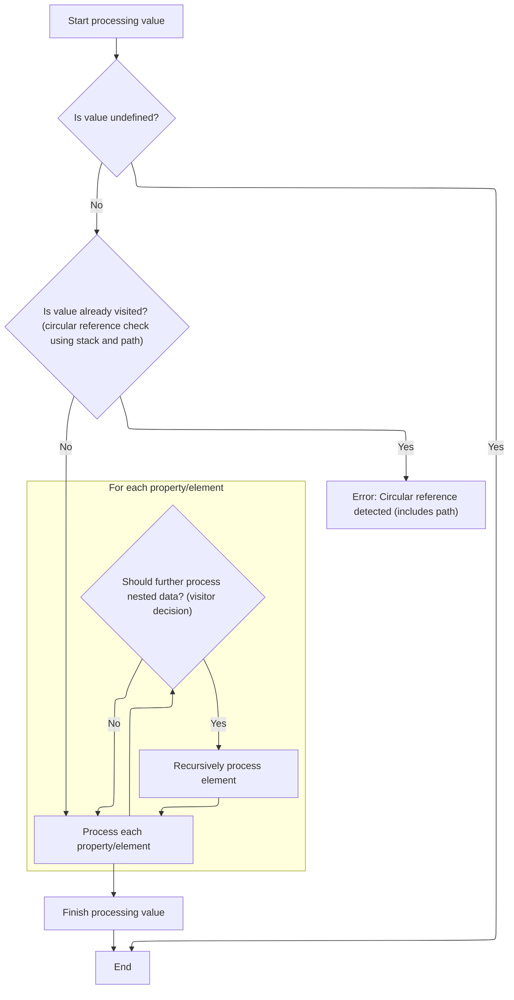

This document outlines how a JavaScript object is converted into a <SwmToken path="lib/helpers/toFormData.js" pos="92:16:16" line-data="  formData = formData || new (PlatformFormData || FormData)();">`FormData`</SwmToken> instance for HTTP form submission. The process handles nested structures, arrays, and special data types, ensuring all fields are correctly serialized and appended. The main steps are:

- Validate and prepare the input object and options
- Format property keys for form data
- Transform property values for submission
- Recursively process nested structures, handling circular references

```mermaid
sequenceDiagram
  participant Developer
  participant FormDataPreparer
  Developer->>FormDataPreparer: Provide object and options
  FormDataPreparer->>FormDataPreparer: Validate and prepare input
  FormDataPreparer->>FormDataPreparer: For each property, format key and transform value
  FormDataPreparer->>FormDataPreparer: Recursively process nested structures
  FormDataPreparer->>FormDataPreparer: Append key-value pairs to FormData
  FormDataPreparer->>Developer: Return completed FormData

%% Swimm:
%% sequenceDiagram
%%   participant Developer
%%   participant FormDataPreparer
%%   Developer->>FormDataPreparer: Provide object and options
%%   FormDataPreparer->>FormDataPreparer: Validate and prepare input
%%   FormDataPreparer->>FormDataPreparer: For each property, format key and transform value
%%   FormDataPreparer->>FormDataPreparer: Recursively process nested structures
%%   FormDataPreparer->>FormDataPreparer: Append <SwmToken path="lib/core/AxiosHeaders.js" pos="107:16:18" line-data="          throw TypeError(&#39;Object iterator must return a key-value pair&#39;);">`key-value`</SwmToken> pairs to <SwmToken path="lib/helpers/toFormData.js" pos="92:16:16" line-data="  formData = formData || new (PlatformFormData || FormData)();">`FormData`</SwmToken>
%%   FormDataPreparer->>Developer: Return completed <SwmToken path="lib/helpers/toFormData.js" pos="92:16:16" line-data="  formData = formData || new (PlatformFormData || FormData)();">`FormData`</SwmToken>
```

- Append <SwmToken path="lib/core/AxiosHeaders.js" pos="107:16:18" line-data="          throw TypeError(&#39;Object iterator must return a key-value pair&#39;);">`key-value`</SwmToken> pairs to <SwmToken path="lib/helpers/toFormData.js" pos="92:16:16" line-data="  formData = formData || new (PlatformFormData || FormData)();">`FormData`</SwmToken>
- Return the completed <SwmToken path="lib/helpers/toFormData.js" pos="92:16:16" line-data="  formData = formData || new (PlatformFormData || FormData)();">`FormData`</SwmToken>



# Where is this flow used?

This flow is used multiple times in the codebase as represented in the following diagram:

```mermaid
graph TD;
      036f37d855e9457b7dc15a93771aae03d15e30f7a3fee7779c33ece5aa119ec7(index.js::transformRequest) --> d65c9bfd0d44b4e5ca5aee5f87cbac4d80830f458123c9cc808282f82363cd7a(lib/helpers/toFormData.js::toFormData):::mainFlowStyle

036f37d855e9457b7dc15a93771aae03d15e30f7a3fee7779c33ece5aa119ec7(index.js::transformRequest) --> aa50d3447fbc6f7e858d7bf3b9532c10d55f4881ff749998c0e614e824195364(lib/helpers/toURLEncodedForm.js::toURLEncodedForm)

ca7d6981110829defe9c579432175d8743b8fa0b7ba876281b7b346a60cbabe7(lib/helpers/AxiosURLSearchParams.js::AxiosURLSearchParams) --> d65c9bfd0d44b4e5ca5aee5f87cbac4d80830f458123c9cc808282f82363cd7a(lib/helpers/toFormData.js::toFormData):::mainFlowStyle

aa50d3447fbc6f7e858d7bf3b9532c10d55f4881ff749998c0e614e824195364(lib/helpers/toURLEncodedForm.js::toURLEncodedForm) --> d65c9bfd0d44b4e5ca5aee5f87cbac4d80830f458123c9cc808282f82363cd7a(lib/helpers/toFormData.js::toFormData):::mainFlowStyle

d630a9bef90497f5922600df8a8b6b03c36eecfd31ae37fdb283ac9cec1c3f20(lib/helpers/toURLEncodedForm.js::visitor) --> d65c9bfd0d44b4e5ca5aee5f87cbac4d80830f458123c9cc808282f82363cd7a(lib/helpers/toFormData.js::toFormData):::mainFlowStyle


classDef mainFlowStyle color:#000000,fill:#7CB9F4
classDef rootsStyle color:#000000,fill:#00FFF4
classDef Style1 color:#000000,fill:#00FFAA
classDef Style2 color:#000000,fill:#FFFF00
classDef Style3 color:#000000,fill:#AA7CB9

%% Swimm:
%% graph TD;
%%       036f37d855e9457b7dc15a93771aae03d15e30f7a3fee7779c33ece5aa119ec7(<SwmPath>[index.js](index.js)</SwmPath>::transformRequest) --> d65c9bfd0d44b4e5ca5aee5f87cbac4d80830f458123c9cc808282f82363cd7a(<SwmPath>[lib/helpers/toFormData.js](lib/helpers/toFormData.js)</SwmPath>::<SwmToken path="lib/helpers/toFormData.js" pos="86:2:2" line-data="function toFormData(obj, formData, options) {">`toFormData`</SwmToken>):::mainFlowStyle
%% 
%% 036f37d855e9457b7dc15a93771aae03d15e30f7a3fee7779c33ece5aa119ec7(<SwmPath>[index.js](index.js)</SwmPath>::transformRequest) --> aa50d3447fbc6f7e858d7bf3b9532c10d55f4881ff749998c0e614e824195364(<SwmPath>[lib/helpers/toURLEncodedForm.js](lib/helpers/toURLEncodedForm.js)</SwmPath>::toURLEncodedForm)
%% 
%% ca7d6981110829defe9c579432175d8743b8fa0b7ba876281b7b346a60cbabe7(<SwmPath>[lib/helpers/AxiosURLSearchParams.js](lib/helpers/AxiosURLSearchParams.js)</SwmPath>::<SwmToken path="lib/helpers/toFormData.js" pos="5:16:16" line-data="// temporary hotfix to avoid circular references until AxiosURLSearchParams is refactored">`AxiosURLSearchParams`</SwmToken>) --> d65c9bfd0d44b4e5ca5aee5f87cbac4d80830f458123c9cc808282f82363cd7a(<SwmPath>[lib/helpers/toFormData.js](lib/helpers/toFormData.js)</SwmPath>::<SwmToken path="lib/helpers/toFormData.js" pos="86:2:2" line-data="function toFormData(obj, formData, options) {">`toFormData`</SwmToken>):::mainFlowStyle
%% 
%% aa50d3447fbc6f7e858d7bf3b9532c10d55f4881ff749998c0e614e824195364(<SwmPath>[lib/helpers/toURLEncodedForm.js](lib/helpers/toURLEncodedForm.js)</SwmPath>::toURLEncodedForm) --> d65c9bfd0d44b4e5ca5aee5f87cbac4d80830f458123c9cc808282f82363cd7a(<SwmPath>[lib/helpers/toFormData.js](lib/helpers/toFormData.js)</SwmPath>::<SwmToken path="lib/helpers/toFormData.js" pos="86:2:2" line-data="function toFormData(obj, formData, options) {">`toFormData`</SwmToken>):::mainFlowStyle
%% 
%% d630a9bef90497f5922600df8a8b6b03c36eecfd31ae37fdb283ac9cec1c3f20(<SwmPath>[lib/helpers/toURLEncodedForm.js](lib/helpers/toURLEncodedForm.js)</SwmPath>::visitor) --> d65c9bfd0d44b4e5ca5aee5f87cbac4d80830f458123c9cc808282f82363cd7a(<SwmPath>[lib/helpers/toFormData.js](lib/helpers/toFormData.js)</SwmPath>::<SwmToken path="lib/helpers/toFormData.js" pos="86:2:2" line-data="function toFormData(obj, formData, options) {">`toFormData`</SwmToken>):::mainFlowStyle
%% 
%% 
%% classDef mainFlowStyle color:#000000,fill:#7CB9F4
%% classDef rootsStyle color:#000000,fill:#00FFF4
%% classDef Style1 color:#000000,fill:#00FFAA
%% classDef Style2 color:#000000,fill:#FFFF00
%% classDef Style3 color:#000000,fill:#AA7CB9
```



# Spec

## Detailed View of the Program's Functionality

a. Validating and Preparing the Input Object and Options

The process begins by ensuring that the provided input is a valid object. If it is not, an error is thrown to prevent further processing. If a <SwmToken path="lib/helpers/toFormData.js" pos="92:16:16" line-data="  formData = formData || new (PlatformFormData || FormData)();">`FormData`</SwmToken> instance is not supplied, a new one is created, using either a platform-specific implementation or the global <SwmToken path="lib/helpers/toFormData.js" pos="92:16:16" line-data="  formData = formData || new (PlatformFormData || FormData)();">`FormData`</SwmToken> if available. The options for processing are then normalized and merged with defaults, ensuring that settings like meta tokens, dot notation, and array index handling are established. These options control how keys and values are serialized into the <SwmToken path="lib/helpers/toFormData.js" pos="92:16:16" line-data="  formData = formData || new (PlatformFormData || FormData)();">`FormData`</SwmToken> structure. The code also checks if a custom visitor function is provided; if not, it uses a default one. The visitor function is responsible for determining how each property in the object is handled during traversal.

b. Iterating Over Each Property (Including Nested Properties)

The core of the process involves recursively traversing each property of the input object. For each property, the code determines how to format the key for form data submission. This involves generating the correct field name, especially for nested structures, arrays, and special cases like objects that should be stringified. The visitor function is called for each property, and it decides whether to process the property directly or to recurse further into nested objects or arrays.

c. Formatting Property Keys for Form Data

When building field names for form data, the code uses a key rendering function. If the property is nested, the path to the property is combined with the current key. Each part of the path is processed to remove any array brackets (e.g., '\[\]') for normalization. The parts are then joined together using either dot notation or bracket notation, depending on the options. This ensures that the resulting field names accurately represent the structure of the original object in a way that is compatible with how form data is typically parsed on the server side.

d. Normalizing Array Field Names

To handle array fields, the code checks if a key ends with '\[\]'. If it does, these brackets are removed to standardize the key. This normalization step ensures that array elements are appended to <SwmToken path="lib/helpers/toFormData.js" pos="92:16:16" line-data="  formData = formData || new (PlatformFormData || FormData)();">`FormData`</SwmToken> with consistent field names, avoiding issues with duplicate or malformed keys.

e. Transforming Property Values for Form Submission

Before appending values to <SwmToken path="lib/helpers/toFormData.js" pos="92:16:16" line-data="  formData = formData || new (PlatformFormData || FormData)();">`FormData`</SwmToken>, each value is converted to a suitable format. Null values are converted to empty strings. Dates are serialized to ISO strings, booleans are converted to their string representations, and binary data (such as ArrayBuffers or typed arrays) is converted to either a Blob or a Buffer, depending on the environment and options. If a value is a Blob but the environment does not support Blob in <SwmToken path="lib/helpers/toFormData.js" pos="92:16:16" line-data="  formData = formData || new (PlatformFormData || FormData)();">`FormData`</SwmToken>, an error is thrown. This conversion ensures that all values added to <SwmToken path="lib/helpers/toFormData.js" pos="92:16:16" line-data="  formData = formData || new (PlatformFormData || FormData)();">`FormData`</SwmToken> are in a format that can be transmitted over HTTP.

f. Processing Arrays and Nested Structures

When the code encounters arrays or file lists, it iterates over each element. For each element, it generates the appropriate field name (taking into account whether to use indexes or brackets) and converts the value as described above. Each element is then appended to <SwmToken path="lib/helpers/toFormData.js" pos="92:16:16" line-data="  formData = formData || new (PlatformFormData || FormData)();">`FormData`</SwmToken>. If the property is a nested object or array, the code checks for circular references to prevent infinite recursion. If no circular reference is detected, it recurses into the nested structure, repeating the process for each property.

g. Recursively Walking the Object Structure

The recursive build function is responsible for traversing the entire object graph. For each property or element, it trims any extra whitespace from the key, then calls the visitor function to determine how to handle the value. If the visitor function returns true, indicating that the value should be further traversed (for example, if it is a nested object or array), the build function is called recursively with the updated path. After processing each property, the current value is removed from the stack to maintain correct tracking of recursion depth and to prevent circular reference issues.

h. Returning the Completed <SwmToken path="lib/helpers/toFormData.js" pos="92:16:16" line-data="  formData = formData || new (PlatformFormData || FormData)();">`FormData`</SwmToken>

Once all properties and nested structures have been processed and appended to <SwmToken path="lib/helpers/toFormData.js" pos="92:16:16" line-data="  formData = formData || new (PlatformFormData || FormData)();">`FormData`</SwmToken>, the fully populated <SwmToken path="lib/helpers/toFormData.js" pos="92:16:16" line-data="  formData = formData || new (PlatformFormData || FormData)();">`FormData`</SwmToken> instance is returned. This instance is now ready to be used in an HTTP request, with all fields and values correctly serialized according to the original object structure and the specified options.

# Rule Definition

| Paragraph Name                 | Rule ID | Category          | Description                                                                                                                                                                                                                                                                                                                                                                                                                        | Conditions                                                                                                                                                                                                                  | Remarks                                                                                                                                                                                                                                                                                                                                                                         |
| ------------------------------ | ------- | ----------------- | ---------------------------------------------------------------------------------------------------------------------------------------------------------------------------------------------------------------------------------------------------------------------------------------------------------------------------------------------------------------------------------------------------------------------------------- | --------------------------------------------------------------------------------------------------------------------------------------------------------------------------------------------------------------------------- | ------------------------------------------------------------------------------------------------------------------------------------------------------------------------------------------------------------------------------------------------------------------------------------------------------------------------------------------------------------------------------- |
| 86-89, 214-216                 | RL-001  | Conditional Logic | The feature must validate that the input is an object (plain object or array) before proceeding. If not, it throws a <SwmToken path="lib/helpers/toFormData.js" pos="88:5:5" line-data="    throw new TypeError(&#39;target must be an object&#39;);">`TypeError`</SwmToken>.                                                                                                                                                      | The input to the function is not an object.                                                                                                                                                                                 | Throws <SwmToken path="lib/helpers/toFormData.js" pos="88:5:5" line-data="    throw new TypeError(&#39;target must be an object&#39;);">`TypeError`</SwmToken> with message 'target must be an object' or 'data must be an object'.                                                                                                                                             |
| 92                             | RL-002  | Data Assignment   | If a <SwmToken path="lib/helpers/toFormData.js" pos="92:16:16" line-data="  formData = formData \|\| new (PlatformFormData \|\| FormData)();">`FormData`</SwmToken> instance is provided, fields are appended to it; otherwise, a new <SwmToken path="lib/helpers/toFormData.js" pos="92:16:16" line-data="  formData = formData \|\| new (PlatformFormData \|\| FormData)();">`FormData`</SwmToken> instance is created and used. | <SwmToken path="lib/helpers/toFormData.js" pos="92:16:16" line-data="  formData = formData \|\| new (PlatformFormData \|\| FormData)();">`FormData`</SwmToken> instance is provided or not provided as the second argument. | Uses <SwmToken path="lib/helpers/toFormData.js" pos="92:12:12" line-data="  formData = formData \|\| new (PlatformFormData \|\| FormData)();">`PlatformFormData`</SwmToken> if available, otherwise uses global <SwmToken path="lib/helpers/toFormData.js" pos="92:16:16" line-data="  formData = formData \|\| new (PlatformFormData \|\| FormData)();">`FormData`</SwmToken>. |
| 95-102                         | RL-003  | Data Assignment   | The options object is merged with defaults: <SwmToken path="lib/helpers/toFormData.js" pos="96:1:1" line-data="    metaTokens: true,">`metaTokens`</SwmToken>=true, dots=false, indexes=false. Only defined options override defaults.                                                                                                                                                                                             | Options object is provided or omitted.                                                                                                                                                                                      | Defaults: <SwmToken path="lib/helpers/toFormData.js" pos="96:1:1" line-data="    metaTokens: true,">`metaTokens`</SwmToken>=true, dots=false, indexes=false.                                                                                                                                                                                                                    |
| 106, 112-114, 148-182, 202-209 | RL-004  | Conditional Logic | A visitor function is used to control recursion and field appending. If not provided, a <SwmToken path="lib/helpers/toFormData.js" pos="106:13:13" line-data="  const visitor = options.visitor \|\| defaultVisitor;">`defaultVisitor`</SwmToken> is used. The visitor must be a function.                                                                                                                                         | Visitor function is provided in options or omitted.                                                                                                                                                                         | Throws <SwmToken path="lib/helpers/toFormData.js" pos="88:5:5" line-data="    throw new TypeError(&#39;target must be an object&#39;);">`TypeError`</SwmToken> if visitor is not a function.                                                                                                                                                                                    |
| 192-213, 175-177, 206-208      | RL-005  | Computation       | The feature recursively processes all properties of the input object, including nested objects and arrays, appending them to the <SwmToken path="lib/helpers/toFormData.js" pos="92:16:16" line-data="  formData = formData \|\| new (PlatformFormData \|\| FormData)();">`FormData`</SwmToken> instance according to visitor logic.                                                                                               | Input object contains nested objects or arrays.                                                                                                                                                                             | Recursion is controlled by the visitor function's return value.                                                                                                                                                                                                                                                                                                                 |
| 39-46, 167, 203, 148-182       | RL-006  | Computation       | Field names are constructed from the current path and key, using dot or bracket notation as determined by the 'dots' option. Brackets are removed for normalization, and <SwmToken path="lib/helpers/toFormData.js" pos="96:1:1" line-data="    metaTokens: true,">`metaTokens`</SwmToken> are handled.                                                                                                                            | Appending a value to <SwmToken path="lib/helpers/toFormData.js" pos="92:16:16" line-data="  formData = formData \|\| new (PlatformFormData \|\| FormData)();">`FormData`</SwmToken>.                                        | If dots=true, use dot notation (e.g., a.b.c). If dots=false, use bracket notation (e.g., a\[b\]\[c\]). If path is empty, use key as-is. Remove trailing '\[\]' from keys.                                                                                                                                                                                                       |
| 167, 72, 164-169               | RL-007  | Computation       | The 'indexes' option determines how array indexes are included in field names: true uses explicit indexes, false uses repeated keys with \[\], null uses plain key.                                                                                                                                                                                                                                                                | Appending array elements to <SwmToken path="lib/helpers/toFormData.js" pos="92:16:16" line-data="  formData = formData \|\| new (PlatformFormData \|\| FormData)();">`FormData`</SwmToken>.                                 | indexes=true: field\[0\], field\[1\]; indexes=false: field\[\]; indexes=null: field.                                                                                                                                                                                                                                                                                            |
| 116-136, 165-169, 179          | RL-008  | Computation       | Values are converted before appending: Date to ISO string, boolean to 'true'/'false', null to '', ArrayBuffer/TypedArray to Blob or Buffer, Blob error if unsupported, otherwise as-is.                                                                                                                                                                                                                                            | Appending a value to <SwmToken path="lib/helpers/toFormData.js" pos="92:16:16" line-data="  formData = formData \|\| new (PlatformFormData \|\| FormData)();">`FormData`</SwmToken>.                                        | Date: ISO string; boolean: 'true'/'false'; null: ''; ArrayBuffer/TypedArray: Blob if supported, else Buffer; Blob: error if not supported.                                                                                                                                                                                                                                      |
| 203                            | RL-009  | Computation       | All property keys are trimmed of leading and trailing whitespace, including Unicode whitespace, before being used as field names.                                                                                                                                                                                                                                                                                                  | Processing any property key.                                                                                                                                                                                                | Trimming uses String.trim(), which removes all standard and Unicode whitespace.                                                                                                                                                                                                                                                                                                 |
| 184-212, 195-197               | RL-010  | Conditional Logic | A stack of visited objects and their paths is maintained. If a circular reference is detected, an error is thrown including the path.                                                                                                                                                                                                                                                                                              | An object is encountered more than once in the traversal stack.                                                                                                                                                             | Throws Error with message 'Circular reference detected in ' + path.                                                                                                                                                                                                                                                                                                             |
| 39-46                          | RL-011  | Computation       | The logic for joining path and key into a field name can be customized or shared via a static method.                                                                                                                                                                                                                                                                                                                              | Field name construction is needed.                                                                                                                                                                                          | <SwmToken path="lib/helpers/toFormData.js" pos="39:2:2" line-data="function renderKey(path, key, dots) {">`renderKey`</SwmToken> function can be reused or replaced for custom formatting.                                                                                                                                                                                      |
| 220                            | RL-012  | Data Assignment   | After all properties have been processed, the completed <SwmToken path="lib/helpers/toFormData.js" pos="92:16:16" line-data="  formData = formData \|\| new (PlatformFormData \|\| FormData)();">`FormData`</SwmToken> instance is returned, ready for HTTP submission.                                                                                                                                                            | All properties have been processed.                                                                                                                                                                                         | Returns the <SwmToken path="lib/helpers/toFormData.js" pos="92:16:16" line-data="  formData = formData \|\| new (PlatformFormData \|\| FormData)();">`FormData`</SwmToken> instance.                                                                                                                                                                                            |

# User Stories

## User Story 1: Serialize objects and arrays to <SwmToken path="lib/helpers/toFormData.js" pos="92:16:16" line-data="  formData = formData || new (PlatformFormData || FormData)();">`FormData`</SwmToken> with recursive processing

---

### Story Description:

As an API consumer, I want to serialize plain objects and arrays (including nested structures) into a <SwmToken path="lib/helpers/toFormData.js" pos="92:16:16" line-data="  formData = formData || new (PlatformFormData || FormData)();">`FormData`</SwmToken> instance so that I can easily submit complex data via HTTP requests.

---

### Business Rule Mapping:

| Rule ID | Paragraph Name            | Rule Description                                                                                                                                                                                                                                                                                                                                                                                                                   |
| ------- | ------------------------- | ---------------------------------------------------------------------------------------------------------------------------------------------------------------------------------------------------------------------------------------------------------------------------------------------------------------------------------------------------------------------------------------------------------------------------------- |
| RL-001  | 86-89, 214-216            | The feature must validate that the input is an object (plain object or array) before proceeding. If not, it throws a <SwmToken path="lib/helpers/toFormData.js" pos="88:5:5" line-data="    throw new TypeError(&#39;target must be an object&#39;);">`TypeError`</SwmToken>.                                                                                                                                                      |
| RL-002  | 92                        | If a <SwmToken path="lib/helpers/toFormData.js" pos="92:16:16" line-data="  formData = formData \|\| new (PlatformFormData \|\| FormData)();">`FormData`</SwmToken> instance is provided, fields are appended to it; otherwise, a new <SwmToken path="lib/helpers/toFormData.js" pos="92:16:16" line-data="  formData = formData \|\| new (PlatformFormData \|\| FormData)();">`FormData`</SwmToken> instance is created and used. |
| RL-003  | 95-102                    | The options object is merged with defaults: <SwmToken path="lib/helpers/toFormData.js" pos="96:1:1" line-data="    metaTokens: true,">`metaTokens`</SwmToken>=true, dots=false, indexes=false. Only defined options override defaults.                                                                                                                                                                                             |
| RL-005  | 192-213, 175-177, 206-208 | The feature recursively processes all properties of the input object, including nested objects and arrays, appending them to the <SwmToken path="lib/helpers/toFormData.js" pos="92:16:16" line-data="  formData = formData \|\| new (PlatformFormData \|\| FormData)();">`FormData`</SwmToken> instance according to visitor logic.                                                                                               |
| RL-012  | 220                       | After all properties have been processed, the completed <SwmToken path="lib/helpers/toFormData.js" pos="92:16:16" line-data="  formData = formData \|\| new (PlatformFormData \|\| FormData)();">`FormData`</SwmToken> instance is returned, ready for HTTP submission.                                                                                                                                                            |

---

### Relevant Functionality:

- **86-89**
  1. **RL-001:**
     - If the input is not an object:
       - Throw a <SwmToken path="lib/helpers/toFormData.js" pos="88:5:5" line-data="    throw new TypeError(&#39;target must be an object&#39;);">`TypeError`</SwmToken> indicating the input must be an object.
- **92**
  1. **RL-002:**
     - If a <SwmToken path="lib/helpers/toFormData.js" pos="92:16:16" line-data="  formData = formData || new (PlatformFormData || FormData)();">`FormData`</SwmToken> instance is provided:
       - Use it for appending fields.
     - Else:
       - Create a new <SwmToken path="lib/helpers/toFormData.js" pos="92:16:16" line-data="  formData = formData || new (PlatformFormData || FormData)();">`FormData`</SwmToken> instance.
- **95-102**
  1. **RL-003:**
     - Merge provided options with defaults.
     - Only override defaults if the option is defined.
- **192-213**
  1. **RL-005:**
     - For each property/value:
       - Call visitor.
       - If visitor returns true and value is visitable:
         - Recurse into value.
       - Else:
         - Append value as a field.
- **220**
  1. **RL-012:**
     - After traversal and appending all fields:
       - Return the <SwmToken path="lib/helpers/toFormData.js" pos="92:16:16" line-data="  formData = formData || new (PlatformFormData || FormData)();">`FormData`</SwmToken> instance.

## User Story 2: Customize field naming and recursion logic

---

### Story Description:

As an API consumer, I want to control how field names are generated and how recursion into nested objects/arrays is handled, so that I can match my backend's expectations and handle special cases.

---

### Business Rule Mapping:

| Rule ID | Paragraph Name                 | Rule Description                                                                                                                                                                                                                                                                                        |
| ------- | ------------------------------ | ------------------------------------------------------------------------------------------------------------------------------------------------------------------------------------------------------------------------------------------------------------------------------------------------------- |
| RL-004  | 106, 112-114, 148-182, 202-209 | A visitor function is used to control recursion and field appending. If not provided, a <SwmToken path="lib/helpers/toFormData.js" pos="106:13:13" line-data="  const visitor = options.visitor \|\| defaultVisitor;">`defaultVisitor`</SwmToken> is used. The visitor must be a function.              |
| RL-006  | 39-46, 167, 203, 148-182       | Field names are constructed from the current path and key, using dot or bracket notation as determined by the 'dots' option. Brackets are removed for normalization, and <SwmToken path="lib/helpers/toFormData.js" pos="96:1:1" line-data="    metaTokens: true,">`metaTokens`</SwmToken> are handled. |
| RL-011  | 39-46                          | The logic for joining path and key into a field name can be customized or shared via a static method.                                                                                                                                                                                                   |
| RL-007  | 167, 72, 164-169               | The 'indexes' option determines how array indexes are included in field names: true uses explicit indexes, false uses repeated keys with \[\], null uses plain key.                                                                                                                                     |
| RL-009  | 203                            | All property keys are trimmed of leading and trailing whitespace, including Unicode whitespace, before being used as field names.                                                                                                                                                                       |

---

### Relevant Functionality:

- **106**
  1. **RL-004:**
     - If visitor is not a function:
       - Throw <SwmToken path="lib/helpers/toFormData.js" pos="88:5:5" line-data="    throw new TypeError(&#39;target must be an object&#39;);">`TypeError`</SwmToken>.
     - Use visitor to determine whether to recurse or append value.
- **39-46**
  1. **RL-006:**
     - If path is empty:
       - Use key as field name.
     - Else:
       - Join path and key using selected notation.
     - Remove trailing '\[\]' from each part.
  2. **RL-011:**
     - Use <SwmToken path="lib/helpers/toFormData.js" pos="39:2:2" line-data="function renderKey(path, key, dots) {">`renderKey`</SwmToken> to join path and key according to options.
     - Allow for custom logic if needed.
- **167**
  1. **RL-007:**
     - If indexes=true:
       - Use <SwmToken path="lib/helpers/toFormData.js" pos="39:2:2" line-data="function renderKey(path, key, dots) {">`renderKey`</SwmToken>(\[key\], index, dots) as field name.
     - If indexes=false:
       - Use key + '\[\]' as field name.
     - If indexes=null:
       - Use key as field name.
- **203**
  1. **RL-009:**
     - For each property key:
       - Trim whitespace before using as field name.

## User Story 3: Ensure robust value conversion and error handling

---

### Story Description:

As an API consumer, I want values to be correctly converted (dates, booleans, nulls, binary data), circular references to be detected, and errors to be thrown for invalid input or unsupported types so that my data is reliably and safely serialized.

---

### Business Rule Mapping:

| Rule ID | Paragraph Name        | Rule Description                                                                                                                                                                        |
| ------- | --------------------- | --------------------------------------------------------------------------------------------------------------------------------------------------------------------------------------- |
| RL-008  | 116-136, 165-169, 179 | Values are converted before appending: Date to ISO string, boolean to 'true'/'false', null to '', ArrayBuffer/TypedArray to Blob or Buffer, Blob error if unsupported, otherwise as-is. |
| RL-010  | 184-212, 195-197      | A stack of visited objects and their paths is maintained. If a circular reference is detected, an error is thrown including the path.                                                   |

---

### Relevant Functionality:

- **116-136**
  1. **RL-008:**
     - If value is null:
       - Convert to ''.
     - If value is Date:
       - Convert to ISO string.
     - If value is boolean:
       - Convert to 'true' or 'false'.
     - If value is Blob and Blob not supported:
       - Throw error.
     - If value is <SwmToken path="lib/utils.js" pos="54:15:15" line-data=" * Determine if a value is an ArrayBuffer">`ArrayBuffer`</SwmToken> or <SwmToken path="lib/utils.js" pos="496:7:7" line-data=" * @param {TypedArray}">`TypedArray`</SwmToken>:
       - Convert to Blob or Buffer.
     - Else:
       - Use value as-is.
- **184-212**
  1. **RL-010:**
     - Before recursing into an object:
       - Check if it is already in the stack.
       - If yes, throw error with path.
       - Else, add to stack and proceed.

# Code Walkthrough

## Preparing Form Data from Objects

```mermaid
%%{init: {"flowchart": {"defaultRenderer": "elk"}} }%%
flowchart TD
  node1["Validate and prepare input object and options"]
  click node1 openCode "lib/helpers/toFormData.js:86:115"
  
  subgraph loop1["For each property (including nested) in the object"]
    node3["Format property key for form data (using business rules)"]
    click node3 openCode "lib/helpers/toFormData.js:26:163"
    node2["Transform property value for form submission"]
    click node2 openCode "lib/helpers/toFormData.js:116:136"
    node3 --> node2
  end
  node1 --> loop1
  loop1 --> node4["Return the completed form data"]
  click node4 openCode "lib/helpers/toFormData.js:218:221"


subgraph node3 [removeBrackets]
  start["Start"] --> sgmain_1_node1{"Does the key end with '[]'?"}
  click start openCode "lib/helpers/toFormData.js:26:28"
  sgmain_1_node1 -->|"Yes"| sgmain_1_node2["Remove trailing brackets"]
  click sgmain_1_node1 openCode "lib/helpers/toFormData.js:27:27"
  sgmain_1_node1 -->|"No"| sgmain_1_node3["Keep key unchanged"]
  click sgmain_1_node2 openCode "lib/helpers/toFormData.js:27:27"
  click sgmain_1_node3 openCode "lib/helpers/toFormData.js:27:27"
  sgmain_1_node2 --> sgmain_1_node4["Return standardized key"]
  sgmain_1_node3 --> sgmain_1_node4
  click sgmain_1_node4 openCode "lib/helpers/toFormData.js:27:28"
end

subgraph node3 [renderKey]
  sgmain_2_node1{"Is there a path?"}
  click sgmain_2_node1 openCode "lib/helpers/toFormData.js:40:41"
  sgmain_2_node1 -->|"No"| sgmain_2_node2["Return key as is"]
  click sgmain_2_node2 openCode "lib/helpers/toFormData.js:40:41"
  sgmain_2_node1 -->|"Yes"| sgmain_2_loop1
  subgraph sgmain_2_loop1["For each part in path and key"]
  sgmain_2_node3["Format each part (remove brackets, add notation)"]
  click sgmain_2_node3 openCode "lib/helpers/toFormData.js:41:44"
  end
  sgmain_2_loop1 --> sgmain_2_node4["Join parts into final key (dot or bracket notation)"]
  click sgmain_2_node4 openCode "lib/helpers/toFormData.js:45:46"
end

%% Swimm:
%% %%{init: {"flowchart": {"defaultRenderer": "elk"}} }%%
%% flowchart TD
%%   node1["Validate and prepare input object and options"]
%%   click node1 openCode "<SwmPath>[lib/helpers/toFormData.js](lib/helpers/toFormData.js)</SwmPath>:86:115"
%%   
%%   subgraph loop1["For each property (including nested) in the object"]
%%     node3["Format property key for form data (using business rules)"]
%%     click node3 openCode "<SwmPath>[lib/helpers/toFormData.js](lib/helpers/toFormData.js)</SwmPath>:26:163"
%%     node2["Transform property value for form submission"]
%%     click node2 openCode "<SwmPath>[lib/helpers/toFormData.js](lib/helpers/toFormData.js)</SwmPath>:116:136"
%%     node3 --> node2
%%   end
%%   node1 --> loop1
%%   loop1 --> node4["Return the completed form data"]
%%   click node4 openCode "<SwmPath>[lib/helpers/toFormData.js](lib/helpers/toFormData.js)</SwmPath>:218:221"
%% 
%% 
%% subgraph node3 [<SwmToken path="lib/helpers/toFormData.js" pos="26:2:2" line-data="function removeBrackets(key) {">`removeBrackets`</SwmToken>]
%%   start["Start"] --> sgmain_1_node1{"Does the key end with '[]'?"}
%%   click start openCode "<SwmPath>[lib/helpers/toFormData.js](lib/helpers/toFormData.js)</SwmPath>:26:28"
%%   sgmain_1_node1 -->|"Yes"| sgmain_1_node2["Remove trailing brackets"]
%%   click sgmain_1_node1 openCode "<SwmPath>[lib/helpers/toFormData.js](lib/helpers/toFormData.js)</SwmPath>:27:27"
%%   sgmain_1_node1 -->|"No"| sgmain_1_node3["Keep key unchanged"]
%%   click sgmain_1_node2 openCode "<SwmPath>[lib/helpers/toFormData.js](lib/helpers/toFormData.js)</SwmPath>:27:27"
%%   click sgmain_1_node3 openCode "<SwmPath>[lib/helpers/toFormData.js](lib/helpers/toFormData.js)</SwmPath>:27:27"
%%   sgmain_1_node2 --> sgmain_1_node4["Return standardized key"]
%%   sgmain_1_node3 --> sgmain_1_node4
%%   click sgmain_1_node4 openCode "<SwmPath>[lib/helpers/toFormData.js](lib/helpers/toFormData.js)</SwmPath>:27:28"
%% end
%% 
%% subgraph node3 [<SwmToken path="lib/helpers/toFormData.js" pos="39:2:2" line-data="function renderKey(path, key, dots) {">`renderKey`</SwmToken>]
%%   sgmain_2_node1{"Is there a path?"}
%%   click sgmain_2_node1 openCode "<SwmPath>[lib/helpers/toFormData.js](lib/helpers/toFormData.js)</SwmPath>:40:41"
%%   sgmain_2_node1 -->|"No"| sgmain_2_node2["Return key as is"]
%%   click sgmain_2_node2 openCode "<SwmPath>[lib/helpers/toFormData.js](lib/helpers/toFormData.js)</SwmPath>:40:41"
%%   sgmain_2_node1 -->|"Yes"| sgmain_2_loop1
%%   subgraph sgmain_2_loop1["For each part in path and key"]
%%   sgmain_2_node3["Format each part (remove brackets, add notation)"]
%%   click sgmain_2_node3 openCode "<SwmPath>[lib/helpers/toFormData.js](lib/helpers/toFormData.js)</SwmPath>:41:44"
%%   end
%%   sgmain_2_loop1 --> sgmain_2_node4["Join parts into final key (dot or bracket notation)"]
%%   click sgmain_2_node4 openCode "<SwmPath>[lib/helpers/toFormData.js](lib/helpers/toFormData.js)</SwmPath>:45:46"
%% end
```



<SwmSnippet path="/lib/helpers/toFormData.js" line="86">

---

In <SwmToken path="lib/helpers/toFormData.js" pos="86:2:2" line-data="function toFormData(obj, formData, options) {">`toFormData`</SwmToken>, we set up everything needed to process the input object and get ready to generate the correct field names for form data using <SwmToken path="lib/helpers/toFormData.js" pos="167:9:9" line-data="            indexes === true ? renderKey([key], index, dots) : (indexes === null ? key : key + &#39;[]&#39;),">`renderKey`</SwmToken>.

```javascript
function toFormData(obj, formData, options) {
  if (!utils.isObject(obj)) {
    throw new TypeError('target must be an object');
  }

  // eslint-disable-next-line no-param-reassign
  formData = formData || new (PlatformFormData || FormData)();

  // eslint-disable-next-line no-param-reassign
  options = utils.toFlatObject(options, {
    metaTokens: true,
    dots: false,
    indexes: false
  }, false, function defined(option, source) {
    // eslint-disable-next-line no-eq-null,eqeqeq
    return !utils.isUndefined(source[option]);
  });

  const metaTokens = options.metaTokens;
  // eslint-disable-next-line no-use-before-define
  const visitor = options.visitor || defaultVisitor;
  const dots = options.dots;
  const indexes = options.indexes;
  const _Blob = options.Blob || typeof Blob !== 'undefined' && Blob;
  const useBlob = _Blob && utils.isSpecCompliantForm(formData);

  if (!utils.isFunction(visitor)) {
    throw new TypeError('visitor must be a function');
  }

  function convertValue(value) {
    if (value === null) return '';

    if (utils.isDate(value)) {
      return value.toISOString();
    }

    if (utils.isBoolean(value)) {
      return value.toString();
    }

    if (!useBlob && utils.isBlob(value)) {
      throw new AxiosError('Blob is not supported. Use a Buffer instead.');
    }

    if (utils.isArrayBuffer(value) || utils.isTypedArray(value)) {
      return useBlob && typeof Blob === 'function' ? new Blob([value]) : Buffer.from(value);
    }

    return value;
  }

  /**
   * Default visitor.
   *
   * @param {*} value
   * @param {String|Number} key
   * @param {Array<String|Number>} path
   * @this {FormData}
   *
   * @returns {boolean} return true to visit the each prop of the value recursively
   */
  function defaultVisitor(value, key, path) {
    let arr = value;

    if (value && !path && typeof value === 'object') {
      if (utils.endsWith(key, '{}')) {
        // eslint-disable-next-line no-param-reassign
        key = metaTokens ? key : key.slice(0, -2);
        // eslint-disable-next-line no-param-reassign
        value = JSON.stringify(value);
      } else if (
        (utils.isArray(value) && isFlatArray(value)) ||
        ((utils.isFileList(value) || utils.endsWith(key, '[]')) && (arr = utils.toArray(value))
        )) {
        // eslint-disable-next-line no-param-reassign
        key = removeBrackets(key);

        arr.forEach(function each(el, index) {
          !(utils.isUndefined(el) || el === null) && formData.append(
            // eslint-disable-next-line no-nested-ternary
            indexes === true ? renderKey([key], index, dots) : (indexes === null ? key : key + '[]'),
```

---

</SwmSnippet>

### Building Field Names for Form Data

<SwmSnippet path="/lib/helpers/toFormData.js" line="39">

---

In <SwmToken path="lib/helpers/toFormData.js" pos="39:2:2" line-data="function renderKey(path, key, dots) {">`renderKey`</SwmToken>, we build up the field name for nested data by joining the path and key, then rely on AxiosHeaders.concat to handle the actual joining logic.

```javascript
function renderKey(path, key, dots) {
  if (!path) return key;
  return path.concat(key).map(function each(token, i) {
```

---

</SwmSnippet>

<SwmSnippet path="/lib/core/AxiosHeaders.js" line="234">

---

<SwmToken path="lib/core/AxiosHeaders.js" pos="234:1:1" line-data="  concat(...targets) {">`concat`</SwmToken> here just hands off the actual concatenation work to a static method on the class, so the logic can be shared or customized by subclasses if needed.

```javascript
  concat(...targets) {
    return this.constructor.concat(this, ...targets);
  }
```

---

</SwmSnippet>

<SwmSnippet path="/lib/helpers/toFormData.js" line="41">

---

Back in <SwmToken path="lib/helpers/toFormData.js" pos="39:2:2" line-data="function renderKey(path, key, dots) {">`renderKey`</SwmToken>, after building the field name, we strip out brackets from tokens to keep the keys clean, then join them up for the final field name. Next, we call <SwmToken path="lib/helpers/toFormData.js" pos="43:5:5" line-data="    token = removeBrackets(token);">`removeBrackets`</SwmToken> to handle this cleanup.

```javascript
  return path.concat(key).map(function each(token, i) {
    // eslint-disable-next-line no-param-reassign
    token = removeBrackets(token);
    return !dots && i ? '[' + token + ']' : token;
  }).join(dots ? '.' : '');
}
```

---

</SwmSnippet>

### Normalizing Array Field Names

<SwmSnippet path="/lib/helpers/toFormData.js" line="26">

---

<SwmToken path="lib/helpers/toFormData.js" pos="26:2:2" line-data="function removeBrackets(key) {">`removeBrackets`</SwmToken> checks if a key ends with '\[\]' to spot array fields, and if so, strips them off. Next, it calls <SwmToken path="lib/helpers/toFormData.js" pos="27:5:5" line-data="  return utils.endsWith(key, &#39;[]&#39;) ? key.slice(0, -2) : key;">`endsWith`</SwmToken> to do this check.

```javascript
function removeBrackets(key) {
  return utils.endsWith(key, '[]') ? key.slice(0, -2) : key;
}
```

---

</SwmSnippet>

<SwmSnippet path="/lib/utils.js" line="462">

---

<SwmToken path="lib/utils.js" pos="462:2:2" line-data="const endsWith = (str, searchString, position) =&gt; {">`endsWith`</SwmToken> checks if a string ends with a given substring by calculating the right position and using <SwmToken path="lib/utils.js" pos="468:9:9" line-data="  const lastIndex = str.indexOf(searchString, position);">`indexOf`</SwmToken>, so it works even if native <SwmToken path="lib/utils.js" pos="462:2:2" line-data="const endsWith = (str, searchString, position) =&gt; {">`endsWith`</SwmToken> isn't available.

```javascript
const endsWith = (str, searchString, position) => {
  str = String(str);
  if (position === undefined || position > str.length) {
    position = str.length;
  }
  position -= searchString.length;
  const lastIndex = str.indexOf(searchString, position);
  return lastIndex !== -1 && lastIndex === position;
}
```

---

</SwmSnippet>

### Processing Array Elements for Form Data



<SwmSnippet path="/lib/helpers/toFormData.js" line="168">

---

Back in <SwmToken path="lib/helpers/toFormData.js" pos="86:2:2" line-data="function toFormData(obj, formData, options) {">`toFormData`</SwmToken>, after generating the field name with <SwmToken path="lib/helpers/toFormData.js" pos="39:2:2" line-data="function renderKey(path, key, dots) {">`renderKey`</SwmToken>, we process each array element by converting it to a suitable format before appending. Next, we call <SwmToken path="lib/helpers/toFormData.js" pos="168:1:1" line-data="            convertValue(el)">`convertValue`</SwmToken> to handle this conversion.

```javascript
            convertValue(el)
          );
        });
        return false;
      }
    }

    if (isVisitable(value)) {
      return true;
    }

```

---

</SwmSnippet>

<SwmSnippet path="/lib/helpers/toFormData.js" line="116">

---

<SwmToken path="lib/helpers/toFormData.js" pos="116:3:3" line-data="  function convertValue(value) {">`convertValue`</SwmToken> takes care of serializing dates, booleans, and binary data so everything added to <SwmToken path="lib/helpers/toFormData.js" pos="92:16:16" line-data="  formData = formData || new (PlatformFormData || FormData)();">`FormData`</SwmToken> is in a supported format.

```javascript
  function convertValue(value) {
    if (value === null) return '';

    if (utils.isDate(value)) {
      return value.toISOString();
    }

    if (utils.isBoolean(value)) {
      return value.toString();
    }

    if (!useBlob && utils.isBlob(value)) {
      throw new AxiosError('Blob is not supported. Use a Buffer instead.');
    }

    if (utils.isArrayBuffer(value) || utils.isTypedArray(value)) {
      return useBlob && typeof Blob === 'function' ? new Blob([value]) : Buffer.from(value);
    }

    return value;
  }
```

---

</SwmSnippet>

<SwmSnippet path="/lib/helpers/toFormData.js" line="179">

---

Back in <SwmToken path="lib/helpers/toFormData.js" pos="86:2:2" line-data="function toFormData(obj, formData, options) {">`toFormData`</SwmToken>, after converting the value, we generate the field name again with <SwmToken path="lib/helpers/toFormData.js" pos="179:5:5" line-data="    formData.append(renderKey(path, key, dots), convertValue(value));">`renderKey`</SwmToken> to make sure it matches the current path and key before appending.

```javascript
    formData.append(renderKey(path, key, dots), convertValue(value));
```

---

</SwmSnippet>

<SwmSnippet path="/lib/helpers/toFormData.js" line="179">

---

Back in <SwmToken path="lib/helpers/toFormData.js" pos="86:2:2" line-data="function toFormData(obj, formData, options) {">`toFormData`</SwmToken>, after getting the field name with <SwmToken path="lib/helpers/toFormData.js" pos="179:5:5" line-data="    formData.append(renderKey(path, key, dots), convertValue(value));">`renderKey`</SwmToken>, we convert the value to make sure it's ready for <SwmToken path="lib/helpers/toFormData.js" pos="92:16:16" line-data="  formData = formData || new (PlatformFormData || FormData)();">`FormData`</SwmToken> before appending.

```javascript
    formData.append(renderKey(path, key, dots), convertValue(value));

    return false;
  }

```

---

</SwmSnippet>

<SwmSnippet path="/lib/helpers/toFormData.js" line="184">

---

Back in <SwmToken path="lib/helpers/toFormData.js" pos="86:2:2" line-data="function toFormData(obj, formData, options) {">`toFormData`</SwmToken>, after converting values, we use build to walk through the object recursively and add everything to <SwmToken path="lib/helpers/toFormData.js" pos="92:16:16" line-data="  formData = formData || new (PlatformFormData || FormData)();">`FormData`</SwmToken>, handling nested data and avoiding circular references.

```javascript
  const stack = [];

  const exposedHelpers = Object.assign(predicates, {
    defaultVisitor,
    convertValue,
    isVisitable
  });

  function build(value, path) {
    if (utils.isUndefined(value)) return;

    if (stack.indexOf(value) !== -1) {
      throw Error('Circular reference detected in ' + path.join('.'));
    }

    stack.push(value);

    utils.forEach(value, function each(el, key) {
      const result = !(utils.isUndefined(el) || el === null) && visitor.call(
        formData, el, utils.isString(key) ? key.trim() : key, path, exposedHelpers
      );

      if (result === true) {
        build(el, path ? path.concat(key) : [key]);
      }
    });

    stack.pop();
  }

  if (!utils.isObject(obj)) {
    throw new TypeError('data must be an object');
  }

  build(obj);

  return formData;
}
```

---

</SwmSnippet>

## Recursively Walking the Object Structure



<SwmSnippet path="/lib/helpers/toFormData.js" line="192">

---

In <SwmToken path="lib/helpers/toFormData.js" pos="192:3:3" line-data="  function build(value, path) {">`build`</SwmToken>, we walk through each property of the object, and trim keys to make sure there’s no extra whitespace before using them as field names.

```javascript
  function build(value, path) {
    if (utils.isUndefined(value)) return;

    if (stack.indexOf(value) !== -1) {
      throw Error('Circular reference detected in ' + path.join('.'));
    }

    stack.push(value);

    utils.forEach(value, function each(el, key) {
      const result = !(utils.isUndefined(el) || el === null) && visitor.call(
        formData, el, utils.isString(key) ? key.trim() : key, path, exposedHelpers
      );

```

---

</SwmSnippet>

<SwmSnippet path="/lib/utils.js" line="243">

---

<SwmToken path="lib/utils.js" pos="243:2:2" line-data="const trim = (str) =&gt; str.trim ?">`trim`</SwmToken> uses the native method if available, but falls back to a regex that strips all kinds of whitespace, including some Unicode ones, for broader compatibility.

```javascript
const trim = (str) => str.trim ?
  str.trim() : str.replace(/^[\s\uFEFF\xA0]+|[\s\uFEFF\xA0]+$/g, '');
```

---

</SwmSnippet>

<SwmSnippet path="/lib/helpers/toFormData.js" line="206">

---

Back in <SwmToken path="lib/helpers/toFormData.js" pos="207:1:1" line-data="        build(el, path ? path.concat(key) : [key]);">`build`</SwmToken>, if visitor says to keep going, we recursively process nested objects or arrays to make sure all fields get added.

```javascript
      if (result === true) {
        build(el, path ? path.concat(key) : [key]);
      }
    });

```

---

</SwmSnippet>

<SwmSnippet path="/lib/helpers/toFormData.js" line="211">

---

At the end of <SwmToken path="lib/helpers/toFormData.js" pos="192:3:3" line-data="  function build(value, path) {">`build`</SwmToken>, we pop the current value from the stack to keep track of recursion and prevent circular reference issues.

```javascript
    stack.pop();
  }
```

---

</SwmSnippet>

&nbsp;

*This is an auto-generated document by Swimm 🌊 and has not yet been verified by a human*

<SwmMeta version="3.0.0" repo-id="Z2l0aHViJTNBJTNBYXhpb3MlM0ElM0FTd2ltbS1EZW1v" repo-name="axios"><sup>Powered by [Swimm](/)</sup></SwmMeta>
