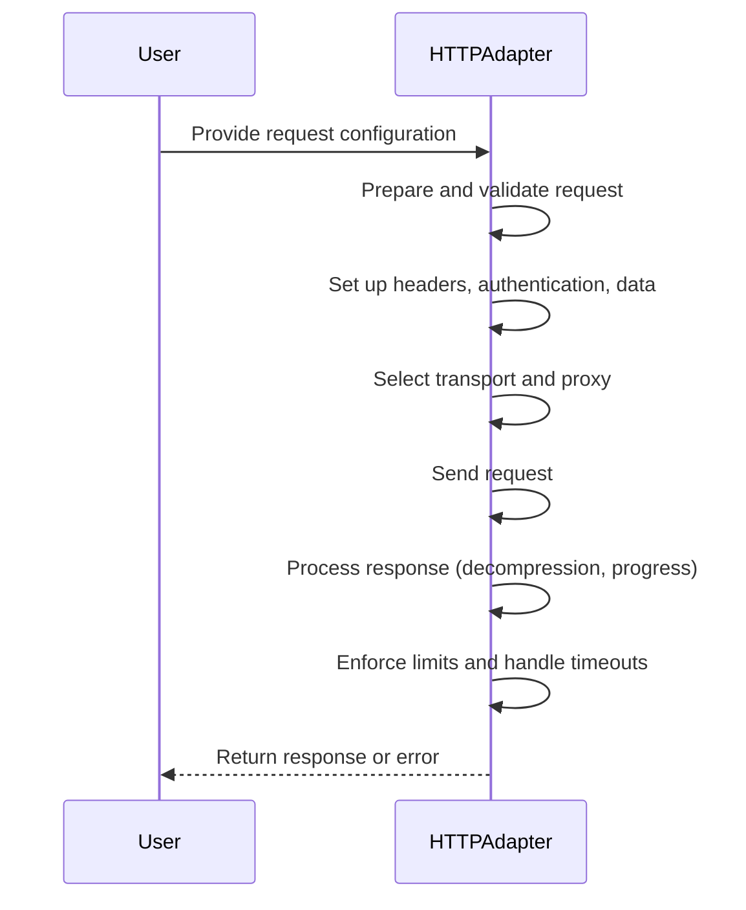
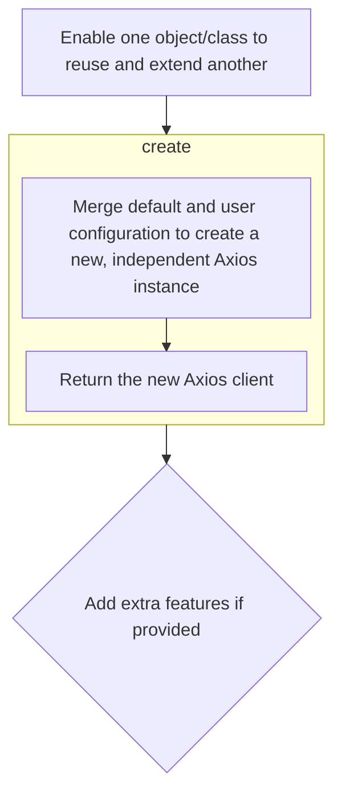
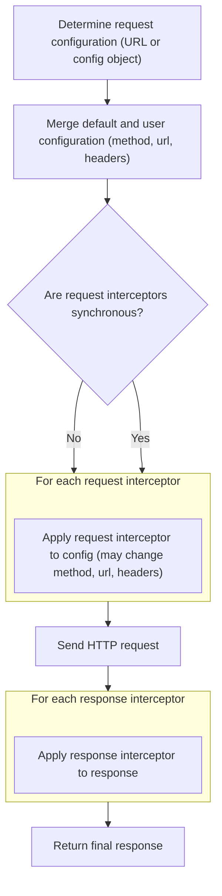
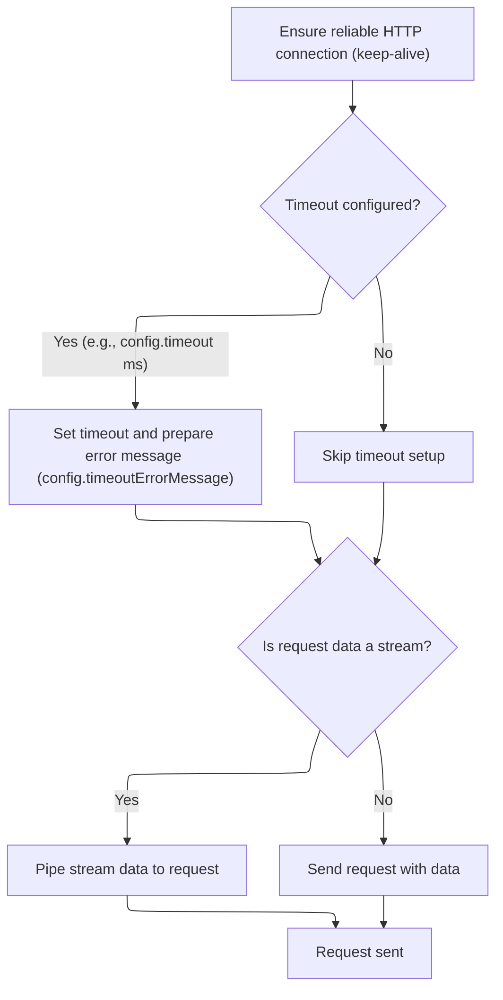

The HTTP request adapter flow takes a user's configuration and manages the entire lifecycle of an HTTP request, from preparation and protocol validation to sending the request and processing the response. It handles headers, authentication, data serialization, transport selection, and advanced features like cancellation and progress tracking. The flow ensures limits and timeouts are respected, returning either the response data or a detailed error.

Main steps:

- Prepare and validate the HTTP request
- Set up headers, authentication, and data
- Select transport and proxy
- Send the request and process the response
- Enforce limits and handle timeouts
- Return response or error



# Spec

## Detailed View of the Program's Functionality

# a. Preparing and Validating HTTP Request Config

The HTTP adapter begins by preparing the HTTP request using the configuration provided by the user. This includes extracting the HTTP method, URL, request data, headers, and other options such as DNS lookup, family, response type, and encoding.

- If a custom DNS lookup function is provided, it is wrapped to ensure compatibility with <SwmToken path="lib/adapters/http.js" pos="558:25:27" line-data="            // stream.destroy() emit aborted event before calling reject() on Node.js v16">`Node.js`</SwmToken> options.
- An internal event emitter is set up to handle cancellation and cleanup.
- Cancellation tokens and abort signals are subscribed to, so the request can be aborted if needed.
- The full URL is constructed by combining the base URL and the request URL, and then parsed to extract the protocol and other components.

Next, the adapter checks if the protocol is <SwmToken path="lib/adapters/http.js" pos="235:9:10" line-data="    if (protocol === &#39;data:&#39;) {">`data:`</SwmToken>:

- If it is, and the method is not <SwmToken path="lib/adapters/http.js" pos="238:9:9" line-data="      if (method !== &#39;GET&#39;) {">`GET`</SwmToken>, it immediately returns a 405 error (method not allowed).
- Otherwise, it attempts to decode the data URI into the appropriate format (text, blob, or stream) based on the response type. If decoding fails, it throws a "bad request" error.
- The decoded data is returned as a successful response with status 200.

If the protocol is not <SwmToken path="lib/adapters/http.js" pos="235:9:10" line-data="    if (protocol === &#39;data:&#39;) {">`data:`</SwmToken>, the adapter checks if the protocol is supported (e.g., <SwmToken path="lib/adapters/http.js" pos="416:6:7" line-data="      agents: { http: config.httpAgent, https: config.httpsAgent },">`http:`</SwmToken>, <SwmToken path="lib/adapters/http.js" pos="416:14:15" line-data="      agents: { http: config.httpAgent, https: config.httpsAgent },">`https:`</SwmToken>). If not, it rejects the request with an "unsupported protocol" error.

# b. Serializing Error Details

When an error occurs (such as an unsupported protocol or a data transformation issue), the error is wrapped in a custom error object. This object includes not only the error message and stack trace, but also the request configuration, error code, and (if available) the request and response objects. The error object provides a <SwmToken path="lib/adapters/http.js" pos="415:6:6" line-data="      headers: headers.toJSON(),">`toJSON`</SwmToken> method to serialize all relevant details for logging or transmission.

# c. Setting Up Error Inheritance

The custom error class is set up to inherit from the standard error object, ensuring it behaves like a native error but with additional Axios-specific properties. This is done by creating a new prototype chain, assigning the constructor, and adding any extra properties needed for Axios errors.

# d. Creating Custom Axios Instances

The Axios library allows users to create new instances with their own default configurations. This is achieved by merging the default and user-provided configurations and then creating a new Axios instance. Each instance is a callable function with all Axios methods and properties attached, including the ability to create further customized instances.

# e. Building and Sending the HTTP Request

After validation, the adapter prepares the request for sending:

- It determines whether to connect via a UNIX socket or a standard hostname/port.
- Proxy settings are applied if needed, including proxy authentication.
- The appropriate transport (HTTP, HTTPS, or a custom transport) is selected, and redirect handling is configured.
- The maximum body length and other options are set.
- The request is created using the selected transport.

When the response is received:

- If download progress tracking or rate limiting is enabled, a transform stream is added to the response pipeline.
- If the response is compressed (gzip, deflate, brotli), the appropriate decompression stream is added.
- If the response type is <SwmToken path="lib/adapters/http.js" pos="261:13:13" line-data="      } else if (responseType === &#39;stream&#39;) {">`stream`</SwmToken>, the response stream is returned directly.
- Otherwise, the response data is buffered. If the response exceeds the maximum allowed content length, the request is aborted and an error is returned.
- When the response ends, the buffered data is converted to the appropriate format (string or array buffer), and the response is returned.

# f. Normalizing and Delegating the Request

The Axios core logic receives the request configuration and normalizes it:

- If the user provided a URL string, it is converted into a config object.
- The default and user configurations are merged.
- Request interceptors are applied in order. If all are synchronous, they are run in sequence; otherwise, they are chained as promises.
- After interceptors, the request is dispatched using the HTTP adapter.
- Response interceptors are then applied in order, allowing the response to be transformed before it is returned to the user.

If an error occurs during the request, Axios attempts to append its own stack trace to the error, making debugging easier for the user.

# g. Managing Timeouts and Sending Data

Before sending the request:

- TCP keep-alive is enabled on the socket to prevent dropped connections.
- If a timeout is configured, it is set on the request. If the timeout is exceeded, the request is aborted and an appropriate error is returned.
- If the request data is a stream, it is piped into the request, with handlers for end, error, and close events to ensure proper cleanup and error reporting.
- If the data is not a stream, it is sent directly with the request.

Once the request is sent, the adapter waits for the response or any errors, and then resolves or rejects the promise accordingly.

# Rule Definition

| Paragraph Name                                                                                                                                                                                                                                                                                                                                                                                                                                                                                                                                                                                                                                                                                   | Rule ID | Category          | Description                                                                                                                                                                                                                                                                                                                                                                                                                                                                                                                                                                                                                                                                                                                                                                                                                                                                                                                                                                                                                                                                                                                                                                                                                                                                                                                           | Conditions                                                                                                                                                                                                                                                                                                                                                                                                                | Remarks                                                                                                                                                                                                                                                                                                                                                                                                                                                               |
| ------------------------------------------------------------------------------------------------------------------------------------------------------------------------------------------------------------------------------------------------------------------------------------------------------------------------------------------------------------------------------------------------------------------------------------------------------------------------------------------------------------------------------------------------------------------------------------------------------------------------------------------------------------------------------------------------ | ------- | ----------------- | ------------------------------------------------------------------------------------------------------------------------------------------------------------------------------------------------------------------------------------------------------------------------------------------------------------------------------------------------------------------------------------------------------------------------------------------------------------------------------------------------------------------------------------------------------------------------------------------------------------------------------------------------------------------------------------------------------------------------------------------------------------------------------------------------------------------------------------------------------------------------------------------------------------------------------------------------------------------------------------------------------------------------------------------------------------------------------------------------------------------------------------------------------------------------------------------------------------------------------------------------------------------------------------------------------------------------------------- | ------------------------------------------------------------------------------------------------------------------------------------------------------------------------------------------------------------------------------------------------------------------------------------------------------------------------------------------------------------------------------------------------------------------------- | --------------------------------------------------------------------------------------------------------------------------------------------------------------------------------------------------------------------------------------------------------------------------------------------------------------------------------------------------------------------------------------------------------------------------------------------------------------------- |
| <SwmPath>[lib/core/Axios.js](lib/core/Axios.js)</SwmPath>: request(), \_request()                                                                                                                                                                                                                                                                                                                                                                                                                                                                                                                                                                                                                | RL-001  | Conditional Logic | The main request function must accept either a configuration object or a URL string as the first argument. If a URL string is provided, it is combined with an optional configuration object to form the complete request configuration.                                                                                                                                                                                                                                                                                                                                                                                                                                                                                                                                                                                                                                                                                                                                                                                                                                                                                                                                                                                                                                                                                              | The first argument to the request function is either a string (URL) or an object (configuration).                                                                                                                                                                                                                                                                                                                         | If a string is provided, it is assigned to the 'url' field of the configuration. If an object is provided, it is used directly.                                                                                                                                                                                                                                                                                                                                       |
| <SwmPath>[lib/core/Axios.js](lib/core/Axios.js)</SwmPath>: \_request(), <SwmPath>[lib/adapters/http.js](lib/adapters/http.js)</SwmPath>: httpAdapter()                                                                                                                                                                                                                                                                                                                                                                                                                                                                                                                                           | RL-002  | Data Assignment   | The request configuration object supports fields such as method, url, <SwmToken path="lib/adapters/http.js" pos="231:11:11" line-data="    const fullPath = buildFullPath(config.baseURL, config.url, config.allowAbsoluteUrls);">`baseURL`</SwmToken>, headers, params, data, timeout, auth, <SwmToken path="lib/adapters/http.js" pos="172:4:4" line-data="    const {responseType, responseEncoding} = config;">`responseType`</SwmToken>, <SwmToken path="lib/adapters/http.js" pos="290:4:4" line-data="    const {onUploadProgress, onDownloadProgress} = config;">`onUploadProgress`</SwmToken>, <SwmToken path="lib/adapters/http.js" pos="290:7:7" line-data="    const {onUploadProgress, onDownloadProgress} = config;">`onDownloadProgress`</SwmToken>, <SwmToken path="lib/adapters/http.js" pos="198:6:6" line-data="      if (config.cancelToken) {">`cancelToken`</SwmToken>, signal, <SwmToken path="lib/adapters/http.js" pos="339:6:6" line-data="      if (config.maxBodyLength &gt; -1 &amp;&amp; data.length &gt; config.maxBodyLength) {">`maxBodyLength`</SwmToken>, <SwmToken path="lib/adapters/http.js" pos="556:21:21" line-data="          // make sure the content length is not over the maxContentLength if specified">`maxContentLength`</SwmToken>, and passes through additional advanced options. | A configuration object is provided for the request.                                                                                                                                                                                                                                                                                                                                                                       | Default method is 'get'. <SwmToken path="lib/adapters/http.js" pos="172:4:4" line-data="    const {responseType, responseEncoding} = config;">`responseType`</SwmToken> default is 'json'. Additional fields are passed through to the adapter.                                                                                                                                                                                                                       |
| <SwmPath>[lib/core/Axios.js](lib/core/Axios.js)</SwmPath>: request(), \_request(), <SwmPath>[lib/adapters/http.js](lib/adapters/http.js)</SwmPath>: httpAdapter()                                                                                                                                                                                                                                                                                                                                                                                                                                                                                                                                | RL-003  | Computation       | The request function returns a Promise that resolves to a response object or rejects with an error object.                                                                                                                                                                                                                                                                                                                                                                                                                                                                                                                                                                                                                                                                                                                                                                                                                                                                                                                                                                                                                                                                                                                                                                                                                            | A request is initiated.                                                                                                                                                                                                                                                                                                                                                                                                   | Promise resolves with a response object or rejects with an error object.                                                                                                                                                                                                                                                                                                                                                                                              |
| <SwmPath>[lib/adapters/http.js](lib/adapters/http.js)</SwmPath>: handleResponse()                                                                                                                                                                                                                                                                                                                                                                                                                                                                                                                                                                                                                | RL-004  | Data Assignment   | The response object must include data, status, <SwmToken path="lib/adapters/http.js" pos="241:1:1" line-data="          statusText: &#39;method not allowed&#39;,">`statusText`</SwmToken>, headers, config, and request fields.                                                                                                                                                                                                                                                                                                                                                                                                                                                                                                                                                                                                                                                                                                                                                                                                                                                                                                                                                                                                                                                                                                      | A request completes successfully.                                                                                                                                                                                                                                                                                                                                                                                         | data: response body (type depends on <SwmToken path="lib/adapters/http.js" pos="172:4:4" line-data="    const {responseType, responseEncoding} = config;">`responseType`</SwmToken>), status: integer, <SwmToken path="lib/adapters/http.js" pos="241:1:1" line-data="          statusText: &#39;method not allowed&#39;,">`statusText`</SwmToken>: string, headers: object, config: request config, request: underlying request object.                              |
| <SwmPath>[lib/core/AxiosError.js](lib/core/AxiosError.js)</SwmPath>: <SwmToken path="lib/adapters/http.js" pos="252:3:3" line-data="        throw AxiosError.from(err, AxiosError.ERR_BAD_REQUEST, config);">`AxiosError`</SwmToken>, <SwmToken path="lib/adapters/http.js" pos="415:6:6" line-data="      headers: headers.toJSON(),">`toJSON`</SwmToken>, from                                                                                                                                                                                                                                                                                                                                 | RL-005  | Data Assignment   | If a request fails, the error object must serialize via <SwmToken path="lib/adapters/http.js" pos="415:6:6" line-data="      headers: headers.toJSON(),">`toJSON`</SwmToken> to include message, name, description, number, <SwmToken path="lib/core/AxiosError.js" pos="46:1:1" line-data="      fileName: this.fileName,">`fileName`</SwmToken>, <SwmToken path="lib/core/AxiosError.js" pos="47:1:1" line-data="      lineNumber: this.lineNumber,">`lineNumber`</SwmToken>, <SwmToken path="lib/core/AxiosError.js" pos="48:1:1" line-data="      columnNumber: this.columnNumber,">`columnNumber`</SwmToken>, stack, config, code, and status.                                                                                                                                                                                                                                                                                                                                                                                                                                                                                                                                                                                                                                                                                   | A request fails and an error is thrown.                                                                                                                                                                                                                                                                                                                                                                                   | Error object fields as specified. <SwmToken path="lib/adapters/http.js" pos="415:6:6" line-data="      headers: headers.toJSON(),">`toJSON`</SwmToken> method produces a plain object with these fields.                                                                                                                                                                                                                                                              |
| <SwmPath>[lib/core/Axios.js](lib/core/Axios.js)</SwmPath>: constructor, \_request(), <SwmPath>[lib/core/InterceptorManager.js](lib/core/InterceptorManager.js)</SwmPath>                                                                                                                                                                                                                                                                                                                                                                                                                                                                                                                         | RL-006  | Conditional Logic | Interceptors can be registered via an interceptors property. Request interceptors run in reverse registration order; response interceptors run in registration order. Synchronous request interceptors run synchronously; if any are async, all run as a promise chain.                                                                                                                                                                                                                                                                                                                                                                                                                                                                                                                                                                                                                                                                                                                                                                                                                                                                                                                                                                                                                                                               | Interceptors are registered and a request is made.                                                                                                                                                                                                                                                                                                                                                                        | Interceptors registered with use(<SwmToken path="lib/core/Axios.js" pos="176:3:3" line-data="      const onFulfilled = requestInterceptorChain[i++];">`onFulfilled`</SwmToken>, <SwmToken path="lib/core/Axios.js" pos="177:3:3" line-data="      const onRejected = requestInterceptorChain[i++];">`onRejected`</SwmToken>, options).                                                                                                                                |
| <SwmPath>[lib/adapters/http.js](lib/adapters/http.js)</SwmPath>: httpAdapter() (protocol === 'data:')                                                                                                                                                                                                                                                                                                                                                                                                                                                                                                                                                                                            | RL-007  | Conditional Logic | If the request URL protocol is 'data:', process the data URI and return a response object without making a network request.                                                                                                                                                                                                                                                                                                                                                                                                                                                                                                                                                                                                                                                                                                                                                                                                                                                                                                                                                                                                                                                                                                                                                                                                           | Request URL protocol is 'data:'.                                                                                                                                                                                                                                                                                                                                                                                          | Only GET method is allowed for data URIs. Response is built from the data URI.                                                                                                                                                                                                                                                                                                                                                                                        |
| <SwmPath>[lib/adapters/http.js](lib/adapters/http.js)</SwmPath>: httpAdapter() (<SwmToken path="lib/adapters/http.js" pos="233:13:13" line-data="    const protocol = parsed.protocol \|\| supportedProtocols[0];">`supportedProtocols`</SwmToken> check)                                                                                                                                                                                                                                                                                                                                                                                                                                        | RL-008  | Conditional Logic | If the protocol is not supported, reject the request with an error indicating 'Unsupported protocol'.                                                                                                                                                                                                                                                                                                                                                                                                                                                                                                                                                                                                                                                                                                                                                                                                                                                                                                                                                                                                                                                                                                                                                                                                                                 | Request URL protocol is not in <SwmToken path="lib/adapters/http.js" pos="233:13:13" line-data="    const protocol = parsed.protocol \|\| supportedProtocols[0];">`supportedProtocols`</SwmToken>.                                                                                                                                                                                                                        | Error code is <SwmToken path="lib/adapters/http.js" pos="252:10:12" line-data="        throw AxiosError.from(err, AxiosError.ERR_BAD_REQUEST, config);">`AxiosError.ERR_BAD_REQUEST`</SwmToken>.                                                                                                                                                                                                                                                                      |
| <SwmPath>[lib/adapters/http.js](lib/adapters/http.js)</SwmPath>: httpAdapter() (<SwmToken path="lib/adapters/http.js" pos="288:1:3" line-data="    headers.set(&#39;User-Agent&#39;, &#39;axios/&#39; + VERSION, false);">`headers.set`</SwmToken>(<SwmToken path="lib/adapters/http.js" pos="284:5:7" line-data="    // Set User-Agent (required by some servers)">`User-Agent`</SwmToken>), <SwmToken path="lib/adapters/http.js" pos="288:1:3" line-data="    headers.set(&#39;User-Agent&#39;, &#39;axios/&#39; + VERSION, false);">`headers.set`</SwmToken>(<SwmToken path="lib/adapters/http.js" pos="408:2:4" line-data="      &#39;Accept-Encoding&#39;,">`Accept-Encoding`</SwmToken>)) | RL-009  | Data Assignment   | Automatically set standard headers such as <SwmToken path="lib/adapters/http.js" pos="284:5:7" line-data="    // Set User-Agent (required by some servers)">`User-Agent`</SwmToken> and <SwmToken path="lib/adapters/http.js" pos="408:2:4" line-data="      &#39;Accept-Encoding&#39;,">`Accept-Encoding`</SwmToken> if not provided by the user.                                                                                                                                                                                                                                                                                                                                                                                                                                                                                                                                                                                                                                                                                                                                                                                                                                                                                                                                                                                    | Request is being prepared and headers are not set by user.                                                                                                                                                                                                                                                                                                                                                                | <SwmToken path="lib/adapters/http.js" pos="284:5:7" line-data="    // Set User-Agent (required by some servers)">`User-Agent`</SwmToken>: 'axios/' + VERSION. <SwmToken path="lib/adapters/http.js" pos="408:2:4" line-data="      &#39;Accept-Encoding&#39;,">`Accept-Encoding`</SwmToken>: 'gzip, compress, deflate, br' if brotli supported.                                                                                                                       |
| <SwmPath>[lib/adapters/http.js](lib/adapters/http.js)</SwmPath>: httpAdapter() (<SwmToken path="lib/adapters/http.js" pos="290:4:4" line-data="    const {onUploadProgress, onDownloadProgress} = config;">`onUploadProgress`</SwmToken>, <SwmToken path="lib/adapters/http.js" pos="290:7:7" line-data="    const {onUploadProgress, onDownloadProgress} = config;">`onDownloadProgress`</SwmToken>)                                                                                                                                                                                                                                                                                            | RL-010  | Computation       | Support progress tracking for uploads and downloads via provided callbacks.                                                                                                                                                                                                                                                                                                                                                                                                                                                                                                                                                                                                                                                                                                                                                                                                                                                                                                                                                                                                                                                                                                                                                                                                                                                           | <SwmToken path="lib/adapters/http.js" pos="290:4:4" line-data="    const {onUploadProgress, onDownloadProgress} = config;">`onUploadProgress`</SwmToken> or <SwmToken path="lib/adapters/http.js" pos="290:7:7" line-data="    const {onUploadProgress, onDownloadProgress} = config;">`onDownloadProgress`</SwmToken> callback is provided in config.                                                                    | Progress events are emitted during upload/download.                                                                                                                                                                                                                                                                                                                                                                                                                   |
| <SwmPath>[lib/adapters/http.js](lib/adapters/http.js)</SwmPath>: httpAdapter() (<SwmToken path="lib/adapters/http.js" pos="556:21:21" line-data="          // make sure the content length is not over the maxContentLength if specified">`maxContentLength`</SwmToken>, <SwmToken path="lib/adapters/http.js" pos="339:6:6" line-data="      if (config.maxBodyLength &gt; -1 &amp;&amp; data.length &gt; config.maxBodyLength) {">`maxBodyLength`</SwmToken> checks)                                                                                                                                                                                                                           | RL-011  | Conditional Logic | Reject the request or response if the body or content length exceeds <SwmToken path="lib/adapters/http.js" pos="339:6:6" line-data="      if (config.maxBodyLength &gt; -1 &amp;&amp; data.length &gt; config.maxBodyLength) {">`maxBodyLength`</SwmToken> or <SwmToken path="lib/adapters/http.js" pos="556:21:21" line-data="          // make sure the content length is not over the maxContentLength if specified">`maxContentLength`</SwmToken>.                                                                                                                                                                                                                                                                                                                                                                                                                                                                                                                                                                                                                                                                                                                                                                                                                                                                                | <SwmToken path="lib/adapters/http.js" pos="339:6:6" line-data="      if (config.maxBodyLength &gt; -1 &amp;&amp; data.length &gt; config.maxBodyLength) {">`maxBodyLength`</SwmToken> or <SwmToken path="lib/adapters/http.js" pos="556:21:21" line-data="          // make sure the content length is not over the maxContentLength if specified">`maxContentLength`</SwmToken> is set and exceeded.                     | <SwmToken path="lib/adapters/http.js" pos="339:6:6" line-data="      if (config.maxBodyLength &gt; -1 &amp;&amp; data.length &gt; config.maxBodyLength) {">`maxBodyLength`</SwmToken> and <SwmToken path="lib/adapters/http.js" pos="556:21:21" line-data="          // make sure the content length is not over the maxContentLength if specified">`maxContentLength`</SwmToken> are integers in bytes. -1 means unlimited.                                          |
| <SwmPath>[lib/adapters/http.js](lib/adapters/http.js)</SwmPath>: httpAdapter() (decompress, <SwmToken path="lib/adapters/http.js" pos="494:19:21" line-data="      if (config.decompress !== false &amp;&amp; res.headers[&#39;content-encoding&#39;]) {">`content-encoding`</SwmToken>)                                                                                                                                                                                                                                                                                                                                                                                                         | RL-012  | Conditional Logic | If decompress is enabled and the response includes an encoding, decompress the response before returning it.                                                                                                                                                                                                                                                                                                                                                                                                                                                                                                                                                                                                                                                                                                                                                                                                                                                                                                                                                                                                                                                                                                                                                                                                                          | <SwmToken path="lib/adapters/http.js" pos="494:4:6" line-data="      if (config.decompress !== false &amp;&amp; res.headers[&#39;content-encoding&#39;]) {">`config.decompress`</SwmToken> !== false and response has <SwmToken path="lib/adapters/http.js" pos="494:19:21" line-data="      if (config.decompress !== false &amp;&amp; res.headers[&#39;content-encoding&#39;]) {">`content-encoding`</SwmToken> header. | Supports gzip, deflate, br (if supported).                                                                                                                                                                                                                                                                                                                                                                                                                            |
| <SwmPath>[lib/adapters/http.js](lib/adapters/http.js)</SwmPath>: httpAdapter() (<SwmToken path="lib/adapters/http.js" pos="172:4:4" line-data="    const {responseType, responseEncoding} = config;">`responseType`</SwmToken> === 'stream', else)                                                                                                                                                                                                                                                                                                                                                                                                                                               | RL-013  | Conditional Logic | If <SwmToken path="lib/adapters/http.js" pos="172:4:4" line-data="    const {responseType, responseEncoding} = config;">`responseType`</SwmToken> is 'stream', return response as a stream object. Otherwise, return as buffer or parsed data.                                                                                                                                                                                                                                                                                                                                                                                                                                                                                                                                                                                                                                                                                                                                                                                                                                                                                                                                                                                                                                                                                        | <SwmToken path="lib/adapters/http.js" pos="172:4:4" line-data="    const {responseType, responseEncoding} = config;">`responseType`</SwmToken> is set in config.                                                                                                                                                                                                                                                          | <SwmToken path="lib/adapters/http.js" pos="172:4:4" line-data="    const {responseType, responseEncoding} = config;">`responseType`</SwmToken>: 'stream', 'arraybuffer', 'json', 'text'.                                                                                                                                                                                                                                                                              |
| <SwmPath>[lib/adapters/http.js](lib/adapters/http.js)</SwmPath>: httpAdapter() (<SwmToken path="lib/adapters/http.js" pos="617:1:3" line-data="    req.on(&#39;error&#39;, function handleRequestError(err) {">`req.on`</SwmToken>('socket', ... <SwmToken path="lib/adapters/http.js" pos="626:3:3" line-data="      socket.setKeepAlive(true, 1000 * 60);">`setKeepAlive`</SwmToken>))                                                                                                                                                                                                                                                                                                         | RL-014  | Computation       | Enable TCP keep-alive on HTTP request sockets.                                                                                                                                                                                                                                                                                                                                                                                                                                                                                                                                                                                                                                                                                                                                                                                                                                                                                                                                                                                                                                                                                                                                                                                                                                                                                        | A request is made using the HTTP adapter.                                                                                                                                                                                                                                                                                                                                                                                 | Keep-alive interval is set to 60 seconds.                                                                                                                                                                                                                                                                                                                                                                                                                             |
| <SwmPath>[lib/adapters/http.js](lib/adapters/http.js)</SwmPath>: httpAdapter() (<SwmToken path="lib/adapters/http.js" pos="630:4:6" line-data="    if (config.timeout) {">`config.timeout`</SwmToken>, <SwmToken path="lib/adapters/http.js" pos="650:1:3" line-data="      req.setTimeout(timeout, function handleRequestTimeout() {">`req.setTimeout`</SwmToken>)                                                                                                                                                                                                                                                                                                                              | RL-015  | Conditional Logic | If a timeout is specified, enforce it and reject the request with an error if exceeded.                                                                                                                                                                                                                                                                                                                                                                                                                                                                                                                                                                                                                                                                                                                                                                                                                                                                                                                                                                                                                                                                                                                                                                                                                                               | <SwmToken path="lib/adapters/http.js" pos="630:4:6" line-data="    if (config.timeout) {">`config.timeout`</SwmToken> is set.                                                                                                                                                                                                                                                                                             | Timeout is in milliseconds. Error code is <SwmToken path="lib/adapters/http.js" pos="659:7:9" line-data="          transitional.clarifyTimeoutError ? AxiosError.ETIMEDOUT : AxiosError.ECONNABORTED,">`AxiosError.ETIMEDOUT`</SwmToken> or <SwmToken path="lib/adapters/http.js" pos="659:13:15" line-data="          transitional.clarifyTimeoutError ? AxiosError.ETIMEDOUT : AxiosError.ECONNABORTED,">`AxiosError.ECONNABORTED`</SwmToken>.                      |
| <SwmPath>[lib/adapters/http.js](lib/adapters/http.js)</SwmPath>: httpAdapter() (if data is stream, <SwmToken path="lib/adapters/http.js" pos="688:1:3" line-data="      data.pipe(req);">`data.pipe`</SwmToken>(req))                                                                                                                                                                                                                                                                                                                                                                                                                                                                            | RL-016  | Computation       | If the request data is a stream, pipe it to the request body.                                                                                                                                                                                                                                                                                                                                                                                                                                                                                                                                                                                                                                                                                                                                                                                                                                                                                                                                                                                                                                                                                                                                                                                                                                                                         | Request data is a stream.                                                                                                                                                                                                                                                                                                                                                                                                 | Supports <SwmToken path="lib/adapters/http.js" pos="558:25:27" line-data="            // stream.destroy() emit aborted event before calling reject() on Node.js v16">`Node.js`</SwmToken> streams.                                                                                                                                                                                                                                                                    |
| <SwmPath>[lib/axios.js](lib/axios.js)</SwmPath>: createInstance(), <SwmPath>[lib/core/Axios.js](lib/core/Axios.js)</SwmPath>: constructor                                                                                                                                                                                                                                                                                                                                                                                                                                                                                                                                                        | RL-017  | Computation       | Allow creation of independent client instances with merged default and user configurations, each with separate interceptors and settings.                                                                                                                                                                                                                                                                                                                                                                                                                                                                                                                                                                                                                                                                                                                                                                                                                                                                                                                                                                                                                                                                                                                                                                                             | instance.create() is called with new configuration.                                                                                                                                                                                                                                                                                                                                                                       | Each instance has its own defaults and interceptors.                                                                                                                                                                                                                                                                                                                                                                                                                  |
| <SwmPath>[lib/core/AxiosError.js](lib/core/AxiosError.js)</SwmPath>: <SwmToken path="lib/adapters/http.js" pos="252:3:3" line-data="        throw AxiosError.from(err, AxiosError.ERR_BAD_REQUEST, config);">`AxiosError`</SwmToken>, inherits, <SwmToken path="lib/adapters/http.js" pos="415:6:6" line-data="      headers: headers.toJSON(),">`toJSON`</SwmToken>                                                                                                                                                                                                                                                                                                                             | RL-018  | Data Assignment   | Custom error classes must inherit from Error, include all standard error properties, and provide a <SwmToken path="lib/adapters/http.js" pos="415:6:6" line-data="      headers: headers.toJSON(),">`toJSON`</SwmToken> method for serialization.                                                                                                                                                                                                                                                                                                                                                                                                                                                                                                                                                                                                                                                                                                                                                                                                                                                                                                                                                                                                                                                                                     | An <SwmToken path="lib/adapters/http.js" pos="252:3:3" line-data="        throw AxiosError.from(err, AxiosError.ERR_BAD_REQUEST, config);">`AxiosError`</SwmToken> is created.                                                                                                                                                                                                                                            | Error fields: message, name, description, number, <SwmToken path="lib/core/AxiosError.js" pos="46:1:1" line-data="      fileName: this.fileName,">`fileName`</SwmToken>, <SwmToken path="lib/core/AxiosError.js" pos="47:1:1" line-data="      lineNumber: this.lineNumber,">`lineNumber`</SwmToken>, <SwmToken path="lib/core/AxiosError.js" pos="48:1:1" line-data="      columnNumber: this.columnNumber,">`columnNumber`</SwmToken>, stack, config, code, status. |
| <SwmPath>[lib/core/Axios.js](lib/core/Axios.js)</SwmPath>: request() (catch block)                                                                                                                                                                                                                                                                                                                                                                                                                                                                                                                                                                                                               | RL-019  | Computation       | Enhance error stack traces by appending the stack trace of the request initiation point to the error.                                                                                                                                                                                                                                                                                                                                                                                                                                                                                                                                                                                                                                                                                                                                                                                                                                                                                                                                                                                                                                                                                                                                                                                                                                 | An error is thrown during request execution.                                                                                                                                                                                                                                                                                                                                                                              | Appends stack trace if possible.                                                                                                                                                                                                                                                                                                                                                                                                                                      |
| <SwmPath>[lib/axios.js](lib/axios.js)</SwmPath>: createInstance(), <SwmToken path="lib/axios.js" pos="39:1:3" line-data="  instance.create = function create(instanceConfig) {">`instance.create`</SwmToken>                                                                                                                                                                                                                                                                                                                                                                                                                                                                                     | RL-020  | Computation       | Allow creation of new client instances via a create() method, merging current instance configuration with new configuration.                                                                                                                                                                                                                                                                                                                                                                                                                                                                                                                                                                                                                                                                                                                                                                                                                                                                                                                                                                                                                                                                                                                                                                                                          | instance.create() is called.                                                                                                                                                                                                                                                                                                                                                                                              | Returns a new Axios instance with merged configuration.                                                                                                                                                                                                                                                                                                                                                                                                               |

# User Stories

## User Story 1: Initiate HTTP requests with flexible configuration and interceptors

---

### Story Description:

As a user, I want to initiate HTTP requests by providing either a URL string or a configuration object, and customize requests and responses using interceptors, so that I can flexibly specify my request details and implement cross-cutting concerns like authentication, logging, or error handling.

---

### Business Rule Mapping:

| Rule ID | Paragraph Name                                                                                                                                                           | Rule Description                                                                                                                                                                                                                                                                                                                                                                                                                                                                                                                                                                                                                                                                                                                                                                                                                                                                                                                                                                                                                                                                                                                                                                                                                                                                                                                      |
| ------- | ------------------------------------------------------------------------------------------------------------------------------------------------------------------------ | ------------------------------------------------------------------------------------------------------------------------------------------------------------------------------------------------------------------------------------------------------------------------------------------------------------------------------------------------------------------------------------------------------------------------------------------------------------------------------------------------------------------------------------------------------------------------------------------------------------------------------------------------------------------------------------------------------------------------------------------------------------------------------------------------------------------------------------------------------------------------------------------------------------------------------------------------------------------------------------------------------------------------------------------------------------------------------------------------------------------------------------------------------------------------------------------------------------------------------------------------------------------------------------------------------------------------------------- |
| RL-001  | <SwmPath>[lib/core/Axios.js](lib/core/Axios.js)</SwmPath>: request(), \_request()                                                                                        | The main request function must accept either a configuration object or a URL string as the first argument. If a URL string is provided, it is combined with an optional configuration object to form the complete request configuration.                                                                                                                                                                                                                                                                                                                                                                                                                                                                                                                                                                                                                                                                                                                                                                                                                                                                                                                                                                                                                                                                                              |
| RL-003  | <SwmPath>[lib/core/Axios.js](lib/core/Axios.js)</SwmPath>: request(), \_request(), <SwmPath>[lib/adapters/http.js](lib/adapters/http.js)</SwmPath>: httpAdapter()        | The request function returns a Promise that resolves to a response object or rejects with an error object.                                                                                                                                                                                                                                                                                                                                                                                                                                                                                                                                                                                                                                                                                                                                                                                                                                                                                                                                                                                                                                                                                                                                                                                                                            |
| RL-002  | <SwmPath>[lib/core/Axios.js](lib/core/Axios.js)</SwmPath>: \_request(), <SwmPath>[lib/adapters/http.js](lib/adapters/http.js)</SwmPath>: httpAdapter()                   | The request configuration object supports fields such as method, url, <SwmToken path="lib/adapters/http.js" pos="231:11:11" line-data="    const fullPath = buildFullPath(config.baseURL, config.url, config.allowAbsoluteUrls);">`baseURL`</SwmToken>, headers, params, data, timeout, auth, <SwmToken path="lib/adapters/http.js" pos="172:4:4" line-data="    const {responseType, responseEncoding} = config;">`responseType`</SwmToken>, <SwmToken path="lib/adapters/http.js" pos="290:4:4" line-data="    const {onUploadProgress, onDownloadProgress} = config;">`onUploadProgress`</SwmToken>, <SwmToken path="lib/adapters/http.js" pos="290:7:7" line-data="    const {onUploadProgress, onDownloadProgress} = config;">`onDownloadProgress`</SwmToken>, <SwmToken path="lib/adapters/http.js" pos="198:6:6" line-data="      if (config.cancelToken) {">`cancelToken`</SwmToken>, signal, <SwmToken path="lib/adapters/http.js" pos="339:6:6" line-data="      if (config.maxBodyLength &gt; -1 &amp;&amp; data.length &gt; config.maxBodyLength) {">`maxBodyLength`</SwmToken>, <SwmToken path="lib/adapters/http.js" pos="556:21:21" line-data="          // make sure the content length is not over the maxContentLength if specified">`maxContentLength`</SwmToken>, and passes through additional advanced options. |
| RL-006  | <SwmPath>[lib/core/Axios.js](lib/core/Axios.js)</SwmPath>: constructor, \_request(), <SwmPath>[lib/core/InterceptorManager.js](lib/core/InterceptorManager.js)</SwmPath> | Interceptors can be registered via an interceptors property. Request interceptors run in reverse registration order; response interceptors run in registration order. Synchronous request interceptors run synchronously; if any are async, all run as a promise chain.                                                                                                                                                                                                                                                                                                                                                                                                                                                                                                                                                                                                                                                                                                                                                                                                                                                                                                                                                                                                                                                               |

---

### Relevant Functionality:

- <SwmPath>[lib/core/Axios.js](lib/core/Axios.js)</SwmPath>**: request()**
  1. **RL-001:**
     - If first argument is a string:
       - Set <SwmToken path="lib/adapters/http.js" pos="231:14:16" line-data="    const fullPath = buildFullPath(config.baseURL, config.url, config.allowAbsoluteUrls);">`config.url`</SwmToken> = first argument
       - Use second argument as config if provided
     - Else:
       - Use first argument as config
  2. **RL-003:**
     - Call <SwmToken path="lib/core/Axios.js" pos="155:8:8" line-data="      const chain = [dispatchRequest.bind(this), undefined];">`dispatchRequest`</SwmToken> or <SwmToken path="lib/adapters/http.js" pos="169:10:10" line-data="export default isHttpAdapterSupported &amp;&amp; function httpAdapter(config) {">`httpAdapter`</SwmToken>
     - Return a Promise
     - On success, resolve with response
     - On failure, reject with error
- <SwmPath>[lib/core/Axios.js](lib/core/Axios.js)</SwmPath>**: \_request()**
  1. **RL-002:**
     - Merge defaults and user config
     - Assign supported fields to config
     - Pass through any additional fields to the adapter
- <SwmPath>[lib/core/Axios.js](lib/core/Axios.js)</SwmPath>**: constructor**
  1. **RL-006:**
     - Register interceptors via interceptors.request.use and interceptors.response.use
     - On request:
       - Build chains for request and response interceptors
       - If all request interceptors are synchronous, run synchronously
       - Else, run as promise chain
       - Response interceptors always run as promise chain

## User Story 2: Receive structured responses and handle errors

---

### Story Description:

As a user, I want to receive structured response objects for successful requests and detailed error objects for failed requests, so that I can reliably process results and handle errors in my application.

---

### Business Rule Mapping:

| Rule ID | Paragraph Name                                                                                                                                                                                                                                                                                                                                                       | Rule Description                                                                                                                                                                                                                                                                                                                                                                                                                                                                                                                                                                                                                                    |
| ------- | -------------------------------------------------------------------------------------------------------------------------------------------------------------------------------------------------------------------------------------------------------------------------------------------------------------------------------------------------------------------- | --------------------------------------------------------------------------------------------------------------------------------------------------------------------------------------------------------------------------------------------------------------------------------------------------------------------------------------------------------------------------------------------------------------------------------------------------------------------------------------------------------------------------------------------------------------------------------------------------------------------------------------------------- |
| RL-004  | <SwmPath>[lib/adapters/http.js](lib/adapters/http.js)</SwmPath>: handleResponse()                                                                                                                                                                                                                                                                                    | The response object must include data, status, <SwmToken path="lib/adapters/http.js" pos="241:1:1" line-data="          statusText: &#39;method not allowed&#39;,">`statusText`</SwmToken>, headers, config, and request fields.                                                                                                                                                                                                                                                                                                                                                                                                                    |
| RL-005  | <SwmPath>[lib/core/AxiosError.js](lib/core/AxiosError.js)</SwmPath>: <SwmToken path="lib/adapters/http.js" pos="252:3:3" line-data="        throw AxiosError.from(err, AxiosError.ERR_BAD_REQUEST, config);">`AxiosError`</SwmToken>, <SwmToken path="lib/adapters/http.js" pos="415:6:6" line-data="      headers: headers.toJSON(),">`toJSON`</SwmToken>, from     | If a request fails, the error object must serialize via <SwmToken path="lib/adapters/http.js" pos="415:6:6" line-data="      headers: headers.toJSON(),">`toJSON`</SwmToken> to include message, name, description, number, <SwmToken path="lib/core/AxiosError.js" pos="46:1:1" line-data="      fileName: this.fileName,">`fileName`</SwmToken>, <SwmToken path="lib/core/AxiosError.js" pos="47:1:1" line-data="      lineNumber: this.lineNumber,">`lineNumber`</SwmToken>, <SwmToken path="lib/core/AxiosError.js" pos="48:1:1" line-data="      columnNumber: this.columnNumber,">`columnNumber`</SwmToken>, stack, config, code, and status. |
| RL-018  | <SwmPath>[lib/core/AxiosError.js](lib/core/AxiosError.js)</SwmPath>: <SwmToken path="lib/adapters/http.js" pos="252:3:3" line-data="        throw AxiosError.from(err, AxiosError.ERR_BAD_REQUEST, config);">`AxiosError`</SwmToken>, inherits, <SwmToken path="lib/adapters/http.js" pos="415:6:6" line-data="      headers: headers.toJSON(),">`toJSON`</SwmToken> | Custom error classes must inherit from Error, include all standard error properties, and provide a <SwmToken path="lib/adapters/http.js" pos="415:6:6" line-data="      headers: headers.toJSON(),">`toJSON`</SwmToken> method for serialization.                                                                                                                                                                                                                                                                                                                                                                                                   |
| RL-019  | <SwmPath>[lib/core/Axios.js](lib/core/Axios.js)</SwmPath>: request() (catch block)                                                                                                                                                                                                                                                                                   | Enhance error stack traces by appending the stack trace of the request initiation point to the error.                                                                                                                                                                                                                                                                                                                                                                                                                                                                                                                                               |

---

### Relevant Functionality:

- <SwmPath>[lib/adapters/http.js](lib/adapters/http.js)</SwmPath>**: handleResponse()**
  1. **RL-004:**
     - On response:
       - Build response object with required fields
       - Resolve promise with response object
- <SwmPath>[lib/core/AxiosError.js](lib/core/AxiosError.js)</SwmPath>**:** <SwmToken path="lib/adapters/http.js" pos="252:3:3" line-data="        throw AxiosError.from(err, AxiosError.ERR_BAD_REQUEST, config);">`AxiosError`</SwmToken>
  1. **RL-005:**
     - On error:
       - Create <SwmToken path="lib/adapters/http.js" pos="252:3:3" line-data="        throw AxiosError.from(err, AxiosError.ERR_BAD_REQUEST, config);">`AxiosError`</SwmToken> instance
       - Ensure <SwmToken path="lib/adapters/http.js" pos="415:6:6" line-data="      headers: headers.toJSON(),">`toJSON`</SwmToken> method returns required fields
  2. **RL-018:**
     - <SwmToken path="lib/adapters/http.js" pos="252:3:3" line-data="        throw AxiosError.from(err, AxiosError.ERR_BAD_REQUEST, config);">`AxiosError`</SwmToken> inherits from Error
     - <SwmToken path="lib/adapters/http.js" pos="415:6:6" line-data="      headers: headers.toJSON(),">`toJSON`</SwmToken> returns required fields
- <SwmPath>[lib/core/Axios.js](lib/core/Axios.js)</SwmPath>**: request() (catch block)**
  1. **RL-019:**
     - On error in request():
       - Capture stack trace at request initiation
       - Append to error.stack if not already present

## User Story 3: Support advanced HTTP behaviors and protocols

---

### Story Description:

As a user, I want the system to support advanced HTTP behaviors such as handling data URIs, rejecting unsupported protocols, setting standard headers, tracking upload/download progress, enforcing body/content length limits, decompressing responses, supporting streaming, enabling keep-alive, enforcing timeouts, and piping streams, so that I can build robust and efficient HTTP integrations.

---

### Business Rule Mapping:

| Rule ID | Paragraph Name                                                                                                                                                                                                                                                                                                                                                                                                                                                                                                                                                                                                                                                                                   | Rule Description                                                                                                                                                                                                                                                                                                                                                                                                                                       |
| ------- | ------------------------------------------------------------------------------------------------------------------------------------------------------------------------------------------------------------------------------------------------------------------------------------------------------------------------------------------------------------------------------------------------------------------------------------------------------------------------------------------------------------------------------------------------------------------------------------------------------------------------------------------------------------------------------------------------ | ------------------------------------------------------------------------------------------------------------------------------------------------------------------------------------------------------------------------------------------------------------------------------------------------------------------------------------------------------------------------------------------------------------------------------------------------------ |
| RL-007  | <SwmPath>[lib/adapters/http.js](lib/adapters/http.js)</SwmPath>: httpAdapter() (protocol === 'data:')                                                                                                                                                                                                                                                                                                                                                                                                                                                                                                                                                                                            | If the request URL protocol is 'data:', process the data URI and return a response object without making a network request.                                                                                                                                                                                                                                                                                                                            |
| RL-008  | <SwmPath>[lib/adapters/http.js](lib/adapters/http.js)</SwmPath>: httpAdapter() (<SwmToken path="lib/adapters/http.js" pos="233:13:13" line-data="    const protocol = parsed.protocol \|\| supportedProtocols[0];">`supportedProtocols`</SwmToken> check)                                                                                                                                                                                                                                                                                                                                                                                                                                        | If the protocol is not supported, reject the request with an error indicating 'Unsupported protocol'.                                                                                                                                                                                                                                                                                                                                                  |
| RL-009  | <SwmPath>[lib/adapters/http.js](lib/adapters/http.js)</SwmPath>: httpAdapter() (<SwmToken path="lib/adapters/http.js" pos="288:1:3" line-data="    headers.set(&#39;User-Agent&#39;, &#39;axios/&#39; + VERSION, false);">`headers.set`</SwmToken>(<SwmToken path="lib/adapters/http.js" pos="284:5:7" line-data="    // Set User-Agent (required by some servers)">`User-Agent`</SwmToken>), <SwmToken path="lib/adapters/http.js" pos="288:1:3" line-data="    headers.set(&#39;User-Agent&#39;, &#39;axios/&#39; + VERSION, false);">`headers.set`</SwmToken>(<SwmToken path="lib/adapters/http.js" pos="408:2:4" line-data="      &#39;Accept-Encoding&#39;,">`Accept-Encoding`</SwmToken>)) | Automatically set standard headers such as <SwmToken path="lib/adapters/http.js" pos="284:5:7" line-data="    // Set User-Agent (required by some servers)">`User-Agent`</SwmToken> and <SwmToken path="lib/adapters/http.js" pos="408:2:4" line-data="      &#39;Accept-Encoding&#39;,">`Accept-Encoding`</SwmToken> if not provided by the user.                                                                                                     |
| RL-010  | <SwmPath>[lib/adapters/http.js](lib/adapters/http.js)</SwmPath>: httpAdapter() (<SwmToken path="lib/adapters/http.js" pos="290:4:4" line-data="    const {onUploadProgress, onDownloadProgress} = config;">`onUploadProgress`</SwmToken>, <SwmToken path="lib/adapters/http.js" pos="290:7:7" line-data="    const {onUploadProgress, onDownloadProgress} = config;">`onDownloadProgress`</SwmToken>)                                                                                                                                                                                                                                                                                            | Support progress tracking for uploads and downloads via provided callbacks.                                                                                                                                                                                                                                                                                                                                                                            |
| RL-011  | <SwmPath>[lib/adapters/http.js](lib/adapters/http.js)</SwmPath>: httpAdapter() (<SwmToken path="lib/adapters/http.js" pos="556:21:21" line-data="          // make sure the content length is not over the maxContentLength if specified">`maxContentLength`</SwmToken>, <SwmToken path="lib/adapters/http.js" pos="339:6:6" line-data="      if (config.maxBodyLength &gt; -1 &amp;&amp; data.length &gt; config.maxBodyLength) {">`maxBodyLength`</SwmToken> checks)                                                                                                                                                                                                                           | Reject the request or response if the body or content length exceeds <SwmToken path="lib/adapters/http.js" pos="339:6:6" line-data="      if (config.maxBodyLength &gt; -1 &amp;&amp; data.length &gt; config.maxBodyLength) {">`maxBodyLength`</SwmToken> or <SwmToken path="lib/adapters/http.js" pos="556:21:21" line-data="          // make sure the content length is not over the maxContentLength if specified">`maxContentLength`</SwmToken>. |
| RL-012  | <SwmPath>[lib/adapters/http.js](lib/adapters/http.js)</SwmPath>: httpAdapter() (decompress, <SwmToken path="lib/adapters/http.js" pos="494:19:21" line-data="      if (config.decompress !== false &amp;&amp; res.headers[&#39;content-encoding&#39;]) {">`content-encoding`</SwmToken>)                                                                                                                                                                                                                                                                                                                                                                                                         | If decompress is enabled and the response includes an encoding, decompress the response before returning it.                                                                                                                                                                                                                                                                                                                                           |
| RL-013  | <SwmPath>[lib/adapters/http.js](lib/adapters/http.js)</SwmPath>: httpAdapter() (<SwmToken path="lib/adapters/http.js" pos="172:4:4" line-data="    const {responseType, responseEncoding} = config;">`responseType`</SwmToken> === 'stream', else)                                                                                                                                                                                                                                                                                                                                                                                                                                               | If <SwmToken path="lib/adapters/http.js" pos="172:4:4" line-data="    const {responseType, responseEncoding} = config;">`responseType`</SwmToken> is 'stream', return response as a stream object. Otherwise, return as buffer or parsed data.                                                                                                                                                                                                         |
| RL-014  | <SwmPath>[lib/adapters/http.js](lib/adapters/http.js)</SwmPath>: httpAdapter() (<SwmToken path="lib/adapters/http.js" pos="617:1:3" line-data="    req.on(&#39;error&#39;, function handleRequestError(err) {">`req.on`</SwmToken>('socket', ... <SwmToken path="lib/adapters/http.js" pos="626:3:3" line-data="      socket.setKeepAlive(true, 1000 * 60);">`setKeepAlive`</SwmToken>))                                                                                                                                                                                                                                                                                                         | Enable TCP keep-alive on HTTP request sockets.                                                                                                                                                                                                                                                                                                                                                                                                         |
| RL-015  | <SwmPath>[lib/adapters/http.js](lib/adapters/http.js)</SwmPath>: httpAdapter() (<SwmToken path="lib/adapters/http.js" pos="630:4:6" line-data="    if (config.timeout) {">`config.timeout`</SwmToken>, <SwmToken path="lib/adapters/http.js" pos="650:1:3" line-data="      req.setTimeout(timeout, function handleRequestTimeout() {">`req.setTimeout`</SwmToken>)                                                                                                                                                                                                                                                                                                                              | If a timeout is specified, enforce it and reject the request with an error if exceeded.                                                                                                                                                                                                                                                                                                                                                                |
| RL-016  | <SwmPath>[lib/adapters/http.js](lib/adapters/http.js)</SwmPath>: httpAdapter() (if data is stream, <SwmToken path="lib/adapters/http.js" pos="688:1:3" line-data="      data.pipe(req);">`data.pipe`</SwmToken>(req))                                                                                                                                                                                                                                                                                                                                                                                                                                                                            | If the request data is a stream, pipe it to the request body.                                                                                                                                                                                                                                                                                                                                                                                          |

---

### Relevant Functionality:

- <SwmPath>[lib/adapters/http.js](lib/adapters/http.js)</SwmPath>**: httpAdapter() (protocol === 'data:')**
  1. **RL-007:**
     - If protocol is 'data:':
       - If method is not GET, return 405 error
       - Parse data URI and build response
       - Resolve with response object
- <SwmPath>[lib/adapters/http.js](lib/adapters/http.js)</SwmPath>**: httpAdapter() (**<SwmToken path="lib/adapters/http.js" pos="233:13:13" line-data="    const protocol = parsed.protocol || supportedProtocols[0];">`supportedProtocols`</SwmToken> **check)**
  1. **RL-008:**
     - If protocol not in <SwmToken path="lib/adapters/http.js" pos="233:13:13" line-data="    const protocol = parsed.protocol || supportedProtocols[0];">`supportedProtocols`</SwmToken>:
       - Reject with <SwmToken path="lib/adapters/http.js" pos="252:3:3" line-data="        throw AxiosError.from(err, AxiosError.ERR_BAD_REQUEST, config);">`AxiosError`</SwmToken>('Unsupported protocol ...')
- <SwmPath>[lib/adapters/http.js](lib/adapters/http.js)</SwmPath>**: httpAdapter() (**<SwmToken path="lib/adapters/http.js" pos="288:1:3" line-data="    headers.set(&#39;User-Agent&#39;, &#39;axios/&#39; + VERSION, false);">`headers.set`</SwmToken>**(**<SwmToken path="lib/adapters/http.js" pos="284:5:7" line-data="    // Set User-Agent (required by some servers)">`User-Agent`</SwmToken>**)**
  1. **RL-009:**
     - If <SwmToken path="lib/adapters/http.js" pos="284:5:7" line-data="    // Set User-Agent (required by some servers)">`User-Agent`</SwmToken> not set, set to 'axios/' + VERSION
     - If <SwmToken path="lib/adapters/http.js" pos="408:2:4" line-data="      &#39;Accept-Encoding&#39;,">`Accept-Encoding`</SwmToken> not set, set to supported encodings
- <SwmPath>[lib/adapters/http.js](lib/adapters/http.js)</SwmPath>**: httpAdapter() (**<SwmToken path="lib/adapters/http.js" pos="290:4:4" line-data="    const {onUploadProgress, onDownloadProgress} = config;">`onUploadProgress`</SwmToken>
  1. **RL-010:**
     - If <SwmToken path="lib/adapters/http.js" pos="290:4:4" line-data="    const {onUploadProgress, onDownloadProgress} = config;">`onUploadProgress`</SwmToken> provided, attach to upload stream
     - If <SwmToken path="lib/adapters/http.js" pos="290:7:7" line-data="    const {onUploadProgress, onDownloadProgress} = config;">`onDownloadProgress`</SwmToken> provided, attach to download stream
- <SwmPath>[lib/adapters/http.js](lib/adapters/http.js)</SwmPath>**: httpAdapter() (**<SwmToken path="lib/adapters/http.js" pos="556:21:21" line-data="          // make sure the content length is not over the maxContentLength if specified">`maxContentLength`</SwmToken>
  1. **RL-011:**
     - If request body length > <SwmToken path="lib/adapters/http.js" pos="339:6:6" line-data="      if (config.maxBodyLength &gt; -1 &amp;&amp; data.length &gt; config.maxBodyLength) {">`maxBodyLength`</SwmToken>, reject with error
     - If response content length > <SwmToken path="lib/adapters/http.js" pos="556:21:21" line-data="          // make sure the content length is not over the maxContentLength if specified">`maxContentLength`</SwmToken>, reject with error
- <SwmPath>[lib/adapters/http.js](lib/adapters/http.js)</SwmPath>**: httpAdapter() (decompress**
  1. **RL-012:**
     - If decompress enabled and <SwmToken path="lib/adapters/http.js" pos="494:19:21" line-data="      if (config.decompress !== false &amp;&amp; res.headers[&#39;content-encoding&#39;]) {">`content-encoding`</SwmToken> present:
       - Add decompression stream to response pipeline
- <SwmPath>[lib/adapters/http.js](lib/adapters/http.js)</SwmPath>**: httpAdapter() (**<SwmToken path="lib/adapters/http.js" pos="172:4:4" line-data="    const {responseType, responseEncoding} = config;">`responseType`</SwmToken> **=== 'stream'**
  1. **RL-013:**
     - If <SwmToken path="lib/adapters/http.js" pos="172:4:4" line-data="    const {responseType, responseEncoding} = config;">`responseType`</SwmToken> is 'stream', set <SwmToken path="lib/adapters/http.js" pos="546:1:3" line-data="        response.data = responseStream;">`response.data`</SwmToken> to stream
     - Else, buffer response and parse according to <SwmToken path="lib/adapters/http.js" pos="172:4:4" line-data="    const {responseType, responseEncoding} = config;">`responseType`</SwmToken>
- <SwmPath>[lib/adapters/http.js](lib/adapters/http.js)</SwmPath>**: httpAdapter() (**<SwmToken path="lib/adapters/http.js" pos="617:1:3" line-data="    req.on(&#39;error&#39;, function handleRequestError(err) {">`req.on`</SwmToken>**('socket'**
  1. **RL-014:**
     - On socket event, call <SwmToken path="lib/adapters/http.js" pos="626:3:3" line-data="      socket.setKeepAlive(true, 1000 * 60);">`setKeepAlive`</SwmToken>(true, 60000)
- <SwmPath>[lib/adapters/http.js](lib/adapters/http.js)</SwmPath>**: httpAdapter() (**<SwmToken path="lib/adapters/http.js" pos="630:4:6" line-data="    if (config.timeout) {">`config.timeout`</SwmToken>
  1. **RL-015:**
     - If <SwmToken path="lib/adapters/http.js" pos="630:4:6" line-data="    if (config.timeout) {">`config.timeout`</SwmToken> set, call <SwmToken path="lib/adapters/http.js" pos="650:1:3" line-data="      req.setTimeout(timeout, function handleRequestTimeout() {">`req.setTimeout`</SwmToken>
     - On timeout, reject with error and abort request
- <SwmPath>[lib/adapters/http.js](lib/adapters/http.js)</SwmPath>**: httpAdapter() (if data is stream**
  1. **RL-016:**
     - If data is stream, pipe to req
     - Else, call <SwmToken path="lib/adapters/http.js" pos="690:1:3" line-data="      req.end(data);">`req.end`</SwmToken>(data)

## User Story 4: Manage multiple independent Axios client instances

---

### Story Description:

As a user, I want to create and manage multiple independent Axios client instances with their own configurations and interceptors, so that I can isolate settings and behaviors for different parts of my application or different APIs.

---

### Business Rule Mapping:

| Rule ID | Paragraph Name                                                                                                                                                                                               | Rule Description                                                                                                                          |
| ------- | ------------------------------------------------------------------------------------------------------------------------------------------------------------------------------------------------------------ | ----------------------------------------------------------------------------------------------------------------------------------------- |
| RL-017  | <SwmPath>[lib/axios.js](lib/axios.js)</SwmPath>: createInstance(), <SwmPath>[lib/core/Axios.js](lib/core/Axios.js)</SwmPath>: constructor                                                                    | Allow creation of independent client instances with merged default and user configurations, each with separate interceptors and settings. |
| RL-020  | <SwmPath>[lib/axios.js](lib/axios.js)</SwmPath>: createInstance(), <SwmToken path="lib/axios.js" pos="39:1:3" line-data="  instance.create = function create(instanceConfig) {">`instance.create`</SwmToken> | Allow creation of new client instances via a create() method, merging current instance configuration with new configuration.              |

---

### Relevant Functionality:

- <SwmPath>[lib/axios.js](lib/axios.js)</SwmPath>**: createInstance()**
  1. **RL-017:**
     - On <SwmToken path="lib/axios.js" pos="28:2:2" line-data="function createInstance(defaultConfig) {">`createInstance`</SwmToken>:
       - Merge <SwmToken path="lib/axios.js" pos="28:4:4" line-data="function createInstance(defaultConfig) {">`defaultConfig`</SwmToken> and <SwmToken path="lib/axios.js" pos="39:11:11" line-data="  instance.create = function create(instanceConfig) {">`instanceConfig`</SwmToken>
       - Create new Axios instance with merged config
       - Return new instance
  2. **RL-020:**
     - On <SwmToken path="lib/axios.js" pos="39:1:3" line-data="  instance.create = function create(instanceConfig) {">`instance.create`</SwmToken>(<SwmToken path="lib/axios.js" pos="39:11:11" line-data="  instance.create = function create(instanceConfig) {">`instanceConfig`</SwmToken>):
       - Merge current and new config
       - Return new Axios instance

# Code Walkthrough

## Preparing and Validating HTTP Request Config

```mermaid
%%{init: {"flowchart": {"defaultRenderer": "elk"}} }%%
flowchart TD
  node1["Prepare HTTP request using user configuration (method, url, data, headers)"] --> node2{"Is protocol 'data:'?"}
  click node1 openCode "lib/adapters/http.js:169:423"
  node2 -->|"Yes"| node3["Process data URI and return response to user"]
  click node2 openCode "lib/adapters/http.js:235:272"
  click node3 openCode "lib/adapters/http.js:235:272"
  node2 -->|"No"| node4{"Is protocol supported?"}
  click node4 openCode "lib/adapters/http.js:274:280"
  node4 -->|"No"| node5["Return error: Unsupported protocol (toJSON)"]
  click node5 openCode "lib/core/AxiosError.js:37:toJSON"
  node4 -->|"Yes"| node6["Send HTTP request and process response (request)"]
  click node6 openCode "lib/core/Axios.js:38:request"
  node6 --> node7["Return response or error to user (inherits)"]
  click node7 openCode "lib/utils.js:409:inherits"


subgraph node5 [toJSON]
  sgmain_1_node1["Produce a simplified error summary (message, name, code, config, request, response) for safe logging or transmission"]
  click sgmain_1_node1 openCode "lib/core/AxiosError.js:36:36"
end

subgraph node6 [request]
  sgmain_2_node1["Receive request configuration and options"] --> sgmain_2_node2["Send HTTP request"]
  click sgmain_2_node1 openCode "lib/core/Axios.js:38:40"
  sgmain_2_node2 -->|"Success"| sgmain_2_node3["Return response"]
  click sgmain_2_node2 openCode "lib/core/Axios.js:65:65"
  sgmain_2_node2 -->|"Error"| sgmain_2_node4["Handle and re-throw error"]
  click sgmain_2_node4 openCode "lib/core/Axios.js:41:62"
end

subgraph node7 [inherits]
  sgmain_3_node1["Enable one object/class to reuse and extend another"]
  click sgmain_3_node1 openCode "lib/utils.js:409:410"
  sgmain_3_node1 --> sgmain_3_node2["Create new object/class with inherited features"]
  click sgmain_3_node2 openCode "lib/axios.js:39:39"
  sgmain_3_node2 --> sgmain_3_node3{"Add extra features if provided"}
  click sgmain_3_node3 openCode "lib/utils.js:411:416"
end

%% Swimm:
%% %%{init: {"flowchart": {"defaultRenderer": "elk"}} }%%
%% flowchart TD
%%   node1["Prepare HTTP request using user configuration (method, url, data, headers)"] --> node2{"Is protocol 'data:'?"}
%%   click node1 openCode "<SwmPath>[lib/adapters/http.js](lib/adapters/http.js)</SwmPath>:169:423"
%%   node2 -->|"Yes"| node3["Process data URI and return response to user"]
%%   click node2 openCode "<SwmPath>[lib/adapters/http.js](lib/adapters/http.js)</SwmPath>:235:272"
%%   click node3 openCode "<SwmPath>[lib/adapters/http.js](lib/adapters/http.js)</SwmPath>:235:272"
%%   node2 -->|"No"| node4{"Is protocol supported?"}
%%   click node4 openCode "<SwmPath>[lib/adapters/http.js](lib/adapters/http.js)</SwmPath>:274:280"
%%   node4 -->|"No"| node5["Return error: Unsupported protocol (<SwmToken path="lib/adapters/http.js" pos="415:6:6" line-data="      headers: headers.toJSON(),">`toJSON`</SwmToken>)"]
%%   click node5 openCode "<SwmPath>[lib/core/AxiosError.js](lib/core/AxiosError.js)</SwmPath>:37:<SwmToken path="lib/adapters/http.js" pos="415:6:6" line-data="      headers: headers.toJSON(),">`toJSON`</SwmToken>"
%%   node4 -->|"Yes"| node6["Send HTTP request and process response (request)"]
%%   click node6 openCode "<SwmPath>[lib/core/Axios.js](lib/core/Axios.js)</SwmPath>:38:request"
%%   node6 --> node7["Return response or error to user (inherits)"]
%%   click node7 openCode "<SwmPath>[lib/utils.js](lib/utils.js)</SwmPath>:409:inherits"
%% 
%% 
%% subgraph node5 [<SwmToken path="lib/adapters/http.js" pos="415:6:6" line-data="      headers: headers.toJSON(),">`toJSON`</SwmToken>]
%%   sgmain_1_node1["Produce a simplified error summary (message, name, code, config, request, response) for safe logging or transmission"]
%%   click sgmain_1_node1 openCode "<SwmPath>[lib/core/AxiosError.js](lib/core/AxiosError.js)</SwmPath>:36:36"
%% end
%% 
%% subgraph node6 [request]
%%   sgmain_2_node1["Receive request configuration and options"] --> sgmain_2_node2["Send HTTP request"]
%%   click sgmain_2_node1 openCode "<SwmPath>[lib/core/Axios.js](lib/core/Axios.js)</SwmPath>:38:40"
%%   sgmain_2_node2 -->|"Success"| sgmain_2_node3["Return response"]
%%   click sgmain_2_node2 openCode "<SwmPath>[lib/core/Axios.js](lib/core/Axios.js)</SwmPath>:65:65"
%%   sgmain_2_node2 -->|"Error"| sgmain_2_node4["Handle and re-throw error"]
%%   click sgmain_2_node4 openCode "<SwmPath>[lib/core/Axios.js](lib/core/Axios.js)</SwmPath>:41:62"
%% end
%% 
%% subgraph node7 [inherits]
%%   sgmain_3_node1["Enable one object/class to reuse and extend another"]
%%   click sgmain_3_node1 openCode "<SwmPath>[lib/utils.js](lib/utils.js)</SwmPath>:409:410"
%%   sgmain_3_node1 --> sgmain_3_node2["Create new object/class with inherited features"]
%%   click sgmain_3_node2 openCode "<SwmPath>[lib/axios.js](lib/axios.js)</SwmPath>:39:39"
%%   sgmain_3_node2 --> sgmain_3_node3{"Add extra features if provided"}
%%   click sgmain_3_node3 openCode "<SwmPath>[lib/utils.js](lib/utils.js)</SwmPath>:411:416"
%% end
```



<SwmSnippet path="/lib/adapters/http.js" line="169">

---

In <SwmToken path="lib/adapters/http.js" pos="169:10:10" line-data="export default isHttpAdapterSupported &amp;&amp; function httpAdapter(config) {">`httpAdapter`</SwmToken>, we're setting up everything needed for an HTTP request: handling custom DNS, cancellation, signals, and all the weird data types users might throw at us. We also deal with special cases like data URIs and make sure only supported protocols are used. Headers like <SwmToken path="lib/adapters/http.js" pos="284:5:7" line-data="    // Set User-Agent (required by some servers)">`User-Agent`</SwmToken> and <SwmToken path="lib/adapters/http.js" pos="408:2:4" line-data="      &#39;Accept-Encoding&#39;,">`Accept-Encoding`</SwmToken> are set up automatically, and we wrap streams for progress/rate limiting. We need to call <SwmToken path="lib/adapters/http.js" pos="415:6:6" line-data="      headers: headers.toJSON(),">`toJSON`</SwmToken> next to serialize error details if something goes wrong, so errors can be handled or logged consistently.

```javascript
export default isHttpAdapterSupported && function httpAdapter(config) {
  return wrapAsync(async function dispatchHttpRequest(resolve, reject, onDone) {
    let {data, lookup, family} = config;
    const {responseType, responseEncoding} = config;
    const method = config.method.toUpperCase();
    let isDone;
    let rejected = false;
    let req;

    if (lookup) {
      const _lookup = callbackify(lookup, (value) => utils.isArray(value) ? value : [value]);
      // hotfix to support opt.all option which is required for node 20.x
      lookup = (hostname, opt, cb) => {
        _lookup(hostname, opt, (err, arg0, arg1) => {
          if (err) {
            return cb(err);
          }

          const addresses = utils.isArray(arg0) ? arg0.map(addr => buildAddressEntry(addr)) : [buildAddressEntry(arg0, arg1)];

          opt.all ? cb(err, addresses) : cb(err, addresses[0].address, addresses[0].family);
        });
      }
    }

    // temporary internal emitter until the AxiosRequest class will be implemented
    const emitter = new EventEmitter();

    const onFinished = () => {
      if (config.cancelToken) {
        config.cancelToken.unsubscribe(abort);
      }

      if (config.signal) {
        config.signal.removeEventListener('abort', abort);
      }

      emitter.removeAllListeners();
    }

    onDone((value, isRejected) => {
      isDone = true;
      if (isRejected) {
        rejected = true;
        onFinished();
      }
    });

    function abort(reason) {
      emitter.emit('abort', !reason || reason.type ? new CanceledError(null, config, req) : reason);
    }

    emitter.once('abort', reject);

    if (config.cancelToken || config.signal) {
      config.cancelToken && config.cancelToken.subscribe(abort);
      if (config.signal) {
        config.signal.aborted ? abort() : config.signal.addEventListener('abort', abort);
      }
    }

    // Parse url
    const fullPath = buildFullPath(config.baseURL, config.url, config.allowAbsoluteUrls);
    const parsed = new URL(fullPath, platform.hasBrowserEnv ? platform.origin : undefined);
    const protocol = parsed.protocol || supportedProtocols[0];

    if (protocol === 'data:') {
      let convertedData;

      if (method !== 'GET') {
        return settle(resolve, reject, {
          status: 405,
          statusText: 'method not allowed',
          headers: {},
          config
        });
      }

      try {
        convertedData = fromDataURI(config.url, responseType === 'blob', {
          Blob: config.env && config.env.Blob
        });
      } catch (err) {
        throw AxiosError.from(err, AxiosError.ERR_BAD_REQUEST, config);
      }

      if (responseType === 'text') {
        convertedData = convertedData.toString(responseEncoding);

        if (!responseEncoding || responseEncoding === 'utf8') {
          convertedData = utils.stripBOM(convertedData);
        }
      } else if (responseType === 'stream') {
        convertedData = stream.Readable.from(convertedData);
      }

      return settle(resolve, reject, {
        data: convertedData,
        status: 200,
        statusText: 'OK',
        headers: new AxiosHeaders(),
        config
      });
    }

    if (supportedProtocols.indexOf(protocol) === -1) {
      return reject(new AxiosError(
        'Unsupported protocol ' + protocol,
        AxiosError.ERR_BAD_REQUEST,
        config
      ));
    }

    const headers = AxiosHeaders.from(config.headers).normalize();

    // Set User-Agent (required by some servers)
    // See https://github.com/axios/axios/issues/69
    // User-Agent is specified; handle case where no UA header is desired
    // Only set header if it hasn't been set in config
    headers.set('User-Agent', 'axios/' + VERSION, false);

    const {onUploadProgress, onDownloadProgress} = config;
    const maxRate = config.maxRate;
    let maxUploadRate = undefined;
    let maxDownloadRate = undefined;

    // support for spec compliant FormData objects
    if (utils.isSpecCompliantForm(data)) {
      const userBoundary = headers.getContentType(/boundary=([-_\w\d]{10,70})/i);

      data = formDataToStream(data, (formHeaders) => {
        headers.set(formHeaders);
      }, {
        tag: `axios-${VERSION}-boundary`,
        boundary: userBoundary && userBoundary[1] || undefined
      });
      // support for https://www.npmjs.com/package/form-data api
    } else if (utils.isFormData(data) && utils.isFunction(data.getHeaders)) {
      headers.set(data.getHeaders());

      if (!headers.hasContentLength()) {
        try {
          const knownLength = await util.promisify(data.getLength).call(data);
          Number.isFinite(knownLength) && knownLength >= 0 && headers.setContentLength(knownLength);
          /*eslint no-empty:0*/
        } catch (e) {
        }
      }
    } else if (utils.isBlob(data) || utils.isFile(data)) {
      data.size && headers.setContentType(data.type || 'application/octet-stream');
      headers.setContentLength(data.size || 0);
      data = stream.Readable.from(readBlob(data));
    } else if (data && !utils.isStream(data)) {
      if (Buffer.isBuffer(data)) {
        // Nothing to do...
      } else if (utils.isArrayBuffer(data)) {
        data = Buffer.from(new Uint8Array(data));
      } else if (utils.isString(data)) {
        data = Buffer.from(data, 'utf-8');
      } else {
        return reject(new AxiosError(
          'Data after transformation must be a string, an ArrayBuffer, a Buffer, or a Stream',
          AxiosError.ERR_BAD_REQUEST,
          config
        ));
      }

      // Add Content-Length header if data exists
      headers.setContentLength(data.length, false);

      if (config.maxBodyLength > -1 && data.length > config.maxBodyLength) {
        return reject(new AxiosError(
          'Request body larger than maxBodyLength limit',
          AxiosError.ERR_BAD_REQUEST,
          config
        ));
      }
    }

    const contentLength = utils.toFiniteNumber(headers.getContentLength());

    if (utils.isArray(maxRate)) {
      maxUploadRate = maxRate[0];
      maxDownloadRate = maxRate[1];
    } else {
      maxUploadRate = maxDownloadRate = maxRate;
    }

    if (data && (onUploadProgress || maxUploadRate)) {
      if (!utils.isStream(data)) {
        data = stream.Readable.from(data, {objectMode: false});
      }

      data = stream.pipeline([data, new AxiosTransformStream({
        maxRate: utils.toFiniteNumber(maxUploadRate)
      })], utils.noop);

      onUploadProgress && data.on('progress', flushOnFinish(
        data,
        progressEventDecorator(
          contentLength,
          progressEventReducer(asyncDecorator(onUploadProgress), false, 3)
        )
      ));
    }

    // HTTP basic authentication
    let auth = undefined;
    if (config.auth) {
      const username = config.auth.username || '';
      const password = config.auth.password || '';
      auth = username + ':' + password;
    }

    if (!auth && parsed.username) {
      const urlUsername = parsed.username;
      const urlPassword = parsed.password;
      auth = urlUsername + ':' + urlPassword;
    }

    auth && headers.delete('authorization');

    let path;

    try {
      path = buildURL(
        parsed.pathname + parsed.search,
        config.params,
        config.paramsSerializer
      ).replace(/^\?/, '');
    } catch (err) {
      const customErr = new Error(err.message);
      customErr.config = config;
      customErr.url = config.url;
      customErr.exists = true;
      return reject(customErr);
    }

    headers.set(
      'Accept-Encoding',
      'gzip, compress, deflate' + (isBrotliSupported ? ', br' : ''), false
      );

    const options = {
      path,
      method: method,
      headers: headers.toJSON(),
      agents: { http: config.httpAgent, https: config.httpsAgent },
      auth,
      protocol,
      family,
      beforeRedirect: dispatchBeforeRedirect,
      beforeRedirects: {}
    };

```

---

</SwmSnippet>

### Serializing Error Details

<SwmSnippet path="/lib/core/AxiosError.js" line="36">

---

<SwmToken path="lib/adapters/http.js" pos="415:6:6" line-data="      headers: headers.toJSON(),">`toJSON`</SwmToken> is about making sure all error details are serializable, not just the message and stack. We call inherits next so that our custom error class can inherit from Error and get all its behavior, plus our own tweaks like <SwmToken path="lib/adapters/http.js" pos="415:6:6" line-data="      headers: headers.toJSON(),">`toJSON`</SwmToken>.

```javascript
  }
```

---

</SwmSnippet>

### Setting Up Error Inheritance



<SwmSnippet path="/lib/utils.js" line="409">

---

In <SwmToken path="lib/utils.js" pos="409:2:2" line-data="const inherits = (constructor, superConstructor, props, descriptors) =&gt; {">`inherits`</SwmToken>, we're wiring up the prototype chain so our constructor gets everything from the parent, plus any extra props. We call create next to build new Axios instances with merged configs, using the inheritance we just set up.

```javascript
const inherits = (constructor, superConstructor, props, descriptors) => {
  constructor.prototype = Object.create(superConstructor.prototype, descriptors);
```

---

</SwmSnippet>

#### Creating Custom Axios Instances

<SwmSnippet path="/lib/axios.js" line="39">

---

<SwmToken path="lib/axios.js" pos="39:3:3" line-data="  instance.create = function create(instanceConfig) {">`create`</SwmToken> merges the default and user configs, then calls <SwmToken path="lib/axios.js" pos="40:3:3" line-data="    return createInstance(mergeConfig(defaultConfig, instanceConfig));">`createInstance`</SwmToken> to actually build a new Axios instance with those settings. This lets users have separate clients with different configs.

```javascript
  instance.create = function create(instanceConfig) {
    return createInstance(mergeConfig(defaultConfig, instanceConfig));
  };
```

---

</SwmSnippet>

<SwmSnippet path="/lib/axios.js" line="28">

---

<SwmToken path="lib/axios.js" pos="28:2:2" line-data="function createInstance(defaultConfig) {">`createInstance`</SwmToken> binds the request method so the instance is callable, then extends it with all Axios methods and properties. It also adds a create method for making new instances with merged configs. This way, you get a function you can call, but also all the Axios goodies attached.

```javascript
function createInstance(defaultConfig) {
  const context = new Axios(defaultConfig);
  const instance = bind(Axios.prototype.request, context);

  // Copy axios.prototype to instance
  utils.extend(instance, Axios.prototype, context, {allOwnKeys: true});

  // Copy context to instance
  utils.extend(instance, context, null, {allOwnKeys: true});

  // Factory for creating new instances
  instance.create = function create(instanceConfig) {
    return createInstance(mergeConfig(defaultConfig, instanceConfig));
  };

  return instance;
}
```

---

</SwmSnippet>

#### Finalizing Error Inheritance

<SwmSnippet path="/lib/utils.js" line="411">

---

We just came back from create, so in <SwmToken path="lib/core/AxiosError.js" pos="36:2:2" line-data="utils.inherits(AxiosError, Error, {">`inherits`</SwmToken> we're finishing up by making sure the prototype chain is correct, the constructor points to the right function, and any extra props are assigned. This keeps custom errors working as expected.

```javascript
  constructor.prototype.constructor = constructor;
  Object.defineProperty(constructor, 'super', {
    value: superConstructor.prototype
  });
  props && Object.assign(constructor.prototype, props);
}
```

---

</SwmSnippet>

### Building and Sending the HTTP Request

```mermaid
%%{init: {"flowchart": {"defaultRenderer": "elk"}} }%%
flowchart TD
  node1["Start HTTP request process"] --> node2{"socketPath set?"}
  click node1 openCode "lib/adapters/http.js:424:425"
  node2 -->|"Yes"| node3["Connect via UNIX socket"]
  click node2 openCode "lib/adapters/http.js:427:429"
  node2 -->|"No"| node4["Connect via hostname/port"]
  click node3 openCode "lib/adapters/http.js:427:429"
  click node4 openCode "lib/adapters/http.js:430:433"
  node3 --> node5["Select transport (HTTP/HTTPS/Custom/Redirects)"]
  node4 --> node5
  click node5 openCode "lib/adapters/http.js:435:450"
  node5 --> node6{"decompress enabled & encoding present?"}
  click node6 openCode "lib/adapters/http.js:494:528"
  node6 -->|"Yes"| node7["Decompress response"]
  node6 -->|"No"| node8["Continue with response"]
  click node7 openCode "lib/adapters/http.js:494:528"
  click node8 openCode "lib/adapters/http.js:488:493"
  node7 --> node9{"responseType is 'stream'?"}
  node8 --> node9
  click node9 openCode "lib/adapters/http.js:545:601"
  node9 -->|"Yes"| node10["Return response as stream"]
  node9 -->|"No"| node11{"Response within maxContentLength?"}
  click node10 openCode "lib/adapters/http.js:545:547"
  node11 -->|"Yes"| node12["Return response as buffer"]
  node11 -->|"No"| node13["Reject: Response too large"]
  click node11 openCode "lib/adapters/http.js:552:563"
  click node12 openCode "lib/adapters/http.js:586:600"
  click node13 openCode "lib/adapters/http.js:557:563"

%% Swimm:
%% %%{init: {"flowchart": {"defaultRenderer": "elk"}} }%%
%% flowchart TD
%%   node1["Start HTTP request process"] --> node2{"<SwmToken path="lib/adapters/http.js" pos="427:6:6" line-data="    if (config.socketPath) {">`socketPath`</SwmToken> set?"}
%%   click node1 openCode "<SwmPath>[lib/adapters/http.js](lib/adapters/http.js)</SwmPath>:424:425"
%%   node2 -->|"Yes"| node3["Connect via UNIX socket"]
%%   click node2 openCode "<SwmPath>[lib/adapters/http.js](lib/adapters/http.js)</SwmPath>:427:429"
%%   node2 -->|"No"| node4["Connect via hostname/port"]
%%   click node3 openCode "<SwmPath>[lib/adapters/http.js](lib/adapters/http.js)</SwmPath>:427:429"
%%   click node4 openCode "<SwmPath>[lib/adapters/http.js](lib/adapters/http.js)</SwmPath>:430:433"
%%   node3 --> node5["Select transport (HTTP/HTTPS/Custom/Redirects)"]
%%   node4 --> node5
%%   click node5 openCode "<SwmPath>[lib/adapters/http.js](lib/adapters/http.js)</SwmPath>:435:450"
%%   node5 --> node6{"decompress enabled & encoding present?"}
%%   click node6 openCode "<SwmPath>[lib/adapters/http.js](lib/adapters/http.js)</SwmPath>:494:528"
%%   node6 -->|"Yes"| node7["Decompress response"]
%%   node6 -->|"No"| node8["Continue with response"]
%%   click node7 openCode "<SwmPath>[lib/adapters/http.js](lib/adapters/http.js)</SwmPath>:494:528"
%%   click node8 openCode "<SwmPath>[lib/adapters/http.js](lib/adapters/http.js)</SwmPath>:488:493"
%%   node7 --> node9{"<SwmToken path="lib/adapters/http.js" pos="172:4:4" line-data="    const {responseType, responseEncoding} = config;">`responseType`</SwmToken> is 'stream'?"}
%%   node8 --> node9
%%   click node9 openCode "<SwmPath>[lib/adapters/http.js](lib/adapters/http.js)</SwmPath>:545:601"
%%   node9 -->|"Yes"| node10["Return response as stream"]
%%   node9 -->|"No"| node11{"Response within <SwmToken path="lib/adapters/http.js" pos="556:21:21" line-data="          // make sure the content length is not over the maxContentLength if specified">`maxContentLength`</SwmToken>?"}
%%   click node10 openCode "<SwmPath>[lib/adapters/http.js](lib/adapters/http.js)</SwmPath>:545:547"
%%   node11 -->|"Yes"| node12["Return response as buffer"]
%%   node11 -->|"No"| node13["Reject: Response too large"]
%%   click node11 openCode "<SwmPath>[lib/adapters/http.js](lib/adapters/http.js)</SwmPath>:552:563"
%%   click node12 openCode "<SwmPath>[lib/adapters/http.js](lib/adapters/http.js)</SwmPath>:586:600"
%%   click node13 openCode "<SwmPath>[lib/adapters/http.js](lib/adapters/http.js)</SwmPath>:557:563"
```



<SwmSnippet path="/lib/adapters/http.js" line="424">

---

We just returned from <SwmToken path="lib/adapters/http.js" pos="415:6:6" line-data="      headers: headers.toJSON(),">`toJSON`</SwmToken>, so in <SwmToken path="lib/adapters/http.js" pos="169:10:10" line-data="export default isHttpAdapterSupported &amp;&amp; function httpAdapter(config) {">`httpAdapter`</SwmToken> we're now picking the right proxy, agent, and transport, setting up decompression and progress tracking, and enforcing <SwmToken path="lib/adapters/http.js" pos="556:21:21" line-data="          // make sure the content length is not over the maxContentLength if specified">`maxContentLength`</SwmToken>. Next, we call Axios.request to actually send the request using all this setup.

```javascript
    // cacheable-lookup integration hotfix
    !utils.isUndefined(lookup) && (options.lookup = lookup);

    if (config.socketPath) {
      options.socketPath = config.socketPath;
    } else {
      options.hostname = parsed.hostname.startsWith("[") ? parsed.hostname.slice(1, -1) : parsed.hostname;
      options.port = parsed.port;
      setProxy(options, config.proxy, protocol + '//' + parsed.hostname + (parsed.port ? ':' + parsed.port : '') + options.path);
    }

    let transport;
    const isHttpsRequest = isHttps.test(options.protocol);
    options.agent = isHttpsRequest ? config.httpsAgent : config.httpAgent;
    if (config.transport) {
      transport = config.transport;
    } else if (config.maxRedirects === 0) {
      transport = isHttpsRequest ? https : http;
    } else {
      if (config.maxRedirects) {
        options.maxRedirects = config.maxRedirects;
      }
      if (config.beforeRedirect) {
        options.beforeRedirects.config = config.beforeRedirect;
      }
      transport = isHttpsRequest ? httpsFollow : httpFollow;
    }

    if (config.maxBodyLength > -1) {
      options.maxBodyLength = config.maxBodyLength;
    } else {
      // follow-redirects does not skip comparison, so it should always succeed for axios -1 unlimited
      options.maxBodyLength = Infinity;
    }

    if (config.insecureHTTPParser) {
      options.insecureHTTPParser = config.insecureHTTPParser;
    }

    // Create the request
    req = transport.request(options, function handleResponse(res) {
      if (req.destroyed) return;

      const streams = [res];

      const responseLength = +res.headers['content-length'];

      if (onDownloadProgress || maxDownloadRate) {
        const transformStream = new AxiosTransformStream({
          maxRate: utils.toFiniteNumber(maxDownloadRate)
        });

        onDownloadProgress && transformStream.on('progress', flushOnFinish(
          transformStream,
          progressEventDecorator(
            responseLength,
            progressEventReducer(asyncDecorator(onDownloadProgress), true, 3)
          )
        ));

        streams.push(transformStream);
      }

      // decompress the response body transparently if required
      let responseStream = res;

      // return the last request in case of redirects
      const lastRequest = res.req || req;

      // if decompress disabled we should not decompress
      if (config.decompress !== false && res.headers['content-encoding']) {
        // if no content, but headers still say that it is encoded,
        // remove the header not confuse downstream operations
        if (method === 'HEAD' || res.statusCode === 204) {
          delete res.headers['content-encoding'];
        }

        switch ((res.headers['content-encoding'] || '').toLowerCase()) {
        /*eslint default-case:0*/
        case 'gzip':
        case 'x-gzip':
        case 'compress':
        case 'x-compress':
          // add the unzipper to the body stream processing pipeline
          streams.push(zlib.createUnzip(zlibOptions));

          // remove the content-encoding in order to not confuse downstream operations
          delete res.headers['content-encoding'];
          break;
        case 'deflate':
          streams.push(new ZlibHeaderTransformStream());

          // add the unzipper to the body stream processing pipeline
          streams.push(zlib.createUnzip(zlibOptions));

          // remove the content-encoding in order to not confuse downstream operations
          delete res.headers['content-encoding'];
          break;
        case 'br':
          if (isBrotliSupported) {
            streams.push(zlib.createBrotliDecompress(brotliOptions));
            delete res.headers['content-encoding'];
          }
        }
      }

      responseStream = streams.length > 1 ? stream.pipeline(streams, utils.noop) : streams[0];

      const offListeners = stream.finished(responseStream, () => {
        offListeners();
        onFinished();
      });

      const response = {
        status: res.statusCode,
        statusText: res.statusMessage,
        headers: new AxiosHeaders(res.headers),
        config,
        request: lastRequest
      };

      if (responseType === 'stream') {
        response.data = responseStream;
        settle(resolve, reject, response);
      } else {
        const responseBuffer = [];
        let totalResponseBytes = 0;

        responseStream.on('data', function handleStreamData(chunk) {
          responseBuffer.push(chunk);
          totalResponseBytes += chunk.length;

          // make sure the content length is not over the maxContentLength if specified
          if (config.maxContentLength > -1 && totalResponseBytes > config.maxContentLength) {
            // stream.destroy() emit aborted event before calling reject() on Node.js v16
            rejected = true;
            responseStream.destroy();
            reject(new AxiosError('maxContentLength size of ' + config.maxContentLength + ' exceeded',
              AxiosError.ERR_BAD_RESPONSE, config, lastRequest));
          }
        });

        responseStream.on('aborted', function handlerStreamAborted() {
          if (rejected) {
            return;
          }

          const err = new AxiosError(
            'stream has been aborted',
            AxiosError.ERR_BAD_RESPONSE,
            config,
            lastRequest
          );
          responseStream.destroy(err);
          reject(err);
        });

        responseStream.on('error', function handleStreamError(err) {
          if (req.destroyed) return;
          reject(AxiosError.from(err, null, config, lastRequest));
        });

        responseStream.on('end', function handleStreamEnd() {
          try {
            let responseData = responseBuffer.length === 1 ? responseBuffer[0] : Buffer.concat(responseBuffer);
            if (responseType !== 'arraybuffer') {
              responseData = responseData.toString(responseEncoding);
              if (!responseEncoding || responseEncoding === 'utf8') {
                responseData = utils.stripBOM(responseData);
              }
            }
            response.data = responseData;
          } catch (err) {
            return reject(AxiosError.from(err, null, config, response.request, response));
          }
          settle(resolve, reject, response);
        });
      }

      emitter.once('abort', err => {
        if (!responseStream.destroyed) {
          responseStream.emit('error', err);
          responseStream.destroy();
        }
      });
    });

    emitter.once('abort', err => {
      reject(err);
      req.destroy(err);
    });

    // Handle errors
    req.on('error', function handleRequestError(err) {
      // @todo remove
      // if (req.aborted && err.code !== AxiosError.ERR_FR_TOO_MANY_REDIRECTS) return;
      reject(AxiosError.from(err, null, config, req));
    });

```

---

</SwmSnippet>

### Normalizing and Delegating the Request

```mermaid
%%{init: {"flowchart": {"defaultRenderer": "elk"}} }%%
flowchart TD
  node1["Receive request configuration and options"] --> node2["Send HTTP request"]
  click node1 openCode "lib/core/Axios.js:38:40"
  node2 -->|"Success"| node3["Return response"]
  click node2 openCode "lib/core/Axios.js:65:65"
  node2 -->|"Error"| node4["Handle and re-throw error"]
  click node4 openCode "lib/core/Axios.js:41:62"

subgraph node2 [_request]
  sgmain_1_node1["Determine request configuration (URL or config object)"] --> sgmain_1_node2["Merge default and user configuration (method, url, headers)"]
  click sgmain_1_node1 openCode "lib/core/Axios.js:68:73"
  click sgmain_1_node2 openCode "lib/core/Axios.js:75:77"
  sgmain_1_node2 --> sgmain_1_node3{"Are request interceptors synchronous?"}
  click sgmain_1_node3 openCode "lib/core/Axios.js:134:141"
  sgmain_1_node3 -->|"Yes"| sgmain_1_loop1
  sgmain_1_node3 -->|"No"| sgmain_1_loop1
  subgraph sgmain_1_loop1["For each request interceptor"]
  sgmain_1_node4["Apply request interceptor to config (may change method, url, headers)"]
  click sgmain_1_node4 openCode "lib/core/Axios.js:135:143"
  end
  sgmain_1_loop1 --> sgmain_1_node5["Send HTTP request"]
  click sgmain_1_node5 openCode "lib/core/Axios.js:187:190"
  sgmain_1_node5 --> sgmain_1_loop2
  subgraph sgmain_1_loop2["For each response interceptor"]
  sgmain_1_node6["Apply response interceptor to response"]
  click sgmain_1_node6 openCode "lib/core/Axios.js:195:197"
  end
  sgmain_1_loop2 --> sgmain_1_node7["Return final response"]
  click sgmain_1_node7 openCode "lib/core/Axios.js:197:197"
end

%% Swimm:
%% %%{init: {"flowchart": {"defaultRenderer": "elk"}} }%%
%% flowchart TD
%%   node1["Receive request configuration and options"] --> node2["Send HTTP request"]
%%   click node1 openCode "<SwmPath>[lib/core/Axios.js](lib/core/Axios.js)</SwmPath>:38:40"
%%   node2 -->|"Success"| node3["Return response"]
%%   click node2 openCode "<SwmPath>[lib/core/Axios.js](lib/core/Axios.js)</SwmPath>:65:65"
%%   node2 -->|"Error"| node4["Handle and re-throw error"]
%%   click node4 openCode "<SwmPath>[lib/core/Axios.js](lib/core/Axios.js)</SwmPath>:41:62"
%% 
%% subgraph node2 [_request]
%%   sgmain_1_node1["Determine request configuration (URL or config object)"] --> sgmain_1_node2["Merge default and user configuration (method, url, headers)"]
%%   click sgmain_1_node1 openCode "<SwmPath>[lib/core/Axios.js](lib/core/Axios.js)</SwmPath>:68:73"
%%   click sgmain_1_node2 openCode "<SwmPath>[lib/core/Axios.js](lib/core/Axios.js)</SwmPath>:75:77"
%%   sgmain_1_node2 --> sgmain_1_node3{"Are request interceptors synchronous?"}
%%   click sgmain_1_node3 openCode "<SwmPath>[lib/core/Axios.js](lib/core/Axios.js)</SwmPath>:134:141"
%%   sgmain_1_node3 -->|"Yes"| sgmain_1_loop1
%%   sgmain_1_node3 -->|"No"| sgmain_1_loop1
%%   subgraph sgmain_1_loop1["For each request interceptor"]
%%   sgmain_1_node4["Apply request interceptor to config (may change method, url, headers)"]
%%   click sgmain_1_node4 openCode "<SwmPath>[lib/core/Axios.js](lib/core/Axios.js)</SwmPath>:135:143"
%%   end
%%   sgmain_1_loop1 --> sgmain_1_node5["Send HTTP request"]
%%   click sgmain_1_node5 openCode "<SwmPath>[lib/core/Axios.js](lib/core/Axios.js)</SwmPath>:187:190"
%%   sgmain_1_node5 --> sgmain_1_loop2
%%   subgraph sgmain_1_loop2["For each response interceptor"]
%%   sgmain_1_node6["Apply response interceptor to response"]
%%   click sgmain_1_node6 openCode "<SwmPath>[lib/core/Axios.js](lib/core/Axios.js)</SwmPath>:195:197"
%%   end
%%   sgmain_1_loop2 --> sgmain_1_node7["Return final response"]
%%   click sgmain_1_node7 openCode "<SwmPath>[lib/core/Axios.js](lib/core/Axios.js)</SwmPath>:197:197"
%% end
```



<SwmSnippet path="/lib/core/Axios.js" line="38">

---

In `Axios.request`, we just normalize the arguments and pass everything to Axios.\_request, which does the actual request logic. This keeps the public API clean and lets us add extra handling if needed.

```javascript
  async request(configOrUrl, config) {
    try {
      return await this._request(configOrUrl, config);
```

---

</SwmSnippet>

#### Preparing Config and Running Interceptors



<SwmSnippet path="/lib/core/Axios.js" line="65">

---

After prepping the config, we run request interceptors synchronously if we can. If one throws, we call its error handler and stop. This keeps things fast unless an async interceptor is present.

```javascript
  _request(configOrUrl, config) {
    /*eslint no-param-reassign:0*/
    // Allow for axios('example/url'[, config]) a la fetch API
    if (typeof configOrUrl === 'string') {
      config = config || {};
      config.url = configOrUrl;
    } else {
      config = configOrUrl || {};
    }

    config = mergeConfig(this.defaults, config);

    const {transitional, paramsSerializer, headers} = config;

    if (transitional !== undefined) {
      validator.assertOptions(transitional, {
        silentJSONParsing: validators.transitional(validators.boolean),
        forcedJSONParsing: validators.transitional(validators.boolean),
        clarifyTimeoutError: validators.transitional(validators.boolean)
      }, false);
    }

    if (paramsSerializer != null) {
      if (utils.isFunction(paramsSerializer)) {
        config.paramsSerializer = {
          serialize: paramsSerializer
        }
      } else {
        validator.assertOptions(paramsSerializer, {
          encode: validators.function,
          serialize: validators.function
        }, true);
      }
    }

    // Set config.allowAbsoluteUrls
    if (config.allowAbsoluteUrls !== undefined) {
      // do nothing
    } else if (this.defaults.allowAbsoluteUrls !== undefined) {
      config.allowAbsoluteUrls = this.defaults.allowAbsoluteUrls;
    } else {
      config.allowAbsoluteUrls = true;
    }

    validator.assertOptions(config, {
      baseUrl: validators.spelling('baseURL'),
      withXsrfToken: validators.spelling('withXSRFToken')
    }, true);

    // Set config.method
    config.method = (config.method || this.defaults.method || 'get').toLowerCase();

    // Flatten headers
    let contextHeaders = headers && utils.merge(
      headers.common,
      headers[config.method]
    );

    headers && utils.forEach(
      ['delete', 'get', 'head', 'post', 'put', 'patch', 'common'],
      (method) => {
        delete headers[method];
      }
    );

    config.headers = AxiosHeaders.concat(contextHeaders, headers);

    // filter out skipped interceptors
    const requestInterceptorChain = [];
    let synchronousRequestInterceptors = true;
    this.interceptors.request.forEach(function unshiftRequestInterceptors(interceptor) {
      if (typeof interceptor.runWhen === 'function' && interceptor.runWhen(config) === false) {
        return;
      }

      synchronousRequestInterceptors = synchronousRequestInterceptors && interceptor.synchronous;

      requestInterceptorChain.unshift(interceptor.fulfilled, interceptor.rejected);
    });

    const responseInterceptorChain = [];
    this.interceptors.response.forEach(function pushResponseInterceptors(interceptor) {
      responseInterceptorChain.push(interceptor.fulfilled, interceptor.rejected);
    });

    let promise;
    let i = 0;
    let len;

    if (!synchronousRequestInterceptors) {
      const chain = [dispatchRequest.bind(this), undefined];
      chain.unshift(...requestInterceptorChain);
      chain.push(...responseInterceptorChain);
      len = chain.length;

      promise = Promise.resolve(config);

      while (i < len) {
        promise = promise.then(chain[i++], chain[i++]);
      }
```

---

</SwmSnippet>

<SwmSnippet path="/lib/core/Axios.js" line="169">

---

After running request interceptors, we call <SwmToken path="lib/core/Axios.js" pos="155:8:8" line-data="      const chain = [dispatchRequest.bind(this), undefined];">`dispatchRequest`</SwmToken> with the config, then chain all the response interceptors onto the promise. This way, responses get processed in order before the user sees them.

```javascript
    len = requestInterceptorChain.length;

    let newConfig = config;

    i = 0;

    while (i < len) {
      const onFulfilled = requestInterceptorChain[i++];
      const onRejected = requestInterceptorChain[i++];
      try {
        newConfig = onFulfilled(newConfig);
      } catch (error) {
        onRejected.call(this, error);
        break;
      }
    }
```

---

</SwmSnippet>

<SwmSnippet path="/lib/core/Axios.js" line="186">

---

Axios.\_request returns a promise that resolves with the processed response or rejects with an error, after all interceptors have run.

```javascript
    try {
      promise = dispatchRequest.call(this, newConfig);
    } catch (error) {
      return Promise.reject(error);
    }

    i = 0;
    len = responseInterceptorChain.length;

    while (i < len) {
      promise = promise.then(responseInterceptorChain[i++], responseInterceptorChain[i++]);
    }
```

---

</SwmSnippet>

#### Enhancing Error Stack Traces

<SwmSnippet path="/lib/core/Axios.js" line="41">

---

After Axios.\_request returns, Axios.request catches any errors and tries to append its own stack trace to the error. This helps users see where in their code the request was made, not just where it failed internally.

```javascript
    } catch (err) {
      if (err instanceof Error) {
        let dummy = {};

        Error.captureStackTrace ? Error.captureStackTrace(dummy) : (dummy = new Error());

        // slice off the Error: ... line
        const stack = dummy.stack ? dummy.stack.replace(/^.+\n/, '') : '';
        try {
          if (!err.stack) {
            err.stack = stack;
            // match without the 2 top stack lines
          } else if (stack && !String(err.stack).endsWith(stack.replace(/^.+\n.+\n/, ''))) {
            err.stack += '\n' + stack
          }
        } catch (e) {
          // ignore the case where "stack" is an un-writable property
        }
      }

      throw err;
    }
  }
```

---

</SwmSnippet>

### Managing Timeouts and Sending Data



<SwmSnippet path="/lib/adapters/http.js" line="623">

---

After Axios.request returns, <SwmToken path="lib/adapters/http.js" pos="169:10:10" line-data="export default isHttpAdapterSupported &amp;&amp; function httpAdapter(config) {">`httpAdapter`</SwmToken> sets up keep-alive on the socket and manages timeouts. If the request takes too long, it aborts and cleans up, making sure we don't leak resources or leave sockets hanging.

```javascript
    // set tcp keep alive to prevent drop connection by peer
    req.on('socket', function handleRequestSocket(socket) {
      // default interval of sending ack packet is 1 minute
      socket.setKeepAlive(true, 1000 * 60);
    });

    // Handle request timeout
    if (config.timeout) {
      // This is forcing a int timeout to avoid problems if the `req` interface doesn't handle other types.
      const timeout = parseInt(config.timeout, 10);

      if (Number.isNaN(timeout)) {
        reject(new AxiosError(
          'error trying to parse `config.timeout` to int',
          AxiosError.ERR_BAD_OPTION_VALUE,
          config,
          req
        ));

        return;
      }

      // Sometime, the response will be very slow, and does not respond, the connect event will be block by event loop system.
      // And timer callback will be fired, and abort() will be invoked before connection, then get "socket hang up" and code ECONNRESET.
      // At this time, if we have a large number of request, nodejs will hang up some socket on background. and the number will up and up.
      // And then these socket which be hang up will devouring CPU little by little.
      // ClientRequest.setTimeout will be fired on the specify milliseconds, and can make sure that abort() will be fired after connect.
      req.setTimeout(timeout, function handleRequestTimeout() {
        if (isDone) return;
        let timeoutErrorMessage = config.timeout ? 'timeout of ' + config.timeout + 'ms exceeded' : 'timeout exceeded';
        const transitional = config.transitional || transitionalDefaults;
        if (config.timeoutErrorMessage) {
          timeoutErrorMessage = config.timeoutErrorMessage;
        }
        reject(new AxiosError(
          timeoutErrorMessage,
          transitional.clarifyTimeoutError ? AxiosError.ETIMEDOUT : AxiosError.ECONNABORTED,
          config,
          req
        ));
        abort();
      });
    }


    // Send the request
    if (utils.isStream(data)) {
      let ended = false;
      let errored = false;

      data.on('end', () => {
        ended = true;
      });

      data.once('error', err => {
        errored = true;
        req.destroy(err);
      });

      data.on('close', () => {
        if (!ended && !errored) {
          abort(new CanceledError('Request stream has been aborted', config, req));
        }
      });

      data.pipe(req);
    } else {
      req.end(data);
    }
  });
}
```

---

</SwmSnippet>

&nbsp;

*This is an auto-generated document by Swimm 🌊 and has not yet been verified by a human*

<SwmMeta version="3.0.0" repo-id="Z2l0aHViJTNBJTNBYXhpb3MlM0ElM0FTd2ltbS1EZW1v" repo-name="axios"><sup>Powered by [Swimm](/)</sup></SwmMeta>
