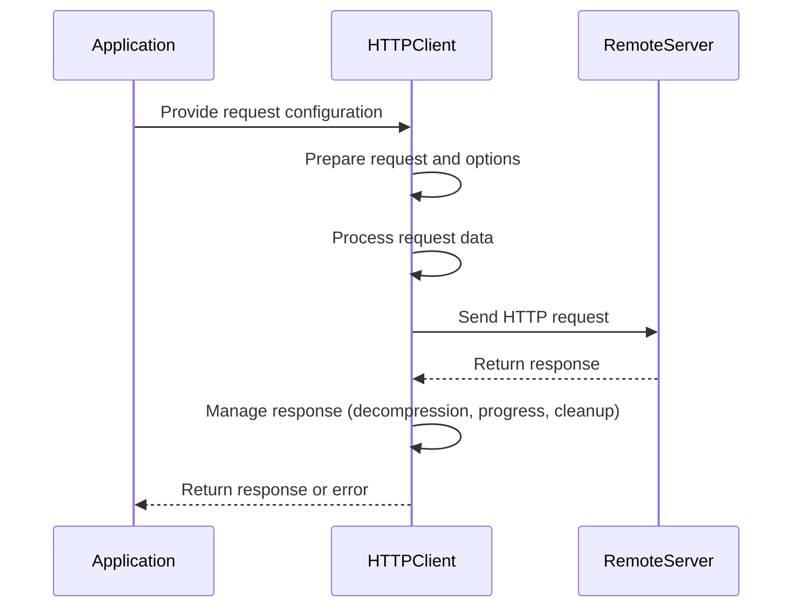
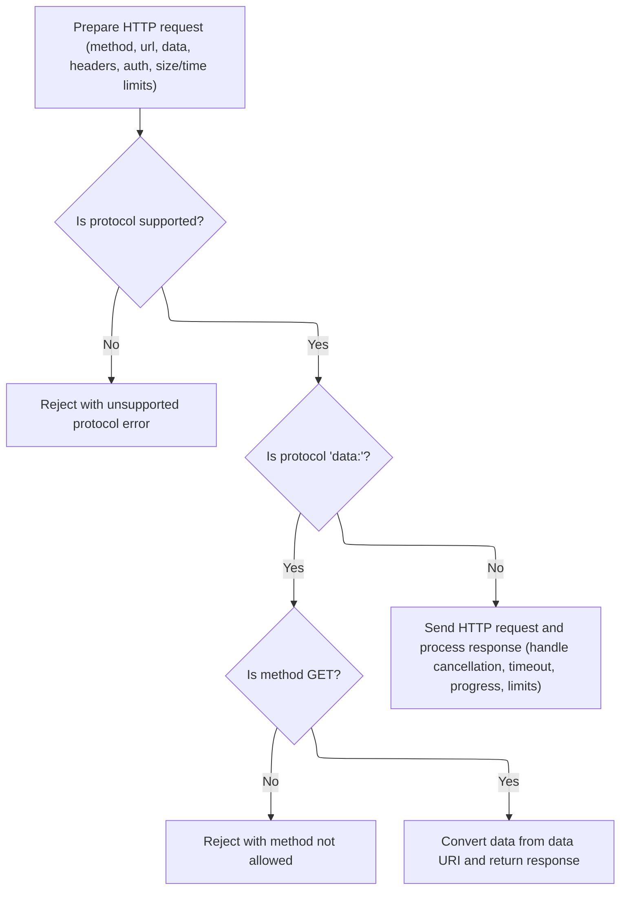

This flow describes how an HTTP request is prepared, sent, and managed from start to finish. The process includes preparing the request with all necessary options, processing the data, configuring network settings, sending the request, and managing the response, including progress tracking and cleanup. The output is either the HTTP response or a detailed error.

Main steps:

- Prepare the HTTP request with configuration and options
- Process and normalize request data
- Configure network and transport settings
- Send the request and manage the response stream
- Handle progress, errors, and cleanup



# Spec

## Detailed View of the Program's Functionality

a. Preparing the HTTP Request

The process begins by preparing all the necessary details for the HTTP request. This includes determining the HTTP method (such as GET, POST, etc.), the target URL, any data to be sent, headers, authentication information, and limits on body size or request time. If a custom DNS lookup function is provided, it is adapted to support modern <SwmToken path="lib/adapters/http.js" pos="558:25:27" line-data="            // stream.destroy() emit aborted event before calling reject() on Node.js v16">`Node.js`</SwmToken> requirements. An internal event emitter is set up to manage cancellation and cleanup events. The code also prepares for request cancellation via tokens or signals, and parses the full URL, extracting the protocol (e.g., http, https, data).

b. Protocol Support and Special Handling for Data URLs

The next step is to check if the protocol is supported. If the protocol is not among the recognized ones, the request is immediately rejected with an error indicating an unsupported protocol. If the protocol is 'data:', the code checks if the HTTP method is GET. If not, it rejects the request with a "method not allowed" error. If the method is GET, the data is decoded directly from the data URI, transformed according to the requested response type (text, blob, stream), and a successful response is returned without making a network call.

c. Preparing Request Data and Headers

If the protocol is supported and not 'data:', the code proceeds to prepare the request data and headers. It normalizes headers and ensures a <SwmToken path="lib/adapters/http.js" pos="284:5:7" line-data="    // Set User-Agent (required by some servers)">`User-Agent`</SwmToken> is set. If the data is a <SwmToken path="lib/adapters/http.js" pos="295:11:11" line-data="    // support for spec compliant FormData objects">`FormData`</SwmToken> object, it is converted to a stream and appropriate headers are set, including content boundaries. For blobs or files, the content type and length are set, and the data is converted to a readable stream. If the data is a string, buffer, or array buffer, it is converted to a buffer and the content length is set. The code enforces the maximum body length, rejecting the request if the data is too large. Upload progress tracking and throttling are set up if requested.

d. Authentication and URL Path Construction

The code then handles HTTP basic authentication, either from the configuration or from the URL itself. If authentication is used, any existing Authorization header is removed to avoid conflicts. The URL path is constructed, including any query parameters, and errors in this process are caught and reported.

e. Setting Up Request Options

Request options are assembled, including the HTTP method, headers, agent (for HTTP or HTTPS), authentication, protocol, family (IPv4/IPv6), and hooks for handling redirects. Proxy settings are applied if needed, and support for socket paths is included for UNIX domain sockets. The code also sets options for maximum body length, insecure HTTP parsing, and custom DNS lookup if provided.

f. Creating and Sending the HTTP Request

The appropriate transport (http, https, or their redirect-following variants) is selected based on the protocol and redirect settings. The request is created using the chosen transport. When the response is received, a stream pipeline is set up to process the response data. If download progress tracking or throttling is enabled, a transform stream is added. If the response is compressed (gzip, deflate, brotli), decompression streams are added as needed, and the <SwmToken path="lib/adapters/http.js" pos="494:19:21" line-data="      if (config.decompress !== false &amp;&amp; res.headers[&#39;content-encoding&#39;]) {">`content-encoding`</SwmToken> header is removed to avoid confusion downstream.

g. Handling the Response

If the response type is 'stream', the response stream is returned directly. Otherwise, the response data is buffered. As data chunks arrive, they are accumulated, and the total size is checked against the maximum allowed content length. If the response is too large, the stream is destroyed and an error is returned. The code also listens for stream aborts and errors, converting them into Axios errors. When the response ends, the buffered data is converted to the appropriate format (string, array buffer), and any byte order marks are stripped if necessary. The final response object is then resolved.

h. Error Serialization

If an error occurs at any point, Axios uses a custom error class that extends the standard Error object. This error class includes additional fields such as the Axios configuration, error code, HTTP status, and the original request and response objects. The error object provides a <SwmToken path="lib/adapters/http.js" pos="415:6:6" line-data="      headers: headers.toJSON(),">`toJSON`</SwmToken> method that serializes all relevant information, including standard error fields (message, name, stack), Microsoft-specific fields (description, number), Mozilla-specific fields (<SwmToken path="lib/core/AxiosError.js" pos="46:1:1" line-data="      fileName: this.fileName,">`fileName`</SwmToken>, <SwmToken path="lib/core/AxiosError.js" pos="47:1:1" line-data="      lineNumber: this.lineNumber,">`lineNumber`</SwmToken>, <SwmToken path="lib/core/AxiosError.js" pos="48:1:1" line-data="      columnNumber: this.columnNumber,">`columnNumber`</SwmToken>), and Axios-specific fields (config, code, status). The configuration is serialized in a way that avoids circular references.

i. Enhancing Error Stack Traces

When an error is caught in the main Axios request method, the code attempts to enhance the error's stack trace. If the JavaScript engine supports <SwmToken path="lib/core/Axios.js" pos="45:1:3" line-data="        Error.captureStackTrace ? Error.captureStackTrace(dummy) : (dummy = new Error());">`Error.captureStackTrace`</SwmToken>, it uses this to capture a new stack trace and append it to the error, making it easier for developers to trace where the error originated in their code.

j. Finalizing the Request Lifecycle

After the request is sent, the code sets up TCP keep-alive on the socket to prevent the connection from being dropped by the peer. It also sets up a timeout if specified, ensuring that the request is aborted if it takes too long. The code listens for stream events to handle errors, aborts, and cleanup, ensuring that all resources are released properly whether the request succeeds, fails, or is cancelled. If the request data is a stream, it is piped into the request, and events are monitored to handle premature stream closure or errors. If the data is not a stream, it is sent directly.

This comprehensive lifecycle ensures that Axios requests are robust, support advanced features like cancellation, progress tracking, and decompression, and provide detailed error information for debugging and reporting.

# Rule Definition

| Paragraph Name                                                                                                                                                                                                                                                                                                                                                                                                                                                                                                                                                                                               | Rule ID | Category          | Description                                                                                                                                                                                                                                                                                                                                                                                                                                                                                                                                                                                                                                                                              | Conditions                                                                                                                                                                                                                                                                                                                                       | Remarks                                                                                                                                                                                                                                                                                                                                                                                                                                                                                                                                                                                                                                                                                                                                                                                                                                                                                                                                                                                                                                                                                                                                                                                                                                                                                                                                                                                                                                                                                                             |
| ------------------------------------------------------------------------------------------------------------------------------------------------------------------------------------------------------------------------------------------------------------------------------------------------------------------------------------------------------------------------------------------------------------------------------------------------------------------------------------------------------------------------------------------------------------------------------------------------------------ | ------- | ----------------- | ---------------------------------------------------------------------------------------------------------------------------------------------------------------------------------------------------------------------------------------------------------------------------------------------------------------------------------------------------------------------------------------------------------------------------------------------------------------------------------------------------------------------------------------------------------------------------------------------------------------------------------------------------------------------------------------- | ------------------------------------------------------------------------------------------------------------------------------------------------------------------------------------------------------------------------------------------------------------------------------------------------------------------------------------------------ | ------------------------------------------------------------------------------------------------------------------------------------------------------------------------------------------------------------------------------------------------------------------------------------------------------------------------------------------------------------------------------------------------------------------------------------------------------------------------------------------------------------------------------------------------------------------------------------------------------------------------------------------------------------------------------------------------------------------------------------------------------------------------------------------------------------------------------------------------------------------------------------------------------------------------------------------------------------------------------------------------------------------------------------------------------------------------------------------------------------------------------------------------------------------------------------------------------------------------------------------------------------------------------------------------------------------------------------------------------------------------------------------------------------------------------------------------------------------------------------------------------------------- |
| <SwmPath>[lib/core/Axios.js](lib/core/Axios.js)</SwmPath>: \_request, request                                                                                                                                                                                                                                                                                                                                                                                                                                                                                                                                | RL-001  | Conditional Logic | The function must accept a configuration object with specific fields, validate their types and presence, normalize values (e.g., method to lower case), and merge with defaults. It must also handle spelling corrections for certain fields and ensure headers are flattened and merged correctly.                                                                                                                                                                                                                                                                                                                                                                                      | Whenever a request is initiated via the main function (request or its aliases).                                                                                                                                                                                                                                                                  | Supported fields include method, url, <SwmToken path="lib/adapters/http.js" pos="231:11:11" line-data="    const fullPath = buildFullPath(config.baseURL, config.url, config.allowAbsoluteUrls);">`baseURL`</SwmToken>, headers, data, auth, timeout, <SwmToken path="lib/adapters/http.js" pos="556:21:21" line-data="          // make sure the content length is not over the maxContentLength if specified">`maxContentLength`</SwmToken>, <SwmToken path="lib/adapters/http.js" pos="339:6:6" line-data="      if (config.maxBodyLength &gt; -1 &amp;&amp; data.length &gt; config.maxBodyLength) {">`maxBodyLength`</SwmToken>, proxy, <SwmToken path="lib/adapters/http.js" pos="416:11:11" line-data="      agents: { http: config.httpAgent, https: config.httpsAgent },">`httpAgent`</SwmToken>, <SwmToken path="lib/adapters/http.js" pos="416:19:19" line-data="      agents: { http: config.httpAgent, https: config.httpsAgent },">`httpsAgent`</SwmToken>, <SwmToken path="lib/adapters/http.js" pos="198:6:6" line-data="      if (config.cancelToken) {">`cancelToken`</SwmToken>, signal, <SwmToken path="lib/adapters/http.js" pos="290:4:4" line-data="    const {onUploadProgress, onDownloadProgress} = config;">`onUploadProgress`</SwmToken>, <SwmToken path="lib/adapters/http.js" pos="290:7:7" line-data="    const {onUploadProgress, onDownloadProgress} = config;">`onDownloadProgress`</SwmToken>, and others. Method is normalized to lower case. Headers are merged and flattened. |
| <SwmPath>[lib/adapters/http.js](lib/adapters/http.js)</SwmPath>: <SwmToken path="lib/adapters/http.js" pos="169:10:10" line-data="export default isHttpAdapterSupported &amp;&amp; function httpAdapter(config) {">`httpAdapter`</SwmToken>                                                                                                                                                                                                                                                                                                                                                                  | RL-002  | Conditional Logic | The function must reject requests with unsupported protocols, handle data: URIs without making network requests, and only allow GET for data: URIs. For http: and https:, a real network request is made.                                                                                                                                                                                                                                                                                                                                                                                                                                                                                | Whenever a request is dispatched and the protocol is determined from the URL.                                                                                                                                                                                                                                                                    | Supported protocols: http:, https:, data:. For data: URIs, only GET is allowed; otherwise, reject with status 405. For unsupported protocols, reject with an error indicating unsupported protocol.                                                                                                                                                                                                                                                                                                                                                                                                                                                                                                                                                                                                                                                                                                                                                                                                                                                                                                                                                                                                                                                                                                                                                                                                                                                                                                                 |
| <SwmPath>[lib/adapters/http.js](lib/adapters/http.js)</SwmPath>: <SwmToken path="lib/adapters/http.js" pos="464:14:14" line-data="    req = transport.request(options, function handleResponse(res) {">`handleResponse`</SwmToken>, settle; <SwmPath>[lib/core/AxiosError.js](lib/core/AxiosError.js)</SwmPath>: <SwmToken path="lib/adapters/http.js" pos="252:3:3" line-data="        throw AxiosError.from(err, AxiosError.ERR_BAD_REQUEST, config);">`AxiosError`</SwmToken>, <SwmToken path="lib/adapters/http.js" pos="415:6:6" line-data="      headers: headers.toJSON(),">`toJSON`</SwmToken>, from | RL-003  | Data Assignment   | The response object must include data, status, <SwmToken path="lib/adapters/http.js" pos="241:1:1" line-data="          statusText: &#39;method not allowed&#39;,">`statusText`</SwmToken>, headers, config, and request. The error object must be an <SwmToken path="lib/adapters/http.js" pos="252:3:3" line-data="        throw AxiosError.from(err, AxiosError.ERR_BAD_REQUEST, config);">`AxiosError`</SwmToken> instance with standard, Microsoft, Mozilla, and Axios-specific fields, and a <SwmToken path="lib/adapters/http.js" pos="415:6:6" line-data="      headers: headers.toJSON(),">`toJSON`</SwmToken> method that serializes all fields, avoiding circular references. | Whenever a request resolves or rejects.                                                                                                                                                                                                                                                                                                          | Response object fields: data (string, Buffer, stream, etc.), status (number), <SwmToken path="lib/adapters/http.js" pos="241:1:1" line-data="          statusText: &#39;method not allowed&#39;,">`statusText`</SwmToken> (string), headers (object), config (original config), request (request object). Error object fields: message, name, stack, description, number, <SwmToken path="lib/core/AxiosError.js" pos="46:1:1" line-data="      fileName: this.fileName,">`fileName`</SwmToken>, <SwmToken path="lib/core/AxiosError.js" pos="47:1:1" line-data="      lineNumber: this.lineNumber,">`lineNumber`</SwmToken>, <SwmToken path="lib/core/AxiosError.js" pos="48:1:1" line-data="      columnNumber: this.columnNumber,">`columnNumber`</SwmToken>, config, code, status, request, response. <SwmToken path="lib/adapters/http.js" pos="415:6:6" line-data="      headers: headers.toJSON(),">`toJSON`</SwmToken> serializes all fields, config is serialized to avoid cycles (e.g., '\[Circular\]').                                                                                                                                                                                                                                                                                                                                                                                                                                                                                                  |
| <SwmPath>[lib/adapters/http.js](lib/adapters/http.js)</SwmPath>: <SwmToken path="lib/adapters/http.js" pos="169:10:10" line-data="export default isHttpAdapterSupported &amp;&amp; function httpAdapter(config) {">`httpAdapter`</SwmToken> (data handling, <SwmToken path="lib/adapters/http.js" pos="552:1:3" line-data="        responseStream.on(&#39;data&#39;, function handleStreamData(chunk) {">`responseStream.on`</SwmToken>('data'))                                                                                                                                                             | RL-004  | Conditional Logic | The function must reject requests if the request body exceeds <SwmToken path="lib/adapters/http.js" pos="339:6:6" line-data="      if (config.maxBodyLength &gt; -1 &amp;&amp; data.length &gt; config.maxBodyLength) {">`maxBodyLength`</SwmToken>, and reject responses if the response body exceeds <SwmToken path="lib/adapters/http.js" pos="556:21:21" line-data="          // make sure the content length is not over the maxContentLength if specified">`maxContentLength`</SwmToken>.                                                                                                                                                                                          | Whenever data is prepared for sending, or response data is being received.                                                                                                                                                                                                                                                                       | <SwmToken path="lib/adapters/http.js" pos="556:21:21" line-data="          // make sure the content length is not over the maxContentLength if specified">`maxContentLength`</SwmToken> and <SwmToken path="lib/adapters/http.js" pos="339:6:6" line-data="      if (config.maxBodyLength &gt; -1 &amp;&amp; data.length &gt; config.maxBodyLength) {">`maxBodyLength`</SwmToken> are numbers (bytes). If exceeded, reject with <SwmToken path="lib/adapters/http.js" pos="252:3:3" line-data="        throw AxiosError.from(err, AxiosError.ERR_BAD_REQUEST, config);">`AxiosError`</SwmToken> and appropriate message.                                                                                                                                                                                                                                                                                                                                                                                                                                                                                                                                                                                                                                                                                                                                                                                                                                                                                            |
| <SwmPath>[lib/adapters/http.js](lib/adapters/http.js)</SwmPath>: <SwmToken path="lib/adapters/http.js" pos="169:10:10" line-data="export default isHttpAdapterSupported &amp;&amp; function httpAdapter(config) {">`httpAdapter`</SwmToken> (abort logic, emitter)                                                                                                                                                                                                                                                                                                                                           | RL-005  | Conditional Logic | The function must support request cancellation via <SwmToken path="lib/adapters/http.js" pos="198:6:6" line-data="      if (config.cancelToken) {">`cancelToken`</SwmToken> or signal, aborting the request and rejecting the promise if cancellation is triggered.                                                                                                                                                                                                                                                                                                                                                                                                                      | If <SwmToken path="lib/adapters/http.js" pos="198:6:6" line-data="      if (config.cancelToken) {">`cancelToken`</SwmToken> or signal is provided in config.                                                                                                                                                                                     | <SwmToken path="lib/adapters/http.js" pos="198:6:6" line-data="      if (config.cancelToken) {">`cancelToken`</SwmToken> and signal are optional fields. On cancellation, emit abort, reject with <SwmToken path="lib/adapters/http.js" pos="218:23:23" line-data="      emitter.emit(&#39;abort&#39;, !reason \|\| reason.type ? new CanceledError(null, config, req) : reason);">`CanceledError`</SwmToken>.                                                                                                                                                                                                                                                                                                                                                                                                                                                                                                                                                                                                                                                                                                                                                                                                                                                                                                                                                                                                                                                                                                      |
| <SwmPath>[lib/adapters/http.js](lib/adapters/http.js)</SwmPath>: <SwmToken path="lib/adapters/http.js" pos="169:10:10" line-data="export default isHttpAdapterSupported &amp;&amp; function httpAdapter(config) {">`httpAdapter`</SwmToken> (<SwmToken path="lib/adapters/http.js" pos="650:1:3" line-data="      req.setTimeout(timeout, function handleRequestTimeout() {">`req.setTimeout`</SwmToken>)                                                                                                                                                                                                    | RL-006  | Conditional Logic | The function must enforce timeouts, aborting the request and rejecting the promise if the timeout is exceeded.                                                                                                                                                                                                                                                                                                                                                                                                                                                                                                                                                                           | If timeout is specified in config.                                                                                                                                                                                                                                                                                                               | timeout is a number (ms). On timeout, reject with <SwmToken path="lib/adapters/http.js" pos="252:3:3" line-data="        throw AxiosError.from(err, AxiosError.ERR_BAD_REQUEST, config);">`AxiosError`</SwmToken> (code ETIMEDOUT or ECONNABORTED depending on <SwmToken path="lib/adapters/http.js" pos="659:3:3" line-data="          transitional.clarifyTimeoutError ? AxiosError.ETIMEDOUT : AxiosError.ECONNABORTED,">`clarifyTimeoutError`</SwmToken>).                                                                                                                                                                                                                                                                                                                                                                                                                                                                                                                                                                                                                                                                                                                                                                                                                                                                                                                                                                                                                                                      |
| <SwmPath>[lib/adapters/http.js](lib/adapters/http.js)</SwmPath>: <SwmToken path="lib/adapters/http.js" pos="169:10:10" line-data="export default isHttpAdapterSupported &amp;&amp; function httpAdapter(config) {">`httpAdapter`</SwmToken> (<SwmToken path="lib/adapters/http.js" pos="368:1:1" line-data="        progressEventDecorator(">`progressEventDecorator`</SwmToken>, <SwmToken path="lib/adapters/http.js" pos="362:15:15" line-data="      data = stream.pipeline([data, new AxiosTransformStream({">`AxiosTransformStream`</SwmToken>)                                                        | RL-007  | Computation       | The function must call <SwmToken path="lib/adapters/http.js" pos="290:4:4" line-data="    const {onUploadProgress, onDownloadProgress} = config;">`onUploadProgress`</SwmToken> and <SwmToken path="lib/adapters/http.js" pos="290:7:7" line-data="    const {onUploadProgress, onDownloadProgress} = config;">`onDownloadProgress`</SwmToken> callbacks, if provided, with progress events during upload and download.                                                                                                                                                                                                                                                                  | If <SwmToken path="lib/adapters/http.js" pos="290:4:4" line-data="    const {onUploadProgress, onDownloadProgress} = config;">`onUploadProgress`</SwmToken> or <SwmToken path="lib/adapters/http.js" pos="290:7:7" line-data="    const {onUploadProgress, onDownloadProgress} = config;">`onDownloadProgress`</SwmToken> is provided in config. | Callbacks receive progress events with loaded and total fields.                                                                                                                                                                                                                                                                                                                                                                                                                                                                                                                                                                                                                                                                                                                                                                                                                                                                                                                                                                                                                                                                                                                                                                                                                                                                                                                                                                                                                                                     |
| <SwmPath>[lib/adapters/http.js](lib/adapters/http.js)</SwmPath>: <SwmToken path="lib/adapters/http.js" pos="464:14:14" line-data="    req = transport.request(options, function handleResponse(res) {">`handleResponse`</SwmToken> (<SwmToken path="lib/adapters/http.js" pos="494:19:21" line-data="      if (config.decompress !== false &amp;&amp; res.headers[&#39;content-encoding&#39;]) {">`content-encoding`</SwmToken> handling)                                                                                                                                                                    | RL-008  | Computation       | The function must transparently decompress response bodies if the response is compressed and decompression is supported by the environment.                                                                                                                                                                                                                                                                                                                                                                                                                                                                                                                                              | If response has <SwmToken path="lib/adapters/http.js" pos="494:19:21" line-data="      if (config.decompress !== false &amp;&amp; res.headers[&#39;content-encoding&#39;]) {">`content-encoding`</SwmToken> header and decompress is not false.                                                                                                  | Supported encodings: gzip, <SwmToken path="lib/adapters/http.js" pos="504:4:6" line-data="        case &#39;x-gzip&#39;:">`x-gzip`</SwmToken>, compress, <SwmToken path="lib/adapters/http.js" pos="506:4:6" line-data="        case &#39;x-compress&#39;:">`x-compress`</SwmToken>, deflate, br (if supported).                                                                                                                                                                                                                                                                                                                                                                                                                                                                                                                                                                                                                                                                                                                                                                                                                                                                                                                                                                                                                                                                                                                                                                                                    |
| <SwmPath>[lib/adapters/http.js](lib/adapters/http.js)</SwmPath>: <SwmToken path="lib/adapters/http.js" pos="169:10:10" line-data="export default isHttpAdapterSupported &amp;&amp; function httpAdapter(config) {">`httpAdapter`</SwmToken> (<SwmToken path="lib/adapters/http.js" pos="197:3:3" line-data="    const onFinished = () =&gt; {">`onFinished`</SwmToken>, emitter cleanup)                                                                                                                                                                                                                     | RL-009  | Computation       | The function must ensure that all resources are released and listeners are cleaned up after the request completes, whether successfully, with error, or via cancellation.                                                                                                                                                                                                                                                                                                                                                                                                                                                                                                                | After request completes in any way.                                                                                                                                                                                                                                                                                                              | Listeners for abort, error, and end are removed. Streams are destroyed as needed.                                                                                                                                                                                                                                                                                                                                                                                                                                                                                                                                                                                                                                                                                                                                                                                                                                                                                                                                                                                                                                                                                                                                                                                                                                                                                                                                                                                                                                   |
| <SwmPath>[lib/core/Axios.js](lib/core/Axios.js)</SwmPath>: request (catch block)                                                                                                                                                                                                                                                                                                                                                                                                                                                                                                                             | RL-010  | Computation       | The function must enhance error stack traces to provide clear information about where the error originated, using available mechanisms in the environment.                                                                                                                                                                                                                                                                                                                                                                                                                                                                                                                               | Whenever an error is caught in the request method.                                                                                                                                                                                                                                                                                               | If error stack is missing or incomplete, append stack from a dummy error.                                                                                                                                                                                                                                                                                                                                                                                                                                                                                                                                                                                                                                                                                                                                                                                                                                                                                                                                                                                                                                                                                                                                                                                                                                                                                                                                                                                                                                           |

# User Stories

## User Story 1: Robust HTTP Request Handling

---

### Story Description:

As an application, I want to make HTTP requests using a flexible configuration object so that I can interact with APIs and services reliably, with support for various protocols, methods, limits, cancellation, and timeouts.

---

### Business Rule Mapping:

| Rule ID | Paragraph Name                                                                                                                                                                                                                                                                                                                                                                                                                                   | Rule Description                                                                                                                                                                                                                                                                                                                                                                                                                                                                                |
| ------- | ------------------------------------------------------------------------------------------------------------------------------------------------------------------------------------------------------------------------------------------------------------------------------------------------------------------------------------------------------------------------------------------------------------------------------------------------ | ----------------------------------------------------------------------------------------------------------------------------------------------------------------------------------------------------------------------------------------------------------------------------------------------------------------------------------------------------------------------------------------------------------------------------------------------------------------------------------------------- |
| RL-001  | <SwmPath>[lib/core/Axios.js](lib/core/Axios.js)</SwmPath>: \_request, request                                                                                                                                                                                                                                                                                                                                                                    | The function must accept a configuration object with specific fields, validate their types and presence, normalize values (e.g., method to lower case), and merge with defaults. It must also handle spelling corrections for certain fields and ensure headers are flattened and merged correctly.                                                                                                                                                                                             |
| RL-002  | <SwmPath>[lib/adapters/http.js](lib/adapters/http.js)</SwmPath>: <SwmToken path="lib/adapters/http.js" pos="169:10:10" line-data="export default isHttpAdapterSupported &amp;&amp; function httpAdapter(config) {">`httpAdapter`</SwmToken>                                                                                                                                                                                                      | The function must reject requests with unsupported protocols, handle data: URIs without making network requests, and only allow GET for data: URIs. For http: and https:, a real network request is made.                                                                                                                                                                                                                                                                                       |
| RL-004  | <SwmPath>[lib/adapters/http.js](lib/adapters/http.js)</SwmPath>: <SwmToken path="lib/adapters/http.js" pos="169:10:10" line-data="export default isHttpAdapterSupported &amp;&amp; function httpAdapter(config) {">`httpAdapter`</SwmToken> (data handling, <SwmToken path="lib/adapters/http.js" pos="552:1:3" line-data="        responseStream.on(&#39;data&#39;, function handleStreamData(chunk) {">`responseStream.on`</SwmToken>('data')) | The function must reject requests if the request body exceeds <SwmToken path="lib/adapters/http.js" pos="339:6:6" line-data="      if (config.maxBodyLength &gt; -1 &amp;&amp; data.length &gt; config.maxBodyLength) {">`maxBodyLength`</SwmToken>, and reject responses if the response body exceeds <SwmToken path="lib/adapters/http.js" pos="556:21:21" line-data="          // make sure the content length is not over the maxContentLength if specified">`maxContentLength`</SwmToken>. |
| RL-005  | <SwmPath>[lib/adapters/http.js](lib/adapters/http.js)</SwmPath>: <SwmToken path="lib/adapters/http.js" pos="169:10:10" line-data="export default isHttpAdapterSupported &amp;&amp; function httpAdapter(config) {">`httpAdapter`</SwmToken> (abort logic, emitter)                                                                                                                                                                               | The function must support request cancellation via <SwmToken path="lib/adapters/http.js" pos="198:6:6" line-data="      if (config.cancelToken) {">`cancelToken`</SwmToken> or signal, aborting the request and rejecting the promise if cancellation is triggered.                                                                                                                                                                                                                             |
| RL-006  | <SwmPath>[lib/adapters/http.js](lib/adapters/http.js)</SwmPath>: <SwmToken path="lib/adapters/http.js" pos="169:10:10" line-data="export default isHttpAdapterSupported &amp;&amp; function httpAdapter(config) {">`httpAdapter`</SwmToken> (<SwmToken path="lib/adapters/http.js" pos="650:1:3" line-data="      req.setTimeout(timeout, function handleRequestTimeout() {">`req.setTimeout`</SwmToken>)                                        | The function must enforce timeouts, aborting the request and rejecting the promise if the timeout is exceeded.                                                                                                                                                                                                                                                                                                                                                                                  |

---

### Relevant Functionality:

- <SwmPath>[lib/core/Axios.js](lib/core/Axios.js)</SwmPath>**: \_request**
  1. **RL-001:**
     - If input is a string, treat as URL and merge with config
     - Merge config with instance defaults
     - Validate transitional and <SwmToken path="lib/adapters/http.js" pos="397:3:3" line-data="        config.paramsSerializer">`paramsSerializer`</SwmToken> options
     - Correct spelling for <SwmToken path="lib/adapters/http.js" pos="231:11:11" line-data="    const fullPath = buildFullPath(config.baseURL, config.url, config.allowAbsoluteUrls);">`baseURL`</SwmToken> and <SwmToken path="lib/core/Axios.js" pos="111:9:9" line-data="      withXsrfToken: validators.spelling(&#39;withXSRFToken&#39;)">`withXSRFToken`</SwmToken>
     - Normalize method to lower case
     - Flatten and merge headers
     - Prepare config for dispatch
- <SwmPath>[lib/adapters/http.js](lib/adapters/http.js)</SwmPath>**:** <SwmToken path="lib/adapters/http.js" pos="169:10:10" line-data="export default isHttpAdapterSupported &amp;&amp; function httpAdapter(config) {">`httpAdapter`</SwmToken>
  1. **RL-002:**
     - Parse URL and extract protocol
     - If protocol is data:
       - If method is not GET, reject with 405
       - Else, decode data URI and return response object (no network)
     - If protocol is not in supported list, reject with error
     - Else, proceed with network request
- <SwmPath>[lib/adapters/http.js](lib/adapters/http.js)</SwmPath>**:** <SwmToken path="lib/adapters/http.js" pos="169:10:10" line-data="export default isHttpAdapterSupported &amp;&amp; function httpAdapter(config) {">`httpAdapter`</SwmToken> **(data handling**
  1. **RL-004:**
     - When preparing data, if <SwmToken path="lib/adapters/http.js" pos="337:5:7" line-data="      headers.setContentLength(data.length, false);">`data.length`</SwmToken> > <SwmToken path="lib/adapters/http.js" pos="339:6:6" line-data="      if (config.maxBodyLength &gt; -1 &amp;&amp; data.length &gt; config.maxBodyLength) {">`maxBodyLength`</SwmToken>, reject
     - When receiving response, accumulate bytes; if total > <SwmToken path="lib/adapters/http.js" pos="556:21:21" line-data="          // make sure the content length is not over the maxContentLength if specified">`maxContentLength`</SwmToken>, destroy stream and reject
- <SwmPath>[lib/adapters/http.js](lib/adapters/http.js)</SwmPath>**:** <SwmToken path="lib/adapters/http.js" pos="169:10:10" line-data="export default isHttpAdapterSupported &amp;&amp; function httpAdapter(config) {">`httpAdapter`</SwmToken> **(abort logic**
  1. **RL-005:**
     - Subscribe to <SwmToken path="lib/adapters/http.js" pos="198:6:6" line-data="      if (config.cancelToken) {">`cancelToken`</SwmToken> and signal
     - On abort, emit abort event, reject with <SwmToken path="lib/adapters/http.js" pos="218:23:23" line-data="      emitter.emit(&#39;abort&#39;, !reason || reason.type ? new CanceledError(null, config, req) : reason);">`CanceledError`</SwmToken>, clean up listeners
- <SwmPath>[lib/adapters/http.js](lib/adapters/http.js)</SwmPath>**:** <SwmToken path="lib/adapters/http.js" pos="169:10:10" line-data="export default isHttpAdapterSupported &amp;&amp; function httpAdapter(config) {">`httpAdapter`</SwmToken> **(**<SwmToken path="lib/adapters/http.js" pos="650:1:3" line-data="      req.setTimeout(timeout, function handleRequestTimeout() {">`req.setTimeout`</SwmToken>**)**
  1. **RL-006:**
     - If timeout is set, call <SwmToken path="lib/adapters/http.js" pos="650:1:3" line-data="      req.setTimeout(timeout, function handleRequestTimeout() {">`req.setTimeout`</SwmToken>
     - On timeout, reject with <SwmToken path="lib/adapters/http.js" pos="252:3:3" line-data="        throw AxiosError.from(err, AxiosError.ERR_BAD_REQUEST, config);">`AxiosError`</SwmToken> and abort request

## User Story 2: Comprehensive Response and Error Objects

---

### Story Description:

As an application, I want to receive detailed response and error objects from my HTTP requests so that I can handle results and failures effectively, with all relevant information and enhanced stack traces for debugging.

---

### Business Rule Mapping:

| Rule ID | Paragraph Name                                                                                                                                                                                                                                                                                                                                                                                                                                                                                                                                                                                               | Rule Description                                                                                                                                                                                                                                                                                                                                                                                                                                                                                                                                                                                                                                                                         |
| ------- | ------------------------------------------------------------------------------------------------------------------------------------------------------------------------------------------------------------------------------------------------------------------------------------------------------------------------------------------------------------------------------------------------------------------------------------------------------------------------------------------------------------------------------------------------------------------------------------------------------------ | ---------------------------------------------------------------------------------------------------------------------------------------------------------------------------------------------------------------------------------------------------------------------------------------------------------------------------------------------------------------------------------------------------------------------------------------------------------------------------------------------------------------------------------------------------------------------------------------------------------------------------------------------------------------------------------------- |
| RL-003  | <SwmPath>[lib/adapters/http.js](lib/adapters/http.js)</SwmPath>: <SwmToken path="lib/adapters/http.js" pos="464:14:14" line-data="    req = transport.request(options, function handleResponse(res) {">`handleResponse`</SwmToken>, settle; <SwmPath>[lib/core/AxiosError.js](lib/core/AxiosError.js)</SwmPath>: <SwmToken path="lib/adapters/http.js" pos="252:3:3" line-data="        throw AxiosError.from(err, AxiosError.ERR_BAD_REQUEST, config);">`AxiosError`</SwmToken>, <SwmToken path="lib/adapters/http.js" pos="415:6:6" line-data="      headers: headers.toJSON(),">`toJSON`</SwmToken>, from | The response object must include data, status, <SwmToken path="lib/adapters/http.js" pos="241:1:1" line-data="          statusText: &#39;method not allowed&#39;,">`statusText`</SwmToken>, headers, config, and request. The error object must be an <SwmToken path="lib/adapters/http.js" pos="252:3:3" line-data="        throw AxiosError.from(err, AxiosError.ERR_BAD_REQUEST, config);">`AxiosError`</SwmToken> instance with standard, Microsoft, Mozilla, and Axios-specific fields, and a <SwmToken path="lib/adapters/http.js" pos="415:6:6" line-data="      headers: headers.toJSON(),">`toJSON`</SwmToken> method that serializes all fields, avoiding circular references. |
| RL-010  | <SwmPath>[lib/core/Axios.js](lib/core/Axios.js)</SwmPath>: request (catch block)                                                                                                                                                                                                                                                                                                                                                                                                                                                                                                                             | The function must enhance error stack traces to provide clear information about where the error originated, using available mechanisms in the environment.                                                                                                                                                                                                                                                                                                                                                                                                                                                                                                                               |

---

### Relevant Functionality:

- <SwmPath>[lib/adapters/http.js](lib/adapters/http.js)</SwmPath>**:** <SwmToken path="lib/adapters/http.js" pos="464:14:14" line-data="    req = transport.request(options, function handleResponse(res) {">`handleResponse`</SwmToken>
  1. **RL-003:**
     - On success, construct response object with required fields
     - On error, construct <SwmToken path="lib/adapters/http.js" pos="252:3:3" line-data="        throw AxiosError.from(err, AxiosError.ERR_BAD_REQUEST, config);">`AxiosError`</SwmToken> with all required fields
     - AxiosError.toJSON serializes all fields, using <SwmToken path="lib/core/AxiosError.js" pos="51:4:6" line-data="      config: utils.toJSONObject(this.config),">`utils.toJSONObject`</SwmToken> for config to avoid cycles
- <SwmPath>[lib/core/Axios.js](lib/core/Axios.js)</SwmPath>**: request (catch block)**
  1. **RL-010:**
     - On error, capture stack trace from dummy error
     - If error stack is missing, assign dummy stack
     - If error stack does not end with dummy stack, append dummy stack

## User Story 3: Advanced Features: Progress, Decompression, and Cleanup

---

### Story Description:

As an application, I want to track upload and download progress, automatically handle compressed responses, and ensure all resources are cleaned up after requests so that my application remains efficient and responsive.

---

### Business Rule Mapping:

| Rule ID | Paragraph Name                                                                                                                                                                                                                                                                                                                                                                                                                                                                                                                                        | Rule Description                                                                                                                                                                                                                                                                                                                                                                                                        |
| ------- | ----------------------------------------------------------------------------------------------------------------------------------------------------------------------------------------------------------------------------------------------------------------------------------------------------------------------------------------------------------------------------------------------------------------------------------------------------------------------------------------------------------------------------------------------------- | ----------------------------------------------------------------------------------------------------------------------------------------------------------------------------------------------------------------------------------------------------------------------------------------------------------------------------------------------------------------------------------------------------------------------- |
| RL-007  | <SwmPath>[lib/adapters/http.js](lib/adapters/http.js)</SwmPath>: <SwmToken path="lib/adapters/http.js" pos="169:10:10" line-data="export default isHttpAdapterSupported &amp;&amp; function httpAdapter(config) {">`httpAdapter`</SwmToken> (<SwmToken path="lib/adapters/http.js" pos="368:1:1" line-data="        progressEventDecorator(">`progressEventDecorator`</SwmToken>, <SwmToken path="lib/adapters/http.js" pos="362:15:15" line-data="      data = stream.pipeline([data, new AxiosTransformStream({">`AxiosTransformStream`</SwmToken>) | The function must call <SwmToken path="lib/adapters/http.js" pos="290:4:4" line-data="    const {onUploadProgress, onDownloadProgress} = config;">`onUploadProgress`</SwmToken> and <SwmToken path="lib/adapters/http.js" pos="290:7:7" line-data="    const {onUploadProgress, onDownloadProgress} = config;">`onDownloadProgress`</SwmToken> callbacks, if provided, with progress events during upload and download. |
| RL-008  | <SwmPath>[lib/adapters/http.js](lib/adapters/http.js)</SwmPath>: <SwmToken path="lib/adapters/http.js" pos="464:14:14" line-data="    req = transport.request(options, function handleResponse(res) {">`handleResponse`</SwmToken> (<SwmToken path="lib/adapters/http.js" pos="494:19:21" line-data="      if (config.decompress !== false &amp;&amp; res.headers[&#39;content-encoding&#39;]) {">`content-encoding`</SwmToken> handling)                                                                                                             | The function must transparently decompress response bodies if the response is compressed and decompression is supported by the environment.                                                                                                                                                                                                                                                                             |
| RL-009  | <SwmPath>[lib/adapters/http.js](lib/adapters/http.js)</SwmPath>: <SwmToken path="lib/adapters/http.js" pos="169:10:10" line-data="export default isHttpAdapterSupported &amp;&amp; function httpAdapter(config) {">`httpAdapter`</SwmToken> (<SwmToken path="lib/adapters/http.js" pos="197:3:3" line-data="    const onFinished = () =&gt; {">`onFinished`</SwmToken>, emitter cleanup)                                                                                                                                                              | The function must ensure that all resources are released and listeners are cleaned up after the request completes, whether successfully, with error, or via cancellation.                                                                                                                                                                                                                                               |

---

### Relevant Functionality:

- <SwmPath>[lib/adapters/http.js](lib/adapters/http.js)</SwmPath>**:** <SwmToken path="lib/adapters/http.js" pos="169:10:10" line-data="export default isHttpAdapterSupported &amp;&amp; function httpAdapter(config) {">`httpAdapter`</SwmToken> **(**<SwmToken path="lib/adapters/http.js" pos="368:1:1" line-data="        progressEventDecorator(">`progressEventDecorator`</SwmToken>
  1. **RL-007:**
     - If <SwmToken path="lib/adapters/http.js" pos="290:4:4" line-data="    const {onUploadProgress, onDownloadProgress} = config;">`onUploadProgress`</SwmToken>, wrap upload stream and emit progress events
     - If <SwmToken path="lib/adapters/http.js" pos="290:7:7" line-data="    const {onUploadProgress, onDownloadProgress} = config;">`onDownloadProgress`</SwmToken>, wrap response stream and emit progress events
- <SwmPath>[lib/adapters/http.js](lib/adapters/http.js)</SwmPath>**:** <SwmToken path="lib/adapters/http.js" pos="464:14:14" line-data="    req = transport.request(options, function handleResponse(res) {">`handleResponse`</SwmToken> **(**<SwmToken path="lib/adapters/http.js" pos="494:19:21" line-data="      if (config.decompress !== false &amp;&amp; res.headers[&#39;content-encoding&#39;]) {">`content-encoding`</SwmToken> **handling)**
  1. **RL-008:**
     - Check <SwmToken path="lib/adapters/http.js" pos="494:19:21" line-data="      if (config.decompress !== false &amp;&amp; res.headers[&#39;content-encoding&#39;]) {">`content-encoding`</SwmToken> header
     - If encoding is supported, add decompression stream to pipeline
     - Remove <SwmToken path="lib/adapters/http.js" pos="494:19:21" line-data="      if (config.decompress !== false &amp;&amp; res.headers[&#39;content-encoding&#39;]) {">`content-encoding`</SwmToken> header after decompression
- <SwmPath>[lib/adapters/http.js](lib/adapters/http.js)</SwmPath>**:** <SwmToken path="lib/adapters/http.js" pos="169:10:10" line-data="export default isHttpAdapterSupported &amp;&amp; function httpAdapter(config) {">`httpAdapter`</SwmToken> **(**<SwmToken path="lib/adapters/http.js" pos="197:3:3" line-data="    const onFinished = () =&gt; {">`onFinished`</SwmToken>
  1. **RL-009:**
     - On request completion, unsubscribe from <SwmToken path="lib/adapters/http.js" pos="198:6:6" line-data="      if (config.cancelToken) {">`cancelToken`</SwmToken> and signal
     - Remove all emitter listeners
     - Destroy streams if necessary

# Code Walkthrough

## Managing Axios Request Lifecycle and Error Serialization



<SwmSnippet path="/lib/adapters/http.js" line="170">

---

In <SwmToken path="lib/adapters/http.js" pos="170:9:9" line-data="  return wrapAsync(async function dispatchHttpRequest(resolve, reject, onDone) {">`dispatchHttpRequest`</SwmToken>, we're setting up everything Axios needs for a request: cancellation, event emitters, custom DNS lookup (with a <SwmToken path="lib/adapters/http.js" pos="558:25:27" line-data="            // stream.destroy() emit aborted event before calling reject() on Node.js v16">`Node.js`</SwmToken> <SwmToken path="lib/adapters/http.js" pos="180:25:27" line-data="      // hotfix to support opt.all option which is required for node 20.x">`20.x`</SwmToken> hotfix), and special handling for 'data:' URLs (which are decoded directly, no network call). We also prep form data, blobs, and streams, set headers, and enforce body/content length limits. This setup is needed before we serialize errors with <SwmToken path="lib/adapters/http.js" pos="415:6:6" line-data="      headers: headers.toJSON(),">`toJSON`</SwmToken>, so any error context is captured with all Axios-specific details.

```javascript
  return wrapAsync(async function dispatchHttpRequest(resolve, reject, onDone) {
    let {data, lookup, family} = config;
    const {responseType, responseEncoding} = config;
    const method = config.method.toUpperCase();
    let isDone;
    let rejected = false;
    let req;

    if (lookup) {
      const _lookup = callbackify(lookup, (value) => utils.isArray(value) ? value : [value]);
      // hotfix to support opt.all option which is required for node 20.x
      lookup = (hostname, opt, cb) => {
        _lookup(hostname, opt, (err, arg0, arg1) => {
          if (err) {
            return cb(err);
          }

          const addresses = utils.isArray(arg0) ? arg0.map(addr => buildAddressEntry(addr)) : [buildAddressEntry(arg0, arg1)];

          opt.all ? cb(err, addresses) : cb(err, addresses[0].address, addresses[0].family);
        });
      }
    }

    // temporary internal emitter until the AxiosRequest class will be implemented
    const emitter = new EventEmitter();

    const onFinished = () => {
      if (config.cancelToken) {
        config.cancelToken.unsubscribe(abort);
      }

      if (config.signal) {
        config.signal.removeEventListener('abort', abort);
      }

      emitter.removeAllListeners();
    }

    onDone((value, isRejected) => {
      isDone = true;
      if (isRejected) {
        rejected = true;
        onFinished();
      }
    });

    function abort(reason) {
      emitter.emit('abort', !reason || reason.type ? new CanceledError(null, config, req) : reason);
    }

    emitter.once('abort', reject);

    if (config.cancelToken || config.signal) {
      config.cancelToken && config.cancelToken.subscribe(abort);
      if (config.signal) {
        config.signal.aborted ? abort() : config.signal.addEventListener('abort', abort);
      }
    }

    // Parse url
    const fullPath = buildFullPath(config.baseURL, config.url, config.allowAbsoluteUrls);
    const parsed = new URL(fullPath, platform.hasBrowserEnv ? platform.origin : undefined);
    const protocol = parsed.protocol || supportedProtocols[0];

    if (protocol === 'data:') {
      let convertedData;

      if (method !== 'GET') {
        return settle(resolve, reject, {
          status: 405,
          statusText: 'method not allowed',
          headers: {},
          config
        });
      }

      try {
        convertedData = fromDataURI(config.url, responseType === 'blob', {
          Blob: config.env && config.env.Blob
        });
      } catch (err) {
        throw AxiosError.from(err, AxiosError.ERR_BAD_REQUEST, config);
      }

      if (responseType === 'text') {
        convertedData = convertedData.toString(responseEncoding);

        if (!responseEncoding || responseEncoding === 'utf8') {
          convertedData = utils.stripBOM(convertedData);
        }
      } else if (responseType === 'stream') {
        convertedData = stream.Readable.from(convertedData);
      }

      return settle(resolve, reject, {
        data: convertedData,
        status: 200,
        statusText: 'OK',
        headers: new AxiosHeaders(),
        config
      });
    }

    if (supportedProtocols.indexOf(protocol) === -1) {
      return reject(new AxiosError(
        'Unsupported protocol ' + protocol,
        AxiosError.ERR_BAD_REQUEST,
        config
      ));
    }

    const headers = AxiosHeaders.from(config.headers).normalize();

    // Set User-Agent (required by some servers)
    // See https://github.com/axios/axios/issues/69
    // User-Agent is specified; handle case where no UA header is desired
    // Only set header if it hasn't been set in config
    headers.set('User-Agent', 'axios/' + VERSION, false);

    const {onUploadProgress, onDownloadProgress} = config;
    const maxRate = config.maxRate;
    let maxUploadRate = undefined;
    let maxDownloadRate = undefined;

    // support for spec compliant FormData objects
    if (utils.isSpecCompliantForm(data)) {
      const userBoundary = headers.getContentType(/boundary=([-_\w\d]{10,70})/i);

      data = formDataToStream(data, (formHeaders) => {
        headers.set(formHeaders);
      }, {
        tag: `axios-${VERSION}-boundary`,
        boundary: userBoundary && userBoundary[1] || undefined
      });
      // support for https://www.npmjs.com/package/form-data api
    } else if (utils.isFormData(data) && utils.isFunction(data.getHeaders)) {
      headers.set(data.getHeaders());

      if (!headers.hasContentLength()) {
        try {
          const knownLength = await util.promisify(data.getLength).call(data);
          Number.isFinite(knownLength) && knownLength >= 0 && headers.setContentLength(knownLength);
          /*eslint no-empty:0*/
        } catch (e) {
        }
      }
    } else if (utils.isBlob(data) || utils.isFile(data)) {
      data.size && headers.setContentType(data.type || 'application/octet-stream');
      headers.setContentLength(data.size || 0);
      data = stream.Readable.from(readBlob(data));
    } else if (data && !utils.isStream(data)) {
      if (Buffer.isBuffer(data)) {
        // Nothing to do...
      } else if (utils.isArrayBuffer(data)) {
        data = Buffer.from(new Uint8Array(data));
      } else if (utils.isString(data)) {
        data = Buffer.from(data, 'utf-8');
      } else {
        return reject(new AxiosError(
          'Data after transformation must be a string, an ArrayBuffer, a Buffer, or a Stream',
          AxiosError.ERR_BAD_REQUEST,
          config
        ));
      }

      // Add Content-Length header if data exists
      headers.setContentLength(data.length, false);

      if (config.maxBodyLength > -1 && data.length > config.maxBodyLength) {
        return reject(new AxiosError(
          'Request body larger than maxBodyLength limit',
          AxiosError.ERR_BAD_REQUEST,
          config
        ));
      }
    }

    const contentLength = utils.toFiniteNumber(headers.getContentLength());

    if (utils.isArray(maxRate)) {
      maxUploadRate = maxRate[0];
      maxDownloadRate = maxRate[1];
    } else {
      maxUploadRate = maxDownloadRate = maxRate;
    }

    if (data && (onUploadProgress || maxUploadRate)) {
      if (!utils.isStream(data)) {
        data = stream.Readable.from(data, {objectMode: false});
      }

      data = stream.pipeline([data, new AxiosTransformStream({
        maxRate: utils.toFiniteNumber(maxUploadRate)
      })], utils.noop);

      onUploadProgress && data.on('progress', flushOnFinish(
        data,
        progressEventDecorator(
          contentLength,
          progressEventReducer(asyncDecorator(onUploadProgress), false, 3)
        )
      ));
    }

    // HTTP basic authentication
    let auth = undefined;
    if (config.auth) {
      const username = config.auth.username || '';
      const password = config.auth.password || '';
      auth = username + ':' + password;
    }

    if (!auth && parsed.username) {
      const urlUsername = parsed.username;
      const urlPassword = parsed.password;
      auth = urlUsername + ':' + urlPassword;
    }

    auth && headers.delete('authorization');

    let path;

    try {
      path = buildURL(
        parsed.pathname + parsed.search,
        config.params,
        config.paramsSerializer
      ).replace(/^\?/, '');
    } catch (err) {
      const customErr = new Error(err.message);
      customErr.config = config;
      customErr.url = config.url;
      customErr.exists = true;
      return reject(customErr);
    }

    headers.set(
      'Accept-Encoding',
      'gzip, compress, deflate' + (isBrotliSupported ? ', br' : ''), false
      );

    const options = {
      path,
      method: method,
      headers: headers.toJSON(),
      agents: { http: config.httpAgent, https: config.httpsAgent },
      auth,
      protocol,
      family,
      beforeRedirect: dispatchBeforeRedirect,
      beforeRedirects: {}
    };

```

---

</SwmSnippet>

<SwmSnippet path="/lib/core/AxiosError.js" line="37">

---

<SwmToken path="lib/core/AxiosError.js" pos="37:1:1" line-data="  toJSON: function toJSON() {">`toJSON`</SwmToken> serializes error objects, including standard, Microsoft, Mozilla, and Axios-specific fields. It uses <SwmToken path="lib/core/AxiosError.js" pos="51:4:6" line-data="      config: utils.toJSONObject(this.config),">`utils.toJSONObject`</SwmToken> for the config to avoid circular refs, making sure all relevant error info is captured for debugging or reporting.

```javascript
  toJSON: function toJSON() {
    return {
      // Standard
      message: this.message,
      name: this.name,
      // Microsoft
      description: this.description,
      number: this.number,
      // Mozilla
      fileName: this.fileName,
      lineNumber: this.lineNumber,
      columnNumber: this.columnNumber,
      stack: this.stack,
      // Axios
      config: utils.toJSONObject(this.config),
      code: this.code,
      status: this.status
    };
  }
```

---

</SwmSnippet>

<SwmSnippet path="/lib/adapters/http.js" line="424">

---

Back in <SwmToken path="lib/adapters/http.js" pos="170:9:9" line-data="  return wrapAsync(async function dispatchHttpRequest(resolve, reject, onDone) {">`dispatchHttpRequest`</SwmToken>, after serializing errors, we move on to setting up the actual HTTP request: configure proxy, agent, and transport, handle IPv6 and socket paths, and build the stream pipeline for the request and response. We also wire up decompression and progress tracking, so when we call Axios.request, it handles the network part and manages the full request/response lifecycle, including cleanup on errors or aborts.

```javascript
    // cacheable-lookup integration hotfix
    !utils.isUndefined(lookup) && (options.lookup = lookup);

    if (config.socketPath) {
      options.socketPath = config.socketPath;
    } else {
      options.hostname = parsed.hostname.startsWith("[") ? parsed.hostname.slice(1, -1) : parsed.hostname;
      options.port = parsed.port;
      setProxy(options, config.proxy, protocol + '//' + parsed.hostname + (parsed.port ? ':' + parsed.port : '') + options.path);
    }

    let transport;
    const isHttpsRequest = isHttps.test(options.protocol);
    options.agent = isHttpsRequest ? config.httpsAgent : config.httpAgent;
    if (config.transport) {
      transport = config.transport;
    } else if (config.maxRedirects === 0) {
      transport = isHttpsRequest ? https : http;
    } else {
      if (config.maxRedirects) {
        options.maxRedirects = config.maxRedirects;
      }
      if (config.beforeRedirect) {
        options.beforeRedirects.config = config.beforeRedirect;
      }
      transport = isHttpsRequest ? httpsFollow : httpFollow;
    }

    if (config.maxBodyLength > -1) {
      options.maxBodyLength = config.maxBodyLength;
    } else {
      // follow-redirects does not skip comparison, so it should always succeed for axios -1 unlimited
      options.maxBodyLength = Infinity;
    }

    if (config.insecureHTTPParser) {
      options.insecureHTTPParser = config.insecureHTTPParser;
    }

    // Create the request
    req = transport.request(options, function handleResponse(res) {
      if (req.destroyed) return;

      const streams = [res];

      const responseLength = +res.headers['content-length'];

      if (onDownloadProgress || maxDownloadRate) {
        const transformStream = new AxiosTransformStream({
          maxRate: utils.toFiniteNumber(maxDownloadRate)
        });

        onDownloadProgress && transformStream.on('progress', flushOnFinish(
          transformStream,
          progressEventDecorator(
            responseLength,
            progressEventReducer(asyncDecorator(onDownloadProgress), true, 3)
          )
        ));

        streams.push(transformStream);
      }

      // decompress the response body transparently if required
      let responseStream = res;

      // return the last request in case of redirects
      const lastRequest = res.req || req;

      // if decompress disabled we should not decompress
      if (config.decompress !== false && res.headers['content-encoding']) {
        // if no content, but headers still say that it is encoded,
        // remove the header not confuse downstream operations
        if (method === 'HEAD' || res.statusCode === 204) {
          delete res.headers['content-encoding'];
        }

        switch ((res.headers['content-encoding'] || '').toLowerCase()) {
        /*eslint default-case:0*/
        case 'gzip':
        case 'x-gzip':
        case 'compress':
        case 'x-compress':
          // add the unzipper to the body stream processing pipeline
          streams.push(zlib.createUnzip(zlibOptions));

          // remove the content-encoding in order to not confuse downstream operations
          delete res.headers['content-encoding'];
          break;
        case 'deflate':
          streams.push(new ZlibHeaderTransformStream());

          // add the unzipper to the body stream processing pipeline
          streams.push(zlib.createUnzip(zlibOptions));

          // remove the content-encoding in order to not confuse downstream operations
          delete res.headers['content-encoding'];
          break;
        case 'br':
          if (isBrotliSupported) {
            streams.push(zlib.createBrotliDecompress(brotliOptions));
            delete res.headers['content-encoding'];
          }
        }
      }

      responseStream = streams.length > 1 ? stream.pipeline(streams, utils.noop) : streams[0];

      const offListeners = stream.finished(responseStream, () => {
        offListeners();
        onFinished();
      });

      const response = {
        status: res.statusCode,
        statusText: res.statusMessage,
        headers: new AxiosHeaders(res.headers),
        config,
        request: lastRequest
      };

      if (responseType === 'stream') {
        response.data = responseStream;
        settle(resolve, reject, response);
      } else {
        const responseBuffer = [];
        let totalResponseBytes = 0;

        responseStream.on('data', function handleStreamData(chunk) {
          responseBuffer.push(chunk);
          totalResponseBytes += chunk.length;

          // make sure the content length is not over the maxContentLength if specified
          if (config.maxContentLength > -1 && totalResponseBytes > config.maxContentLength) {
            // stream.destroy() emit aborted event before calling reject() on Node.js v16
            rejected = true;
            responseStream.destroy();
            reject(new AxiosError('maxContentLength size of ' + config.maxContentLength + ' exceeded',
              AxiosError.ERR_BAD_RESPONSE, config, lastRequest));
          }
        });

        responseStream.on('aborted', function handlerStreamAborted() {
          if (rejected) {
            return;
          }

          const err = new AxiosError(
            'stream has been aborted',
            AxiosError.ERR_BAD_RESPONSE,
            config,
            lastRequest
          );
          responseStream.destroy(err);
          reject(err);
        });

        responseStream.on('error', function handleStreamError(err) {
          if (req.destroyed) return;
          reject(AxiosError.from(err, null, config, lastRequest));
        });

        responseStream.on('end', function handleStreamEnd() {
          try {
            let responseData = responseBuffer.length === 1 ? responseBuffer[0] : Buffer.concat(responseBuffer);
            if (responseType !== 'arraybuffer') {
              responseData = responseData.toString(responseEncoding);
              if (!responseEncoding || responseEncoding === 'utf8') {
                responseData = utils.stripBOM(responseData);
              }
            }
            response.data = responseData;
          } catch (err) {
            return reject(AxiosError.from(err, null, config, response.request, response));
          }
          settle(resolve, reject, response);
        });
      }

      emitter.once('abort', err => {
        if (!responseStream.destroyed) {
          responseStream.emit('error', err);
          responseStream.destroy();
        }
      });
    });

    emitter.once('abort', err => {
      reject(err);
      req.destroy(err);
    });

    // Handle errors
    req.on('error', function handleRequestError(err) {
      // @todo remove
      // if (req.aborted && err.code !== AxiosError.ERR_FR_TOO_MANY_REDIRECTS) return;
      reject(AxiosError.from(err, null, config, req));
    });

```

---

</SwmSnippet>

<SwmSnippet path="/lib/core/Axios.js" line="38">

---

`Axios.request` wraps the actual request call and, if an error is thrown, it enhances the error's stack trace using V8's <SwmToken path="lib/core/Axios.js" pos="45:1:3" line-data="        Error.captureStackTrace ? Error.captureStackTrace(dummy) : (dummy = new Error());">`Error.captureStackTrace`</SwmToken> (if available) or by creating a new Error. This gives developers a clearer picture of where the error originated, making debugging easier.

```javascript
  async request(configOrUrl, config) {
    try {
      return await this._request(configOrUrl, config);
    } catch (err) {
      if (err instanceof Error) {
        let dummy = {};

        Error.captureStackTrace ? Error.captureStackTrace(dummy) : (dummy = new Error());

        // slice off the Error: ... line
        const stack = dummy.stack ? dummy.stack.replace(/^.+\n/, '') : '';
        try {
          if (!err.stack) {
            err.stack = stack;
            // match without the 2 top stack lines
          } else if (stack && !String(err.stack).endsWith(stack.replace(/^.+\n.+\n/, ''))) {
            err.stack += '\n' + stack
          }
        } catch (e) {
          // ignore the case where "stack" is an un-writable property
        }
      }

      throw err;
    }
  }
```

---

</SwmSnippet>

<SwmSnippet path="/lib/adapters/http.js" line="623">

---

After returning from `Axios.request`, <SwmToken path="lib/adapters/http.js" pos="170:9:9" line-data="  return wrapAsync(async function dispatchHttpRequest(resolve, reject, onDone) {">`dispatchHttpRequest`</SwmToken> finishes by wiring up keep-alive, timeout, and stream piping. It listens for stream events to handle errors, aborts, and cleanup, making sure everything is released properly whether the request succeeds, fails, or is cancelled.

```javascript
    // set tcp keep alive to prevent drop connection by peer
    req.on('socket', function handleRequestSocket(socket) {
      // default interval of sending ack packet is 1 minute
      socket.setKeepAlive(true, 1000 * 60);
    });

    // Handle request timeout
    if (config.timeout) {
      // This is forcing a int timeout to avoid problems if the `req` interface doesn't handle other types.
      const timeout = parseInt(config.timeout, 10);

      if (Number.isNaN(timeout)) {
        reject(new AxiosError(
          'error trying to parse `config.timeout` to int',
          AxiosError.ERR_BAD_OPTION_VALUE,
          config,
          req
        ));

        return;
      }

      // Sometime, the response will be very slow, and does not respond, the connect event will be block by event loop system.
      // And timer callback will be fired, and abort() will be invoked before connection, then get "socket hang up" and code ECONNRESET.
      // At this time, if we have a large number of request, nodejs will hang up some socket on background. and the number will up and up.
      // And then these socket which be hang up will devouring CPU little by little.
      // ClientRequest.setTimeout will be fired on the specify milliseconds, and can make sure that abort() will be fired after connect.
      req.setTimeout(timeout, function handleRequestTimeout() {
        if (isDone) return;
        let timeoutErrorMessage = config.timeout ? 'timeout of ' + config.timeout + 'ms exceeded' : 'timeout exceeded';
        const transitional = config.transitional || transitionalDefaults;
        if (config.timeoutErrorMessage) {
          timeoutErrorMessage = config.timeoutErrorMessage;
        }
        reject(new AxiosError(
          timeoutErrorMessage,
          transitional.clarifyTimeoutError ? AxiosError.ETIMEDOUT : AxiosError.ECONNABORTED,
          config,
          req
        ));
        abort();
      });
    }


    // Send the request
    if (utils.isStream(data)) {
      let ended = false;
      let errored = false;

      data.on('end', () => {
        ended = true;
      });

      data.once('error', err => {
        errored = true;
        req.destroy(err);
      });

      data.on('close', () => {
        if (!ended && !errored) {
          abort(new CanceledError('Request stream has been aborted', config, req));
        }
      });

      data.pipe(req);
    } else {
      req.end(data);
    }
  });
```

---

</SwmSnippet>

&nbsp;

*This is an auto-generated document by Swimm 🌊 and has not yet been verified by a human*

<SwmMeta version="3.0.0" repo-id="Z2l0aHViJTNBJTNBYXhpb3MlM0ElM0FTd2ltbS1EZW1v" repo-name="axios"><sup>Powered by [Swimm](/)</sup></SwmMeta>
